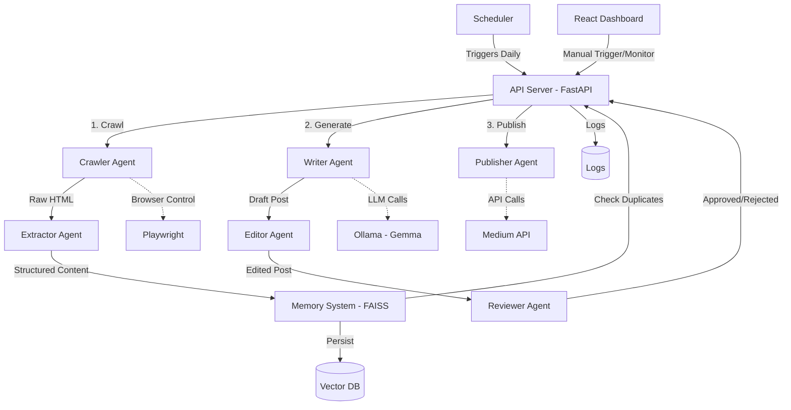
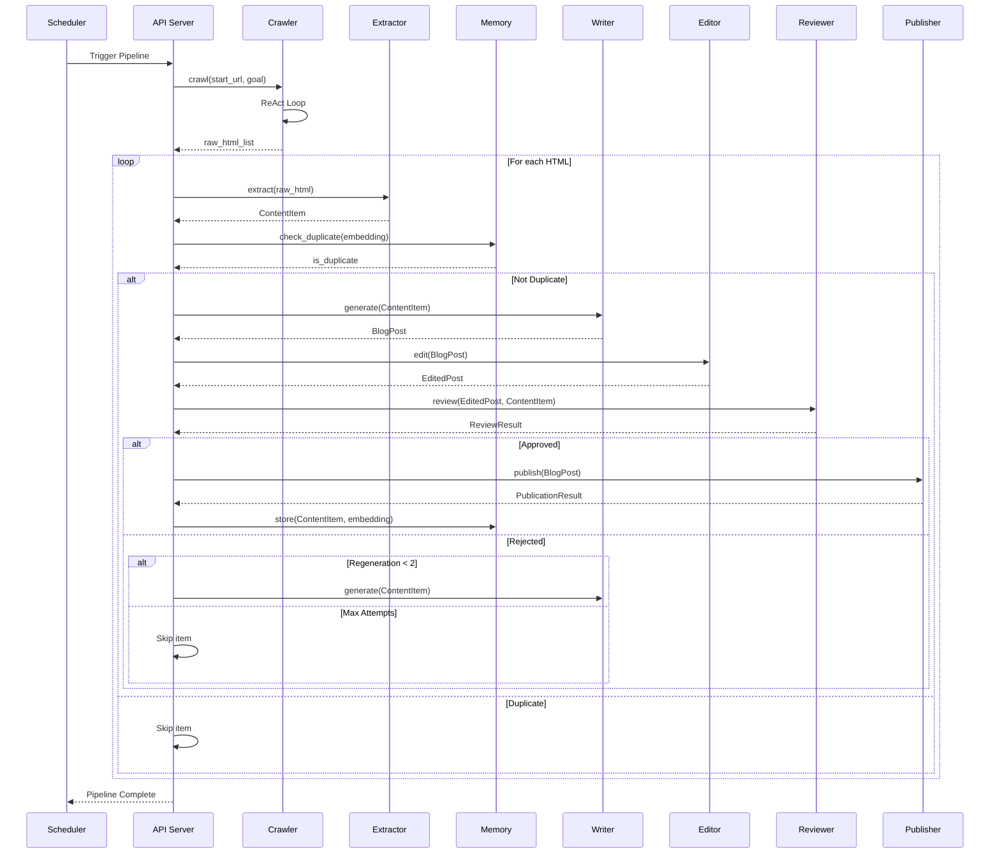
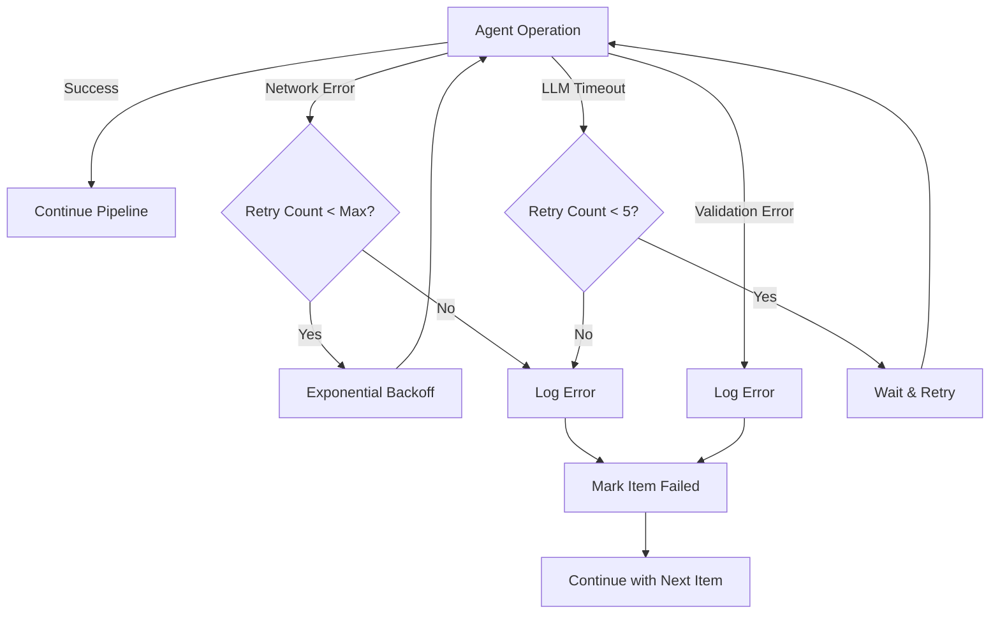

# Design Document: Autonomous Blog Agent

## Overview

The Autonomous Blog Agent is a multi-agent system that autonomously discovers, processes, and publishes original blog content. The system uses a ReAct (Reason → Act → Observe) loop for intelligent web crawling, LLM-based content generation via Gemma/Ollama, and a coordinated pipeline for quality assurance and publishing.

### Key Design Principles

1. **Autonomous Navigation**: The Crawler Agent uses LLM reasoning to analyze page structure and decide actions dynamically, avoiding brittle hardcoded selectors
2. **Multi-Agent Architecture**: Specialized agents handle distinct responsibilities (crawling, extraction, writing, editing, review, publishing)
3. **Quality Assurance**: Multi-stage review process ensures originality and quality before publication
4. **Resilience**: Retry mechanisms with exponential backoff handle transient failures
5. **Memory**: FAISS-based vector storage prevents duplicate content processing
6. **Safety**: Draft-only publishing with optional manual approval via dashboard

### Technology Stack

- **Backend Framework**: FastAPI (async HTTP server, agent coordination)
- **Agent Orchestration**: LangChain/LangGraph (workflow management, agent communication)
- **LLM**: Gemma via Ollama (content generation, crawler reasoning)
- **Browser Automation**: Playwright (headless browser control)
- **Vector Storage**: FAISS (content embeddings, duplicate detection)
- **Publishing**: Medium API (blog post publication)
- **Scheduling**: Python `schedule` library or cron
- **Frontend** (optional): React (monitoring dashboard)

## Architecture

### System Architecture Diagram



### Component Interactions

1. **Scheduler** triggers the API Server at scheduled intervals
2. **API Server** orchestrates the workflow through LangChain/LangGraph
3. **Crawler Agent** uses Playwright + LLM reasoning to navigate and discover content
4. **Extractor Agent** cleans and structures raw HTML into JSON
5. **Memory System** checks for duplicates using FAISS vector similarity
6. **Writer Agent** generates original content via Ollama/Gemma
7. **Editor Agent** improves quality and readability
8. **Reviewer Agent** validates originality against source material
9. **Publisher Agent** posts approved content to Medium as drafts
10. **Dashboard** (optional) provides monitoring and manual approval

## Components and Interfaces

### 1. Crawler Agent

**Responsibility**: Autonomous web navigation using LLM-driven decision making

**Implementation Approach**:
- ReAct loop: Reason (analyze page state) → Act (execute action) → Observe (update state)
- LLM analyzes page snapshot and decides next action
- No hardcoded selectors - uses semantic understanding of page structure

**Action Space**:
```python
from enum import Enum
from dataclasses import dataclass
from typing import Literal

class ActionType(Enum):
    CLICK = "click"
    NEXT = "next"
    PREV = "prev"
    EXTRACT = "extract"
    SCROLL = "scroll"
    WAIT = "wait"
    NAVIGATE = "navigate"

@dataclass
class CrawlerAction:
    action_type: ActionType
    target: str | None = None  # Element description or URL
    direction: Literal["up", "down"] | None = None  # For scroll
    duration: float | None = None  # For wait (seconds)
```

**Interface**:
```python
from typing import Protocol

class CrawlerAgent(Protocol):
    async def crawl(self, start_url: str, goal: str) -> list[str]:
        """
        Autonomously crawl from start_url to achieve goal.
        
        Args:
            start_url: Starting URL (e.g., ByteByteGo homepage)
            goal: High-level objective (e.g., "find recent articles")
            
        Returns:
            List of raw HTML content from discovered articles
        """
        ...
    
    async def reason(self, page_state: dict) -> CrawlerAction:
        """
        Use LLM to decide next action based on current page state.
        
        Args:
            page_state: Current page snapshot (text, links, structure)
            
        Returns:
            Next action to execute
        """
        ...
    
    async def execute_action(self, action: CrawlerAction) -> dict:
        """
        Execute browser action via Playwright.
        
        Args:
            action: Action to perform
            
        Returns:
            Observation result (new page state, success/failure)
        """
        ...
```

**Key Design Decisions**:
- LLM receives page accessibility tree (not raw HTML) for efficient reasoning
- Action history maintained in context to avoid loops
- Respects robots.txt by checking before navigation
- Timeout mechanism prevents infinite loops (max 50 actions per crawl)

### 2. Extractor Agent

**Responsibility**: Clean and structure raw HTML into usable content

**Interface**:
```python
from dataclasses import dataclass
from datetime import datetime

@dataclass
class ContentItem:
    title: str
    author: str | None
    publication_date: datetime | None
    url: str
    text_content: str
    code_blocks: list[str]
    images: list[str]
    metadata: dict

class ExtractorAgent(Protocol):
    async def extract(self, raw_html: str, url: str) -> ContentItem:
        """
        Extract and structure content from raw HTML.
        
        Args:
            raw_html: Raw HTML from crawler
            url: Source URL
            
        Returns:
            Structured content item
            
        Raises:
            ExtractionError: If extraction fails
        """
        ...
```

**Implementation**:
- Use BeautifulSoup or trafilatura for HTML parsing
- Remove navigation, ads, footers using heuristics
- Extract metadata from meta tags and structured data
- Preserve code blocks with language detection
- Extract alt text from images

### 3. Memory System

**Responsibility**: Track processed content and detect duplicates

**Interface**:
```python
from typing import Protocol
import numpy as np

class MemorySystem(Protocol):
    async def store(self, content: ContentItem, embedding: np.ndarray) -> None:
        """Store content item with its embedding."""
        ...
    
    async def check_duplicate(self, embedding: np.ndarray, threshold: float = 0.85) -> bool:
        """
        Check if content is duplicate based on embedding similarity.
        
        Args:
            embedding: Content embedding vector
            threshold: Similarity threshold (0.85 = 85% similar)
            
        Returns:
            True if duplicate found, False otherwise
        """
        ...
    
    async def get_history(self, limit: int = 100) -> list[ContentItem]:
        """Retrieve processing history."""
        ...
    
    async def persist(self) -> None:
        """Save index to disk."""
        ...
    
    async def load(self) -> None:
        """Load index from disk."""
        ...
```

**Implementation**:
- FAISS IndexFlatIP for cosine similarity search
- Embeddings generated via sentence-transformers (e.g., all-MiniLM-L6-v2)
- Metadata stored alongside vectors in separate JSON file
- Automatic persistence after each store operation

### 4. Writer Agent

**Responsibility**: Generate original blog posts from source material

**Interface**:
```python
@dataclass
class BlogPost:
    title: str
    content: str  # Markdown format
    tags: list[str]
    word_count: int
    source_url: str
    generated_at: datetime

class WriterAgent(Protocol):
    async def generate(self, content: ContentItem) -> BlogPost:
        """
        Generate original blog post from source content.
        
        Args:
            content: Source material
            
        Returns:
            Generated blog post
            
        Raises:
            GenerationError: If generation fails after retries
        """
        ...
```

**Implementation**:
- Ollama client with Gemma model
- Prompt engineering: "Inspired by this content, write an original blog post..."
- Temperature: 0.7 (balance creativity and coherence)
- Max tokens: 2000 (target 800-1500 words)
- Retry logic: 3 attempts with exponential backoff (1s, 2s, 4s)
- Structured output: Title, intro, body sections, conclusion

### 5. Editor Agent

**Responsibility**: Improve readability and quality

**Interface**:
```python
@dataclass
class EditedPost:
    post: BlogPost
    changes: list[str]  # Description of edits made
    
class EditorAgent(Protocol):
    async def edit(self, post: BlogPost) -> EditedPost:
        """
        Improve post quality and readability.
        
        Args:
            post: Draft blog post
            
        Returns:
            Edited post with change log
        """
        ...
```

**Implementation**:
- LLM-based editing via Ollama
- Checks: grammar, spelling, punctuation, flow
- Maintains technical accuracy
- Formats code blocks consistently
- Returns tracked changes for transparency

### 6. Reviewer Agent

**Responsibility**: Validate content originality

**Interface**:
```python
from enum import Enum

class ReviewDecision(Enum):
    APPROVED = "approved"
    REJECTED = "rejected"

@dataclass
class ReviewResult:
    decision: ReviewDecision
    similarity_score: float
    justification: str
    issues: list[str]

class ReviewerAgent(Protocol):
    async def review(self, post: BlogPost, source: ContentItem) -> ReviewResult:
        """
        Review post for originality against source.
        
        Args:
            post: Generated blog post
            source: Original source material
            
        Returns:
            Review decision with justification
        """
        ...
```

**Implementation**:
- Sentence-level similarity using embeddings
- Threshold: 0.70 (reject if >70% similar)
- Check for direct copying (n-gram overlap)
- LLM-based semantic comparison
- Detailed justification for rejection

### 7. Publisher Agent

**Responsibility**: Publish approved content to Medium

**Interface**:
```python
@dataclass
class PublicationResult:
    success: bool
    post_url: str | None
    error: str | None
    published_at: datetime

class PublisherAgent(Protocol):
    async def publish(self, post: BlogPost) -> PublicationResult:
        """
        Publish blog post to Medium as draft.
        
        Args:
            post: Approved blog post
            
        Returns:
            Publication result with URL
            
        Raises:
            PublicationError: If publication fails after retries
        """
        ...
    
    async def can_publish_today(self) -> bool:
        """Check if daily publication limit reached."""
        ...
```

**Implementation**:
- Medium API v1 integration
- OAuth token from environment variable
- Publish as draft (publishStatus: "draft")
- Auto-generate tags from content
- Retry logic: 3 attempts with exponential backoff
- Rate limiting: 1 post per day (tracked in memory system)

### 8. API Server

**Responsibility**: Coordinate all agents and expose HTTP endpoints

**Endpoints**:
```python
from fastapi import FastAPI, HTTPException
from pydantic import BaseModel

app = FastAPI()

class PipelineStatus(BaseModel):
    status: Literal["running", "completed", "failed"]
    current_step: str
    items_processed: int
    errors: list[str]

@app.post("/pipeline/trigger")
async def trigger_pipeline() -> dict:
    """Manually trigger content pipeline."""
    ...

@app.get("/pipeline/status")
async def get_status() -> PipelineStatus:
    """Get current pipeline status."""
    ...

@app.get("/health")
async def health_check() -> dict:
    """Health check endpoint."""
    ...

@app.get("/history")
async def get_history(limit: int = 50) -> list[dict]:
    """Get processing history."""
    ...

@app.get("/stats")
async def get_stats() -> dict:
    """Get system statistics."""
    ...
```

**Orchestration Flow**:
```python
from langgraph.graph import StateGraph, END

# Define workflow state
class WorkflowState(TypedDict):
    content_items: list[ContentItem]
    current_item: ContentItem | None
    blog_post: BlogPost | None
    review_result: ReviewResult | None
    regeneration_count: int
    errors: list[str]

# Build workflow graph
workflow = StateGraph(WorkflowState)

workflow.add_node("crawl", crawl_node)
workflow.add_node("extract", extract_node)
workflow.add_node("check_duplicate", check_duplicate_node)
workflow.add_node("write", write_node)
workflow.add_node("edit", edit_node)
workflow.add_node("review", review_node)
workflow.add_node("publish", publish_node)

# Define edges
workflow.set_entry_point("crawl")
workflow.add_edge("crawl", "extract")
workflow.add_edge("extract", "check_duplicate")
workflow.add_conditional_edges(
    "check_duplicate",
    lambda state: "write" if not state["is_duplicate"] else "skip"
)
workflow.add_edge("write", "edit")
workflow.add_edge("edit", "review")
workflow.add_conditional_edges(
    "review",
    lambda state: "publish" if state["review_result"].decision == ReviewDecision.APPROVED else "regenerate"
)
workflow.add_edge("publish", END)

app = workflow.compile()
```

### 9. Scheduler

**Responsibility**: Trigger daily pipeline execution

**Implementation**:
```python
import schedule
import asyncio
from datetime import datetime

class PipelineScheduler:
    def __init__(self, api_client):
        self.api_client = api_client
        self.is_running = False
    
    async def run_pipeline(self):
        if self.is_running:
            print(f"[{datetime.now()}] Pipeline already running, skipping")
            return
        
        self.is_running = True
        try:
            print(f"[{datetime.now()}] Starting scheduled pipeline run")
            result = await self.api_client.trigger_pipeline()
            print(f"[{datetime.now()}] Pipeline completed: {result}")
        except Exception as e:
            print(f"[{datetime.now()}] Pipeline failed: {e}")
        finally:
            self.is_running = False
    
    def start(self, time: str = "09:00"):
        """Start scheduler with daily execution at specified time."""
        schedule.every().day.at(time).do(
            lambda: asyncio.create_task(self.run_pipeline())
        )
        
        while True:
            schedule.run_pending()
            asyncio.sleep(60)
```

### 10. Dashboard (Optional)

**Responsibility**: Monitoring and manual approval interface

**Key Features**:
- Real-time pipeline status display
- Processing history table with filters
- Manual approval workflow for draft posts
- Error log viewer
- System statistics (duplicates detected, success rate)
- Manual pipeline trigger button

**Technology**:
- React with TypeScript
- TanStack Query for API state management
- Tailwind CSS for styling
- WebSocket for real-time updates (optional)

## Data Models

### Core Data Structures

```python
from dataclasses import dataclass
from datetime import datetime
from enum import Enum
from typing import Literal
import numpy as np

# Crawler Models
@dataclass
class CrawlerAction:
    action_type: Literal["click", "next", "prev", "extract", "scroll", "wait", "navigate"]
    target: str | None = None
    direction: Literal["up", "down"] | None = None
    duration: float | None = None

@dataclass
class PageState:
    url: str
    title: str
    text_content: str
    links: list[dict]  # [{"text": str, "href": str}]
    action_history: list[CrawlerAction]
    timestamp: datetime

# Content Models
@dataclass
class ContentItem:
    title: str
    author: str | None
    publication_date: datetime | None
    url: str
    text_content: str
    code_blocks: list[str]
    images: list[str]
    metadata: dict
    
    def to_json(self) -> dict:
        """Serialize to JSON-compatible dict."""
        ...
    
    @classmethod
    def from_json(cls, data: dict) -> "ContentItem":
        """Deserialize from JSON dict."""
        ...

@dataclass
class BlogPost:
    title: str
    content: str  # Markdown
    tags: list[str]
    word_count: int
    source_url: str
    generated_at: datetime
    
    def to_markdown(self) -> str:
        """Convert to markdown format for publishing."""
        ...

# Review Models
class ReviewDecision(Enum):
    APPROVED = "approved"
    REJECTED = "rejected"

@dataclass
class ReviewResult:
    decision: ReviewDecision
    similarity_score: float
    justification: str
    issues: list[str]

# Publication Models
@dataclass
class PublicationResult:
    success: bool
    post_url: str | None
    error: str | None
    published_at: datetime

# Memory Models
@dataclass
class MemoryEntry:
    content_id: str
    embedding: np.ndarray
    metadata: ContentItem
    processed_at: datetime
```

### Database Schema (FAISS + JSON)

**Vector Index**: FAISS IndexFlatIP
- Dimension: 384 (for all-MiniLM-L6-v2 embeddings)
- Metric: Inner product (cosine similarity)
- File: `memory/vectors.index`

**Metadata Store**: JSON file
```json
{
  "entries": [
    {
      "content_id": "uuid-here",
      "metadata": {
        "title": "...",
        "url": "...",
        "processed_at": "2024-01-01T00:00:00Z"
      }
    }
  ],
  "stats": {
    "total_processed": 42,
    "duplicates_detected": 5,
    "last_publication": "2024-01-01T00:00:00Z"
  }
}
```

## Agent Orchestration Flow

### Pipeline Execution Sequence



### Error Handling Flow



## Correctness Properties

*A property is a characteristic or behavior that should hold true across all valid executions of a system—essentially, a formal statement about what the system should do. Properties serve as the bridge between human-readable specifications and machine-verifiable correctness guarantees.*


### Property 1: Robots.txt Compliance

*For any* robots.txt file and target URL, the crawler SHALL correctly determine whether crawling is allowed based on the User-agent and Disallow directives.

**Validates: Requirements 1.9**

### Property 2: HTML Cleaning Preserves Content

*For any* HTML document containing navigation, advertisements, or non-content elements, the extraction process SHALL remove these elements while preserving the main content text, code blocks, and images.

**Validates: Requirements 2.1, 2.2**

### Property 3: ContentItem Structure Completeness

*For any* extracted content, the resulting ContentItem SHALL contain all required metadata fields (title, author, publication_date, url, text_content, code_blocks, images, metadata).

**Validates: Requirements 2.3**

### Property 4: ContentItem Serialization Round-Trip

*For any* valid ContentItem, serializing to JSON and then deserializing SHALL produce an equivalent ContentItem with all fields preserved.

**Validates: Requirements 2.5**

### Property 5: Cosine Similarity Properties

*For any* two embedding vectors, the cosine similarity calculation SHALL satisfy: (1) symmetry (sim(A,B) = sim(B,A)), (2) range [0,1], (3) identity (sim(A,A) = 1.0).

**Validates: Requirements 3.3, 6.2**

### Property 6: Duplicate Detection Threshold

*For any* content embedding with cosine similarity above 0.85 to stored content, the Memory System SHALL mark it as a duplicate and prevent further processing.

**Validates: Requirements 3.4**

### Property 7: Blog Post Word Count Validation

*For any* generated BlogPost, the word count SHALL be between 800 and 1500 words inclusive.

**Validates: Requirements 4.4**

### Property 8: Exponential Backoff Retry Logic

*For any* failed operation requiring retry with exponential backoff, the delay between attempts SHALL follow the pattern: attempt N has delay 2^(N-1) seconds (1s, 2s, 4s, ...).

**Validates: Requirements 4.5, 7.5, 12.2**

### Property 9: Blog Post Structure Completeness

*For any* generated BlogPost, the content SHALL include all required sections: title, introduction, body sections, and conclusion.

**Validates: Requirements 4.6**

### Property 10: Code Block Formatting Preservation

*For any* code block in a BlogPost, the formatting SHALL preserve indentation, syntax highlighting markers, and language identifiers.

**Validates: Requirements 5.4**

### Property 11: Edited Post Change Tracking

*For any* edited BlogPost, the resulting EditedPost SHALL include a non-empty list of changes describing the modifications made.

**Validates: Requirements 5.6**

### Property 12: Review Threshold Decision

*For any* BlogPost with similarity score above 0.70 to the source ContentItem, the Reviewer SHALL reject the post with decision = REJECTED.

**Validates: Requirements 6.3**

### Property 13: N-gram Overlap Detection

*For any* text pair with identical sentences or paragraphs (n-gram overlap above threshold), the plagiarism detection SHALL identify and report the copied segments.

**Validates: Requirements 6.4**

### Property 14: Review Justification Presence

*For any* ReviewResult, the justification field SHALL be non-empty and provide reasoning for the approval or rejection decision.

**Validates: Requirements 6.6**

### Property 15: Tag Generation Presence

*For any* BlogPost prepared for publication, the tags list SHALL be non-empty and contain relevant topic keywords.

**Validates: Requirements 7.4**

### Property 16: Publication Rate Limiting

*For any* sequence of publication attempts within a 24-hour period, at most one publication SHALL succeed, with subsequent attempts rejected until the next day.

**Validates: Requirements 7.7, 13.6**

### Property 17: Concurrent Execution Prevention

*For any* overlapping pipeline execution attempts, only one SHALL run at a time, with subsequent triggers skipped until the current execution completes.

**Validates: Requirements 8.4**

### Property 18: API Key Leak Prevention

*For any* log message, error response, or API response, the content SHALL NOT contain API key patterns (strings matching common API key formats).

**Validates: Requirements 11.5**

### Property 19: Ollama Retry Limit

*For any* sequence of failed Ollama service calls, the Writer Agent SHALL retry at most 5 times before marking the operation as failed.

**Validates: Requirements 12.5**

### Property 20: Regeneration Attempt Limit

*For any* ContentItem that produces rejected BlogPosts, the system SHALL attempt regeneration at most 2 times before skipping the item.

**Validates: Requirements 13.3**

## Error Handling

### Error Categories

1. **Network Errors**: Transient failures in HTTP requests, browser automation, or API calls
2. **Validation Errors**: Invalid data structures, missing required fields, or constraint violations
3. **LLM Errors**: Timeouts, rate limits, or malformed responses from Ollama
4. **Storage Errors**: FAISS index corruption, disk I/O failures, or serialization errors
5. **Business Logic Errors**: Duplicate detection, originality threshold violations, rate limit exceeded

### Error Handling Strategies

#### Retry with Exponential Backoff

**Applies to**: Network errors, LLM timeouts, API rate limits

**Implementation**:
```python
import asyncio
from typing import TypeVar, Callable

T = TypeVar('T')

async def retry_with_backoff(
    operation: Callable[[], T],
    max_attempts: int = 3,
    base_delay: float = 1.0,
    max_delay: float = 60.0
) -> T:
    """
    Retry operation with exponential backoff.
    
    Args:
        operation: Async function to retry
        max_attempts: Maximum retry attempts
        base_delay: Initial delay in seconds
        max_delay: Maximum delay cap
        
    Returns:
        Operation result
        
    Raises:
        Last exception if all retries exhausted
    """
    last_exception = None
    
    for attempt in range(max_attempts):
        try:
            return await operation()
        except Exception as e:
            last_exception = e
            if attempt < max_attempts - 1:
                delay = min(base_delay * (2 ** attempt), max_delay)
                await asyncio.sleep(delay)
    
    raise last_exception
```

**Configuration**:
- Writer Agent (Ollama): 5 attempts, 1s base delay
- Publisher Agent (Medium API): 3 attempts, 1s base delay
- Network requests: 3 attempts, 1s base delay

#### Graceful Degradation

**Applies to**: Individual content item failures, non-critical agent errors

**Strategy**: Log error, mark item as failed, continue processing remaining items

**Implementation**:
```python
async def process_content_items(items: list[ContentItem]) -> dict:
    """Process multiple items with error isolation."""
    results = {
        "successful": [],
        "failed": [],
        "errors": []
    }
    
    for item in items:
        try:
            result = await process_single_item(item)
            results["successful"].append(result)
        except Exception as e:
            logger.error(f"Failed to process {item.url}: {e}")
            results["failed"].append(item.url)
            results["errors"].append(str(e))
    
    return results
```

#### Circuit Breaker

**Applies to**: Repeated failures to external services (Ollama, Medium API)

**Strategy**: Temporarily stop calling failing service after threshold, resume after cooldown

**Implementation**:
```python
from datetime import datetime, timedelta

class CircuitBreaker:
    def __init__(self, failure_threshold: int = 5, timeout: int = 60):
        self.failure_threshold = failure_threshold
        self.timeout = timeout
        self.failures = 0
        self.last_failure_time = None
        self.state = "closed"  # closed, open, half-open
    
    async def call(self, operation: Callable):
        if self.state == "open":
            if datetime.now() - self.last_failure_time > timedelta(seconds=self.timeout):
                self.state = "half-open"
            else:
                raise Exception("Circuit breaker is open")
        
        try:
            result = await operation()
            if self.state == "half-open":
                self.state = "closed"
                self.failures = 0
            return result
        except Exception as e:
            self.failures += 1
            self.last_failure_time = datetime.now()
            if self.failures >= self.failure_threshold:
                self.state = "open"
            raise e
```

#### Validation and Early Exit

**Applies to**: Configuration errors, missing required data, invalid input

**Strategy**: Validate early, fail fast with descriptive error messages

**Implementation**:
```python
from pydantic import BaseModel, validator

class Config(BaseModel):
    medium_api_token: str
    ollama_endpoint: str
    ollama_model: str = "gemma:7b"
    
    @validator('medium_api_token')
    def validate_token(cls, v):
        if not v or len(v) < 10:
            raise ValueError("Invalid Medium API token")
        return v
    
    @validator('ollama_endpoint')
    def validate_endpoint(cls, v):
        if not v.startswith('http'):
            raise ValueError("Ollama endpoint must be HTTP URL")
        return v

def load_config() -> Config:
    """Load and validate configuration on startup."""
    try:
        return Config(
            medium_api_token=os.getenv("MEDIUM_API_TOKEN"),
            ollama_endpoint=os.getenv("OLLAMA_ENDPOINT", "http://localhost:11434"),
            ollama_model=os.getenv("OLLAMA_MODEL", "gemma:7b")
        )
    except Exception as e:
        logger.error(f"Configuration validation failed: {e}")
        sys.exit(1)
```

#### Storage Recovery

**Applies to**: FAISS index corruption, metadata file corruption

**Strategy**: Detect corruption, rebuild from backup or logs

**Implementation**:
```python
class MemorySystem:
    async def load(self):
        """Load FAISS index with corruption recovery."""
        try:
            self.index = faiss.read_index(self.index_path)
            self.metadata = self._load_metadata()
        except Exception as e:
            logger.warning(f"Failed to load index: {e}. Attempting recovery...")
            await self._recover_from_backup()
    
    async def _recover_from_backup(self):
        """Rebuild index from backup or logs."""
        if os.path.exists(self.backup_path):
            logger.info("Restoring from backup")
            shutil.copy(self.backup_path, self.index_path)
            self.index = faiss.read_index(self.index_path)
        else:
            logger.info("Rebuilding index from logs")
            self.index = faiss.IndexFlatIP(self.dimension)
            # Rebuild from processing logs
            await self._rebuild_from_logs()
```

### Error Logging

All errors SHALL be logged with:
- Timestamp
- Error type and message
- Stack trace
- Context (agent name, content URL, operation)
- Correlation ID for request tracing

**Log Format**:
```json
{
  "timestamp": "2024-01-01T12:00:00Z",
  "level": "ERROR",
  "correlation_id": "uuid-here",
  "agent": "writer_agent",
  "operation": "generate_post",
  "content_url": "https://example.com/article",
  "error_type": "OllamaTimeoutError",
  "message": "Ollama request timed out after 30s",
  "stack_trace": "...",
  "retry_attempt": 2
}
```

## Testing Strategy

### Testing Approach

The Autonomous Blog Agent requires a multi-layered testing strategy combining property-based tests, unit tests, integration tests, and end-to-end tests.

#### 1. Property-Based Tests

**Purpose**: Verify universal properties hold across all valid inputs

**Library**: Hypothesis (Python)

**Configuration**:
- Minimum 100 iterations per property test
- Each test tagged with feature name and property number
- Tag format: `# Feature: autonomous-blog-agent, Property N: <property text>`

**Test Coverage**:
- Serialization round-trips (ContentItem, BlogPost)
- Similarity calculations (cosine similarity properties)
- Validation logic (word count, thresholds, rate limits)
- Retry mechanisms (exponential backoff, attempt limits)
- Security checks (API key leak prevention)

**Example**:
```python
from hypothesis import given, strategies as st
import hypothesis

@given(st.builds(ContentItem))
def test_content_item_serialization_roundtrip(item: ContentItem):
    """
    Feature: autonomous-blog-agent, Property 4: ContentItem Serialization Round-Trip
    
    For any valid ContentItem, serializing to JSON and deserializing
    should produce an equivalent ContentItem.
    """
    json_data = item.to_json()
    restored = ContentItem.from_json(json_data)
    assert restored == item
```

#### 2. Unit Tests

**Purpose**: Test specific examples, edge cases, and error conditions

**Library**: pytest

**Coverage Areas**:
- HTML extraction with malformed input
- Configuration validation with missing values
- Error handling for specific failure scenarios
- API endpoint responses
- Logging behavior

**Example**:
```python
def test_extractor_handles_empty_html():
    """Test that extractor gracefully handles empty HTML."""
    extractor = ExtractorAgent()
    with pytest.raises(ExtractionError):
        await extractor.extract("", "https://example.com")

def test_config_validation_missing_token():
    """Test that config validation fails with missing Medium token."""
    with pytest.raises(ValueError, match="Invalid Medium API token"):
        Config(medium_api_token="", ollama_endpoint="http://localhost:11434")
```

#### 3. Integration Tests

**Purpose**: Test component interactions and external service integrations

**Coverage Areas**:
- Playwright browser automation
- LLM reasoning and decision-making (with mock responses)
- FAISS vector storage operations
- Medium API publishing (with mock API)
- LangGraph workflow orchestration
- Agent communication and data flow

**Approach**:
- Use mocks for external services (Ollama, Medium API)
- Use test fixtures for sample HTML, content items
- Test full agent workflows with realistic data

**Example**:
```python
@pytest.mark.integration
async def test_crawler_extracts_article_links(mock_playwright):
    """Test crawler can identify and extract article links."""
    crawler = CrawlerAgent(browser=mock_playwright)
    mock_playwright.set_page_content(SAMPLE_BYTEBYGO_HTML)
    
    links = await crawler.crawl(
        start_url="https://blog.bytebytego.com",
        goal="find recent articles"
    )
    
    assert len(links) > 0
    assert all(link.startswith("https://") for link in links)

@pytest.mark.integration
async def test_memory_system_detects_duplicates(tmp_path):
    """Test memory system correctly identifies duplicate content."""
    memory = MemorySystem(storage_path=tmp_path)
    
    item1 = create_test_content_item("Article about databases")
    embedding1 = generate_embedding(item1.text_content)
    
    await memory.store(item1, embedding1)
    
    # Create very similar content
    item2 = create_test_content_item("Article about databases")
    embedding2 = generate_embedding(item2.text_content)
    
    is_duplicate = await memory.check_duplicate(embedding2)
    assert is_duplicate is True
```

#### 4. End-to-End Tests

**Purpose**: Validate complete pipeline execution

**Approach**:
- Run full pipeline with test data
- Verify each stage produces expected output
- Check error handling and recovery
- Validate final publication (to test Medium account)

**Example**:
```python
@pytest.mark.e2e
@pytest.mark.slow
async def test_full_pipeline_execution():
    """Test complete pipeline from crawl to publish."""
    # Setup test environment
    config = load_test_config()
    api_server = create_test_api_server(config)
    
    # Trigger pipeline
    response = await api_server.trigger_pipeline()
    
    # Wait for completion
    status = await wait_for_completion(api_server, timeout=300)
    
    # Verify results
    assert status["status"] == "completed"
    assert status["items_processed"] > 0
    assert len(status["errors"]) == 0
    
    # Verify publication
    history = await api_server.get_history()
    assert len(history) > 0
    assert history[0]["published"] is True
```

### Test Organization

```
tests/
├── unit/
│   ├── test_crawler.py
│   ├── test_extractor.py
│   ├── test_memory.py
│   ├── test_writer.py
│   ├── test_editor.py
│   ├── test_reviewer.py
│   ├── test_publisher.py
│   └── test_config.py
├── integration/
│   ├── test_crawler_integration.py
│   ├── test_memory_integration.py
│   ├── test_workflow.py
│   └── test_api_endpoints.py
├── property/
│   ├── test_serialization_properties.py
│   ├── test_similarity_properties.py
│   ├── test_validation_properties.py
│   ├── test_retry_properties.py
│   └── test_security_properties.py
├── e2e/
│   └── test_full_pipeline.py
├── fixtures/
│   ├── sample_html.py
│   ├── sample_content.py
│   └── mock_responses.py
└── conftest.py
```

### Test Coverage Goals

- **Unit tests**: 80%+ code coverage
- **Property tests**: All 20 correctness properties implemented
- **Integration tests**: All agent interactions and external service integrations
- **E2E tests**: At least 2 complete pipeline scenarios (success and failure)

### Continuous Integration

- Run unit and property tests on every commit
- Run integration tests on pull requests
- Run E2E tests nightly or before releases
- Fail build if coverage drops below 80%
- Fail build if any property test fails
