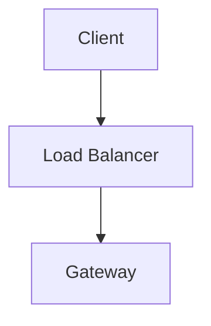

# DEV.to Integration Guide

## ✅ Integration Complete!

The Autonomous Blog Agent now supports **DEV.to publishing** with native markdown support!

## 🎯 Quick Setup (3 Steps)

### Step 1: Get Your DEV.to API Key

1. Go to https://dev.to/settings/extensions
2. Scroll to **"DEV API Keys"** section
3. Click **"New Key"**
4. Copy the API key (you won't see it again!)

### Step 2: Configure Environment Variables

Add these to your `.env` file:

```bash
# DEV.to Configuration
DEVTO_API_TOKEN=your_devto_api_key_here
PUBLISH_TO_DEVTO=true  # Set to true to enable DEV.to publishing
```

### Step 3: Restart the Server

```bash
# Restart to pick up new config
python -m src.main run-server --host 127.0.0.1 --port 8000
```

That's it! The next blog post generated will be published to DEV.to as a draft! 🎉

---

## 🔄 Publishing Flow

```
Blog Post Generated
       ↓
Save Local Draft (Always)
       ↓
Is DEV.to configured?
       ↓ YES
Publish to DEV.to (as draft)
       ↓
Return DEV.to URL
       ↓
✅ Complete!
```

---

## 🎨 Key Features

### ✅ Native Markdown Support
Unlike Medium, DEV.to accepts **raw markdown directly**:
- ✅ Mermaid diagrams render natively
- ✅ Code blocks with syntax highlighting
- ✅ Headers, lists, bold/italic formatting
- ✅ No HTML conversion needed!

### 🏷️ Smart Tag Handling
DEV.to has strict tag requirements:
- **Maximum 4 tags** per post
- **Lowercase only**
- **Alphanumeric + hyphens** (no special characters)
- **Max 20 characters** per tag

The publisher automatically cleans tags:
```python
# Before: ["system-design", "Distributed Systems!", "ML/AI"]
# After:  ["system-design", "distributed-systems", "ml-ai"]
```

### 📝 Draft-First Approach
Posts are saved as **drafts first** (`published: false`):
- ✅ Review before going live
- ✅ Edit on DEV.to dashboard
- ✅ Publish manually when ready
- ✅ No accidental live posts

---

## 🔧 How It Works

### Publisher Priority

The system tries platforms in this order:

1. **DEV.to** (if configured) - Simpler, accepts markdown
2. **Medium** (if configured) - Requires HTML conversion
3. **Local Drafts** (always saved)

```python
# Priority logic in publisher.py
if devto_configured:
    publish_to_devto()
elif medium_configured:
    publish_to_medium()
else:
    save_local_draft()
```

### API Payload

```json
{
  "article": {
    "title": "How Telegram Scales to 800M Users",
    "body_markdown": "# How Telegram Scales...\n\n[Full markdown content with Mermaid diagrams]",
    "tags": ["system-design", "scalability", "distributed-systems", "architecture"],
    "published": false,
    "canonical_url": "https://telegram.org/blog"
  }
}
```

### Response

```json
{
  "url": "https://dev.to/yourusername/how-telegram-scales-abc123",
  "id": 123456,
  "title": "How Telegram Scales to 800M Users"
}
```

---

## 🆚 DEV.to vs Medium

| Feature | DEV.to | Medium |
|---------|--------|--------|
| **Content Format** | Raw markdown ✅ | HTML conversion required |
| **Mermaid Diagrams** | Native support ✅ | Converted to images |
| **Setup Complexity** | Simple (1 key) | Complex (key + author ID) |
| **Tags** | Max 4, lowercase | Up to 5, flexible |
| **Code Syntax** | Native highlighting | Basic HTML only |
| **Audience** | Developer community | General audience |
| **SEO** | Excellent | Good |
| **Draft Review** | Yes (dashboard) | Yes (dashboard) |

### Why DEV.to is Simpler

1. **No HTML conversion** - Markdown goes straight through
2. **No author ID needed** - API key is enough
3. **Better code support** - Native syntax highlighting
4. **Mermaid support** - Diagrams render automatically
5. **Developer audience** - Perfect for technical content

---

## 📋 Configuration Options

### Environment Variables

```bash
# Required
DEVTO_API_TOKEN=your_api_key_here

# Publishing toggle
PUBLISH_TO_DEVTO=true  # or false to disable

# Optional: Publishing behavior
# - published: false = save as draft (default)
# - published: true = go live immediately
```

### In Code

```python
# In src/config.py
devto_api_token: str = ""
publish_to_devto: bool = False
```

---

## 🚀 Usage Examples

### Trigger Pipeline (with DEV.to publishing)

```bash
# Via API
curl -X POST http://localhost:8000/pipeline/trigger

# Via CLI
python -m src.main trigger-pipeline
```

### Expected Output

```
✅ Published to DEV.to: https://dev.to/yourusername/how-telegram-scales-abc123
```

### View on DEV.to

1. Go to https://dev.to
2. Click your profile picture
3. Go to **"Drafts"** tab
4. Review and edit your post
5. Click **"Publish"** when ready

---

## 🔍 Troubleshooting

### Issue: 401 Unauthorized

**Cause**: Invalid or missing API key  
**Fix**: 
```bash
# Check your .env file
grep DEVTO_API_TOKEN .env

# Regenerate key at: https://dev.to/settings/extensions
```

### Issue: 422 Unprocessable Entity

**Cause**: Invalid tags or content format  
**Fix**: 
- Ensure tags are lowercase, alphanumeric + hyphens only
- Max 4 tags
- Content must be valid markdown

### Issue: Tags Rejected

**Cause**: DEV.to doesn't allow special characters in tags  
**Fix**: Automatic - the publisher cleans tags automatically:
```python
# Automatically converts:
"System Design!" → "system-design"
"ML/AI" → "ml-ai"
"Distributed-Systems" → "distributed-systems"
```

### Issue: Post Goes Live Immediately

**Cause**: `published: true` in payload  
**Fix**: Currently set to `published: false` (draft mode)  
To change, edit `publisher.py` line ~200

---

## 📊 Rate Limits

DEV.to API limits:
- **30 requests per 30 seconds** per IP
- **No daily limit** documented
- Retry logic handles rate limits automatically

The system includes exponential backoff retry:
```python
retry_with_backoff(
    self._call_devto_api,
    post,
    max_retries=3,
    base_delay=1.0,
    max_delay=60.0
)
```

---

## 🎯 Best Practices

### 1. Review Before Publishing
- Posts saved as drafts by default
- Review on DEV.to dashboard
- Edit formatting if needed
- Add cover image manually

### 2. Optimize Tags
- Use popular DEV.to tags for visibility
- Good tags: `programming`, `webdev`, `python`, `ai`
- Check trending tags on DEV.to

### 3. Add Canonical URL
- Prevents duplicate content issues
- Points to original source
- Good for SEO

### 4. Post Timing
- Best times: Tuesday-Thursday, 9am-12pm EST
- DEV.to audience: US/Europe developers
- Consistent schedule helps

---

## 🔄 Migration from Medium

If you're switching from Medium to DEV.to:

### Changes Needed

1. **Update `.env`**:
```bash
# Remove or comment out Medium
# MEDIUM_API_TOKEN=
# PUBLISH_TO_MEDIUM=false

# Add DEV.to
DEVTO_API_TOKEN=your_key
PUBLISH_TO_DEVTO=true
```

2. **Benefits**:
- ✅ Simpler setup (no author ID)
- ✅ Better code formatting
- ✅ Native Mermaid diagrams
- ✅ Developer audience
- ✅ No HTML conversion

3. **Keep Both**:
- You can keep both enabled
- DEV.to will be tried first
- Falls back to Medium if DEV.to fails

---

## 📝 Example Published Post

### Markdown Input (from generator)
```markdown
# How Telegram Scales to 800M Users



## Architecture
Telegram uses a distributed message bus...
```

### DEV.to Output
- ✅ Title rendered as H1
- ✅ Mermaid diagram rendered as interactive SVG
- ✅ Code blocks with syntax highlighting
- ✅ Headers, lists, bold text all formatted
- ✅ Tags: `#systemdesign #scalability #distributedsystems #architecture`

---

## 🎉 Summary

### What Was Added

1. ✅ **Config fields** in `src/config.py`
2. ✅ **Publisher method** `_call_devto_api()`
3. ✅ **Publish flow** with priority handling
4. ✅ **Tag cleaning** for DEV.to requirements
5. ✅ **Retry logic** with exponential backoff
6. ✅ **Environment variables** in `.env.example`

### What Makes It Great

- 🎨 **Native markdown** - No conversion needed
- 📊 **Mermaid diagrams** - Render natively
- 🏷️ **Smart tags** - Auto-cleaned and validated
- 📝 **Draft mode** - Review before publishing
- 🔄 **Retry logic** - Handles transient failures
- 🚀 **Simple setup** - Just API key + toggle

### Next Steps

1. Get your DEV.to API key
2. Add to `.env`
3. Trigger pipeline
4. Review draft on DEV.to
5. Publish when ready!

---

**Happy Publishing! 🚀**

Your technical blog posts will now reach the DEV.to developer community automatically!
