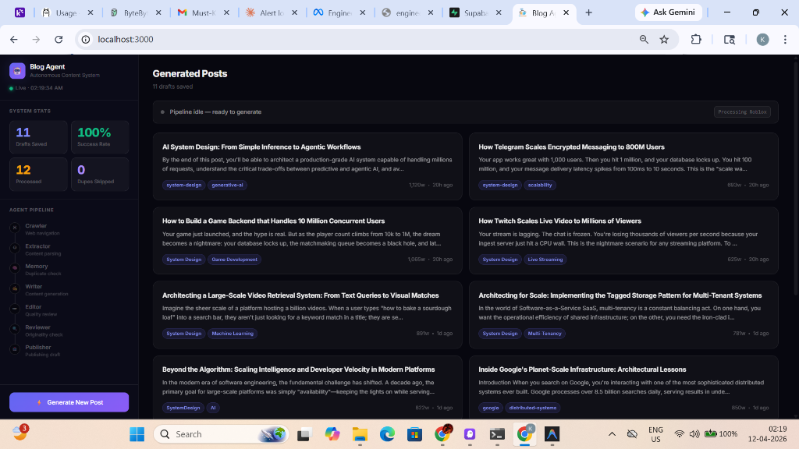
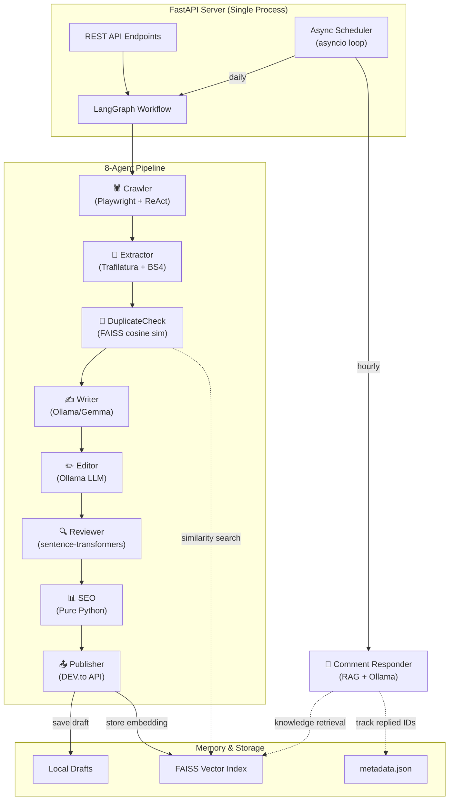
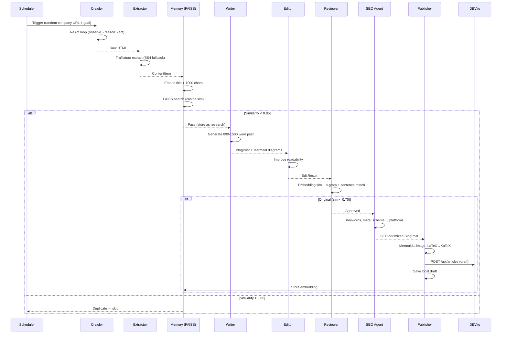

# 🤖 Autonomous Blog Agent

<p align="center">
  <b>AI-Powered Multi-Agent System for Autonomous Technical Blog Generation & Engagement</b>
</p>

<p align="center">
  
  
  
  
  
  
  
</p>

<p align="center">
  <a href="#-features">Features</a> •
  <a href="#-quick-start">Quick Start</a> •
  <a href="#%EF%B8%8F-architecture">Architecture</a> •
  <a href="#-agents">Agents</a> •
  <a href="#-deployment">Deployment</a> •
  <a href="#-api-reference">API</a> •
  <a href="#-testing">Testing</a>
</p>

---

<p align="center">
  <b>🎯 Fully autonomous: Crawl → Extract → Write → Edit → Review → SEO → Publish → Engage</b><br>
  <i>From web research to published blog posts with AI-powered comment responses</i>
</p>

<p align="center">
  
</p>

---

## ✨ Features

### 🕷️ Autonomous Research (CrawlerAgent)
- **ReAct Loop** — LLM-driven Reason→Act→Observe cycle for intelligent web navigation
- **500+ Companies** — Database of tech companies across 16 categories for diverse content discovery
- **Anti-Bot Bypass** — Stealth mode with realistic user agents, randomized timing, and Playwright automation
- **Goal-Directed Crawling** — LLM dynamically decides which links to follow and when to extract

### 🧠 Vector Memory System
- **FAISS Integration** — Semantic duplicate detection via 384-dim embeddings (fastembed ONNX)
- **Cross-Session Persistence** — Index + metadata saved to disk, survives restarts
- **Knowledge Base** — Stores crawled content summaries for the Comment Responder's RAG retrieval
- **Singleton Pattern** — Single FAISS index shared across all agents

### ✍️ 8-Agent LangGraph Pipeline
```
Crawler → Extractor → DuplicateCheck → Writer → Editor → Reviewer → SEO → Publisher
```
- **LangGraph StateGraph** — Declarative workflow with conditional branching
- **Mermaid Diagrams** — Auto-generated architecture diagrams in every post
- **Originality Enforcement** — 3-layer plagiarism detection (embeddings + n-grams + sentence matching)
- **SEO Optimization** — Pure-Python keyword extraction, schema markup, and 5 platform variants

### 💬 Comment Responder Agent
- **Automatic Engagement** — Fetches and replies to comments on all published articles
- **RAG-Style Context** — Searches FAISS memory for relevant technical content before replying
- **Smart Prompting** — System/user prompt separation with comment classification and persona control
- **Idempotent** — Tracks replied comment IDs across scheduler runs

### 📅 Built-in Async Scheduler
- **Native asyncio Loop** — No external scheduler dependencies, runs within the FastAPI process
- **Daily Pipeline** — Triggers content generation at a configurable time (default: 09:00)
- **Hourly Comment Responder** — Checks for and replies to new comments every hour
- **Concurrent Prevention** — Global flag prevents overlapping pipeline executions

### 🔍 SEO & Multi-Platform Publishing
- **5 Platform Variants** — LinkedIn, Twitter/X, DEV.to, Hashnode, Medium content generation
- **Schema.org Markup** — Auto-generates TechArticle, FAQPage, and HowTo JSON-LD
- **Mermaid→Image Pipeline** — Converts Mermaid diagrams to rendered images for DEV.to
- **Tag Sanitization** — Platform-specific tag rules (length, format, count) handled automatically

### 🚀 Production-Ready
- **Single-Process Deployment** — API + scheduler + agents in one process (Render-compatible)
- **< 3s Port Binding** — Background model loading prevents timeout on cloud platforms
- **Structured JSON Logging** — Sensitive data redaction, agent tagging, correlation IDs
- **Circuit Breaker + Retry** — Exponential backoff with full circuit breaker pattern

---

## 🚀 Quick Start

### Prerequisites

| Requirement | Version | Purpose |
|-------------|---------|---------|
| **Python** | 3.12+ | Backend runtime |
| **Ollama** | Latest | Local LLM inference |
| **Node.js** | 18+ | 3D Dashboard (optional) |
| **Git** | Latest | Version control |

### 1️⃣ Installation

```bash
# Clone the repository
git clone https://github.com/karan-kr-451/blogAgent.git
cd blogAgent

# Create virtual environment
python -m venv .venv
source .venv/bin/activate  # On Windows: .venv\Scripts\activate

# Install dependencies
pip install -e .

# Install Playwright browsers
playwright install

# (Optional) Install frontend dependencies
cd frontend && npm install && cd ..
```

### 2️⃣ Configuration

```bash
# Copy example configuration
cp .env.example .env
```

Edit `.env` with your settings:

```env
# Required for publishing
DEVTO_API_TOKEN=your_devto_api_key

# LLM Configuration (cloud endpoint or local Ollama)
OLLAMA_ENDPOINT=http://localhost:11434
OLLAMA_MODEL=gemma:7b
OLLAMA_API_KEY=             # Optional, for cloud-hosted Ollama

# Scheduler
SCHEDULE_TIME=09:00
SCHEDULE_ENABLED=true

# Publishing targets
PUBLISH_TO_DEVTO=true
PUBLISH_TO_MEDIUM=false
MEDIUM_API_TOKEN=           # Optional

# Server
API_HOST=0.0.0.0
API_PORT=8000
```

### 3️⃣ Launch

```bash
# Start the API server (includes scheduler)
python main.py run-server

# Or with custom options
python main.py --log-level DEBUG --log-format text run-server --port 8000

# Start 3D Dashboard (optional, separate terminal)
cd frontend && npm run dev
```

### 4️⃣ Manual Operations

```bash
# Trigger the full pipeline manually
python main.py trigger-pipeline

# Run the comment responder
python main.py respond-comments

# Check server health
python main.py health
```

---

## 🏗️ Architecture

### System Overview



### Data Flow



---

## 🤖 Agents

### Agent Details

| Agent | File | Key Technology | LLM? |
|-------|------|---------------|------|
| **CrawlerAgent** | `src/agents/crawler.py` | Playwright + ReAct loop | ✅ Ollama |
| **ExtractorAgent** | `src/agents/extractor.py` | Trafilatura + BeautifulSoup | ❌ |
| **WriterAgent** | `src/agents/writer.py` | Prompt engineering + Mermaid generation | ✅ Ollama |
| **EditorAgent** | `src/agents/editor.py` | Quality improvement prompts | ✅ Ollama |
| **ReviewerAgent** | `src/agents/reviewer.py` | sentence-transformers + n-gram analysis | ❌ |
| **SEOAgent** | `src/agents/seo.py` | Rule-based keyword extraction + schema.org | ❌ |
| **PublisherAgent** | `src/agents/publisher.py` | DEV.to Forem API + Mermaid→image conversion | ❌ |
| **CommentResponder** | `src/agents/comment_responder.py` | RAG (FAISS search) + Ollama generation | ✅ Ollama |

### ReAct Loop (CrawlerAgent)

```
[OBSERVE] Page: Netflix Tech Blog — Articles about microservices, Zuul, Hystrix
[THINK]   I see a link "How Netflix Scales Its API" — relevant to system design goal
[ACTION]  CLICK link_index=5
[OBSERVE] Article page loaded with 2000 words of content
[THINK]   This contains substantial technical content, ready to extract
[ACTION]  EXTRACT
```

The LLM decides navigation dynamically based on page content — no predefined URL patterns.

---

## 🌐 Deployment

### Render (Production)

The project includes Render-specific configuration:

| File | Purpose |
|------|---------|
| `render.yaml` | Service definition, build command, env vars |
| `render-build.sh` | Install script (pip + Playwright browsers) |
| `start.sh` | Startup script (port resolution, server launch) |

```yaml
# render.yaml
services:
  - type: web
    name: blog-agent
    runtime: python
    buildCommand: ./render-build.sh
    startCommand: ./start.sh
    envVars:
      - key: PORT
        generateValue: true
      - key: SCHEDULE_ENABLED
        value: "true"
```

**Key deployment decisions:**
- **Single process** — API + scheduler in one process to stay within Render's free tier
- **Dynamic PORT** — Pydantic `validation_alias="PORT"` auto-resolves Render's assigned port
- **Background model loading** — `asyncio.create_task()` in lifespan prevents port-binding timeout
- **Memory-conscious** — fastembed (ONNX, ~80MB) instead of sentence-transformers (~200MB)

### Local Development

```bash
# Start with dev mode (auto-reload)
python main.py run-server --reload

# View structured logs in text mode
python main.py --log-format text run-server

# Debug level logging
python main.py --log-level DEBUG run-server
```

---

## 📊 API Reference

### Endpoints

| Method | Endpoint | Description |
|--------|----------|-------------|
| `POST` | `/pipeline/trigger` | Trigger the content generation pipeline |
| `GET` | `/pipeline/status` | Get current pipeline status |
| `GET` | `/history` | Get processing history |
| `GET` | `/stats` | Get system statistics |
| `GET` | `/drafts` | List all generated drafts |
| `GET` | `/drafts/{filename}` | Get a specific draft |
| `POST` | `/comments/respond` | Trigger comment responder |
| `GET` | `/health` | Health check |

### Usage Examples

```bash
# Trigger pipeline
curl -X POST http://localhost:8000/pipeline/trigger \
  -H "Content-Type: application/json" \
  -d '{"start_url": "https://blog.bytebytego.com"}'

# Check pipeline status
curl http://localhost:8000/pipeline/status
# Response: {"status": "running", "current_step": "Processing Netflix", ...}

# Get statistics
curl http://localhost:8000/stats
# Response: {"total_processed": 14, "duplicates_detected": 0, "success_rate": 100.0, ...}

# Trigger comment responder
curl -X POST http://localhost:8000/comments/respond

# Health check
curl http://localhost:8000/health
# Response: {"status": "healthy", "version": "1.0.0", "timestamp": "..."}
```

---

## 🧪 Testing

### Run Tests

```bash
# All tests
pytest tests/ -v

# With coverage report
pytest tests/ --cov=src --cov-report=html

# Specific test files
pytest tests/test_content_item_properties.py -v
pytest tests/test_crawler_properties.py -v
pytest tests/test_writer_properties.py -v
```

### Property-Based Testing (Hypothesis)

We use **Hypothesis** to validate **20+ correctness properties** — not just example-based tests:

| # | Property | What It Validates |
|---|----------|-------------------|
| 1 | Robots.txt Compliance | Crawler respects robots.txt rules |
| 2 | HTML Cleaning | Content structure preserved after extraction |
| 3 | ContentItem Structure | All required fields present and valid |
| 4 | Serialization Round-Trip | Serialize→deserialize produces identical data |
| 5 | Cosine Similarity | Mathematical bounds [0,1] and symmetry |
| 6 | Duplicate Detection | Threshold behavior at boundary values |
| 7 | Word Count Validation | Blog posts within [min, max] word count |
| 8 | Exponential Backoff | Retry delays grow correctly with cap |
| 9 | Blog Post Structure | Required sections and heading hierarchy |
| 10 | Code Block Formatting | Code blocks survive editing unchanged |
| 11 | Change Tracking | Editor reports accurate diffs |
| 12 | Review Thresholds | Decision boundaries are correct |
| 13 | N-gram Overlap | Plagiarism detection accuracy |
| 14 | Review Justification | Reviewer always explains its decision |
| 15 | Tag Generation | Tags match platform requirements |
| 16 | Rate Limiting | Publication frequency limits enforced |
| 17 | Concurrent Prevention | Only one pipeline runs at a time |
| 18 | API Key Security | Secrets never appear in log output |
| 19 | Ollama Retry | Retry limits are respected |
| 20 | Regeneration Attempts | Max attempts enforced correctly |

---

## 📂 Project Structure

```
blogAgent/
├── main.py                           # CLI entry point (Click)
├── src/
│   ├── agents/
│   │   ├── crawler.py                # 🕷️ ReAct web crawler (Playwright + LLM)
│   │   ├── extractor.py              # 🔧 HTML → ContentItem (Trafilatura + BS4)
│   │   ├── writer.py                 # ✍️ Blog post generator (Ollama)
│   │   ├── editor.py                 # ✏️ Readability improver (Ollama)
│   │   ├── reviewer.py              # 🔍 Originality validator (embeddings + n-grams)
│   │   ├── seo.py                    # 📊 SEO optimizer (pure Python, no LLM)
│   │   ├── publisher.py              # 📤 DEV.to/Medium publisher
│   │   └── comment_responder.py      # 💬 Auto comment replies (RAG + Ollama)
│   ├── api/
│   │   ├── server.py                 # FastAPI app, lifespan, endpoints
│   │   └── workflow.py               # LangGraph StateGraph orchestration
│   ├── memory/
│   │   └── memory_system.py          # FAISS vector store (Singleton)
│   ├── scheduler/
│   │   └── scheduler.py              # Native asyncio scheduler
│   ├── models/
│   │   └── data_models.py            # Pydantic data models
│   ├── utils/
│   │   └── retry.py                  # Exponential backoff + Circuit Breaker
│   ├── config.py                     # Pydantic Settings configuration
│   ├── logging_config.py             # JSON structured logging + redaction
│   └── companies_database.py         # 500+ tech companies (16 categories)
├── frontend/                         # 3D Dashboard (React + Three.js + Vite)
├── tests/                            # Hypothesis property-based tests
├── drafts/                           # Generated blog posts (local storage)
├── memory/                           # FAISS index + metadata persistence
├── logs/                             # Structured JSON logs
├── render.yaml                       # Render deployment config
├── render-build.sh                   # Render build script
├── start.sh                          # Production startup script
├── pyproject.toml                    # Python dependencies
├── requirements.txt                  # Pip requirements
├── .env.example                      # Configuration template
└── README.md                         # This file
```

---

## 🔧 Configuration Reference

### All Environment Variables

| Variable | Default | Description |
|----------|---------|-------------|
| `DEVTO_API_TOKEN` | `""` | DEV.to API key for publishing |
| `DEVTO_EMAIL` | `""` | DEV.to email (for session auth) |
| `DEVTO_PASSWORD` | `""` | DEV.to password (for session auth) |
| `PUBLISH_TO_DEVTO` | `false` | Enable DEV.to publishing |
| `MEDIUM_API_TOKEN` | `""` | Medium API token |
| `PUBLISH_TO_MEDIUM` | `false` | Enable Medium publishing |
| `OLLAMA_ENDPOINT` | `http://localhost:11434` | Ollama API URL |
| `OLLAMA_MODEL` | `gemma:7b` | Model for content generation |
| `OLLAMA_API_KEY` | `""` | API key for cloud Ollama |
| `OLLAMA_TEMPERATURE` | `0.7` | Generation temperature (0.0–2.0) |
| `OLLAMA_MAX_TOKENS` | `2000` | Max tokens per generation |
| `OLLAMA_TIMEOUT` | `120` | Request timeout in seconds |
| `CRAWLER_START_URL` | `https://blog.bytebytego.com` | Default crawl starting URL |
| `CRAWLER_MAX_ACTIONS` | `50` | Max ReAct loop iterations |
| `CRAWLER_HEADLESS` | `true` | Run Playwright headlessly |
| `SCHEDULE_TIME` | `09:00` | Daily pipeline trigger time (HH:MM) |
| `SCHEDULE_ENABLED` | `true` | Enable the built-in scheduler |
| `DUPLICATE_THRESHOLD` | `0.85` | FAISS cosine similarity threshold |
| `REVIEW_SIMILARITY_THRESHOLD` | `0.70` | Reviewer plagiarism threshold |
| `MIN_WORD_COUNT` | `800` | Minimum blog post word count |
| `MAX_WORD_COUNT` | `1500` | Maximum blog post word count |
| `API_HOST` | `0.0.0.0` | Server bind address |
| `PORT` / `API_PORT` | `8000` | Server port (PORT for Render) |
| `LOG_LEVEL` | `INFO` | Logging level |
| `LOG_FORMAT` | `json` | Log format (json/text) |
| `LOG_FILE` | `logs/agent.log` | Log file path |

---

## 🔮 Troubleshooting

### Common Issues

**Crawler returns 0 items**
```bash
# Solution: Some sites block automated browsers
# The system uses fallback content from the companies database
# Check logs: grep "CrawlerAgent" logs/agent.log
```

**Ollama connection refused**
```bash
# Start Ollama
ollama serve

# Pull the model
ollama pull gemma:7b

# Test connection
curl http://localhost:11434/api/tags
```

**Memory errors on cloud deployment**
```bash
# The system uses fastembed (~80MB) instead of sentence-transformers (~200MB)
# If still OOM, increase instance memory or reduce CRAWLER_MAX_ACTIONS
```

**Playwright fails to launch**
```bash
# Reinstall browsers (required after fresh install)
playwright install

# On Linux/Render, install system dependencies
playwright install-deps
```

### Viewing Logs

```bash
# Tail live logs
tail -f logs/agent.log

# Filter by agent
cat logs/agent.log | python -m json.tool | grep "CrawlerAgent"

# Human-readable format (development)
python main.py --log-format text run-server
```

---

## 📊 Performance

| Metric | Value |
|--------|-------|
| **Companies Database** | 500+ companies, 16 categories |
| **Blog Post Length** | 800–1500 words |
| **Pipeline Duration** | 5–10 minutes per post |
| **Memory Peak** | ~410MB (during crawl + review) |
| **Startup Time** | < 3 seconds to port binding |
| **Duplicate Detection** | 0.85 cosine similarity threshold |
| **SEO Score** | 70–85/100 (typical) |
| **Platform Variants** | 5 per post (LinkedIn, Twitter, DEV.to, Hashnode, Medium) |

---

## 🤝 Contributing

1. Fork the repository
2. Create your feature branch (`git checkout -b feature/amazing-feature`)
3. Commit your changes (`git commit -m 'feat: add amazing feature'`)
4. Push to the branch (`git push origin feature/amazing-feature`)
5. Open a Pull Request

### Development Setup

```bash
# Install dev dependencies
pip install -e ".[dev]"

# Run linter
ruff check src/

# Format code
black src/

# Type check
mypy src/

# Run property-based tests
pytest tests/ -v --hypothesis-show-statistics
```

---

## 📜 License

Distributed under the **MIT License**. See `LICENSE` for more information.

---

## 🙏 Acknowledgments

- **LangGraph** — Workflow orchestration with conditional branching
- **Playwright** — Browser automation for the ReAct crawler
- **FAISS** — Vector similarity search for duplicate detection
- **fastembed** — Lightweight ONNX embeddings for memory-constrained environments
- **Ollama** — Local LLM inference with Gemma
- **Trafilatura** — Web article content extraction
- **Three.js** — 3D visualization in the dashboard
- **ByteByteGo** — System design content inspiration

---

<p align="center">
  <b>Made with ❤️ for autonomous content generation</b><br>
  <i>Star ⭐ this repo if you find it useful!</i>
</p>
