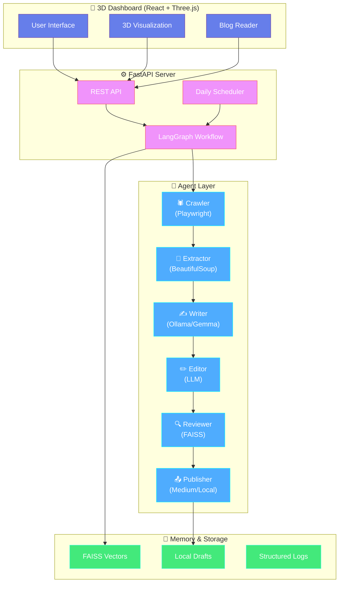
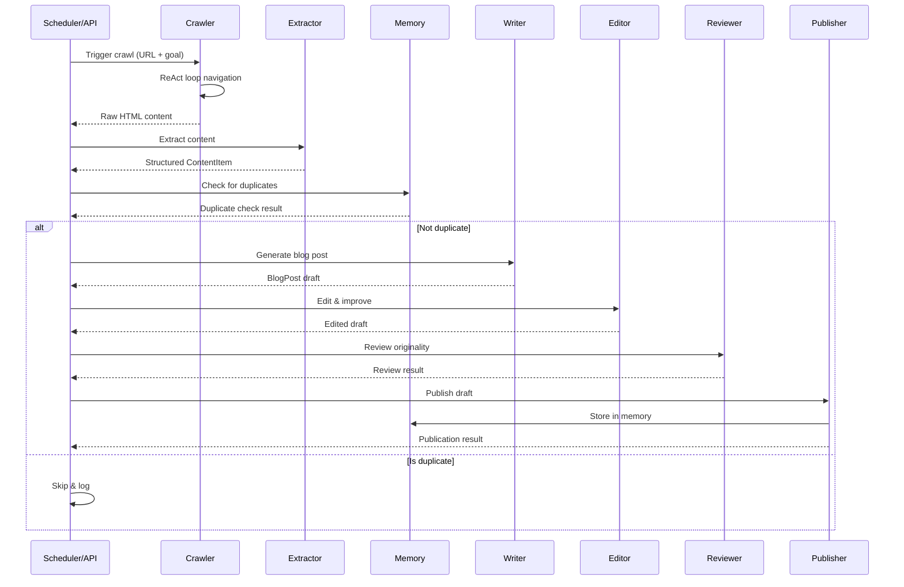
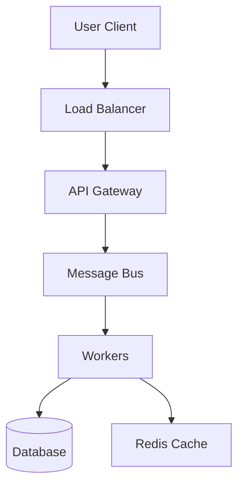

# 🤖 Autonomous Blog Agent

<p align="center">
  <b>AI-Powered Multi-Agent System for Autonomous Technical Blog Generation</b>
</p>

<p align="center">
  
  
  
  
  
  
  
</p>

<p align="center">
  <a href="#-features">Features</a> •
  <a href="#-quick-start">Quick Start</a> •
  <a href="#%EF%B8%8F-architecture">Architecture</a> •
  <a href="#-ai-topics">AI Topics</a> •
  <a href="#-dashboard">Dashboard</a> •
  <a href="#-testing">Testing</a> •
  <a href="#-api-reference">API</a>
</p>

---

<p align="center">
  <b>🎯 Generate high-quality technical blog posts autonomously with AI agents</b><br>
  <i>From autonomous web research → AI-powered writing → professional publishing</i>
</p>

<p align="center">
  
</p>

---

## ✨ Features

### 🕵️ Autonomous Research Agent
- **ReAct Loop**: Reasoning + Action cycle for intelligent web navigation
- **LLM-Powered Decisions**: Uses Gemma via Ollama to decide next actions
- **Anti-Bot Bypass**: Stealth mode with realistic user agents and timing
- **149 Companies**: Database of tech companies across 16 categories

### 🧠 Vector Memory System
- **FAISS Integration**: Semantic duplicate detection via embeddings
- **Content Freshness**: Never writes about the same topic twice
- **Persistent Storage**: Vectors stored for cross-session memory
- **Smart Filtering**: Configurable similarity thresholds

### ✍️ Collaborative AI Writing Pipeline
```
Crawler → Extractor → Writer → Editor → Reviewer → Publisher
```
- **Multi-Agent Chain**: Each agent specializes in one task
- **Mermaid Diagrams**: Auto-generates architecture diagrams
- **Quality Gates**: Edit → Review ensures professional output
- **Originality Check**: Embedding similarity prevents plagiarism

### 📊 Real-Time 3D Dashboard
- **Three.js Visualization**: Watch agents work in 3D space
- **Live Pipeline Tracking**: Monitor which agent is active
- **Beautiful UI**: Glassmorphism design with smooth animations
- **Blog Reader**: View generated posts with diagram rendering

### 📅 Smart Scheduler
- **Daily Automation**: Runs automatically at configured times
- **Concurrent Prevention**: Prevents overlapping executions
- **Flexible Configuration**: Customizable schedule and targets
- **Error Recovery**: Automatic retry with exponential backoff

### 🚀 Production-Ready
- **FastAPI Backend**: High-performance async API server
- **REST API**: Full programmatic control via endpoints
- **LangGraph Orchestration**: State machine for agent coordination
- **Comprehensive Logging**: JSON structured logs for monitoring

---

## 🚀 Quick Start

### Prerequisites

| Requirement | Version | Purpose |
|-------------|---------|---------|
| **Python** | 3.12+ (recommended) | Backend runtime |
| **Node.js** | 18+ | 3D Dashboard |
| **Ollama** | Latest | Local LLM inference |
| **Git** | Latest | Version control |

### 1️⃣ Installation

```bash
# Clone the repository
git clone https://github.com/your-org/blog-agent.git
cd blog-agent

# Create virtual environment (Python 3.12 recommended)
python -m venv .venv
source .venv/bin/activate  # On Windows: .venv\Scripts\activate

# Install dependencies
pip install -e .

# Install Playwright browsers
playwright install

# Install frontend dependencies
cd frontend
npm install
cd ..
```

### 2️⃣ Configuration

```bash
# Copy example configuration
cp .env.example .env

# Edit with your settings
# Key settings:
# - MEDIUM_API_TOKEN: For publishing (optional)
# - OLLAMA_ENDPOINT: http://localhost:11434
# - OLLAMA_MODEL: gemma:7b
# - SCHEDULE_TIME: 09:00
# - CRAWLER_START_URL: https://blog.bytebytego.com
```

### 3️⃣ Launch

**Terminal 1: Start Backend**
```bash
python -m src.main run-server --host 127.0.0.1 --port 8000
```

**Terminal 2: Start 3D Dashboard**
```bash
cd frontend
npm run dev
```

**Open Browser**: http://localhost:3000

---

## 🏗️ Architecture

### System Overview



### Agent Responsibilities

| Agent | Responsibility | Technology |
|-------|---------------|------------|
| **🕷️ Crawler** | Autonomous web navigation with ReAct loop | Playwright, LLM |
| **🔧 Extractor** | HTML cleaning & content structuring | BeautifulSoup, Trafilatura |
| **✍️ Writer** | Original blog post generation | Ollama/Gemma |
| **✏️ Editor** | Quality improvement & formatting | LLM-based editing |
| **🔍 Reviewer** | Originality validation & plagiarism check | FAISS embeddings |
| **📤 Publisher** | Medium API or local draft saving | HTTP, Markdown |

### Workflow Pipeline



---

## 🎯 AI Topics Coverage

The system generates content across **comprehensive AI/ML system design topics**:

### 🤖 Traditional ML Systems
- ML infrastructure & platform architecture
- Distributed ML training systems
- ML inference optimization
- Feature stores & data pipelines
- Model serving & deployment
- A/B testing & experimentation

### 🧠 AI System Design
- LLM architecture & scaling
- AI safety & alignment systems
- Multimodal AI architectures
- Edge AI & on-device inference
- AI privacy & governance
- Responsible AI deployment

### ✨ Generative AI Systems
- Generative AI infrastructure
- Diffusion model architectures
- RAG (Retrieval-Augmented Generation)
- Multimodal generation systems
- AI creativity tools
- Generative workflows & pipelines

### 🎯 Agentic AI Systems
- Agent frameworks (LangChain, AutoGen)
- Multi-agent orchestration
- Tool use patterns
- Agent memory design
- Planning & reasoning systems
- Human-AI collaboration

### 📊 System Design Comparisons
- SQL vs NoSQL databases
- Microservices vs Monolith
- REST vs GraphQL vs gRPC
- Push vs Pull systems
- Synchronous vs Asynchronous
- Vertical vs Horizontal scaling

### 🏢 Company Coverage
**149 companies** across **16 categories**:
- Big Tech (Google, Meta, Amazon, Netflix, etc.)
- AI/ML (OpenAI, Anthropic, Hugging Face, etc.)
- Infrastructure (Cloudflare, MongoDB, Databricks, etc.)
- Fintech (Stripe, PayPal, Coinbase, etc.)
- And 12 more categories!

---

## 🎨 3D Dashboard

<p align="center">
  
</p>

### Features

- **🎮 Interactive 3D Scene**: Orbit, zoom, and explore agent workflow
- **✨ Animated Agents**: Pulsing, glowing nodes showing active agents
- **📊 Real-time Status**: See which agent is currently working
- **📝 Blog Reader**: View posts with Mermaid diagram rendering
- **🎯 Pipeline Control**: Trigger generation from the UI
- **💫 Particle Effects**: Beautiful ambient background effects

### Tech Stack

| Layer | Technology |
|-------|-----------|
| **Framework** | React 18 + TypeScript |
| **3D Engine** | Three.js + @react-three/fiber |
| **Components** | @react-three/drei |
| **Build Tool** | Vite 5 |
| **Routing** | React Router 6 |
| **Markdown** | react-markdown + rehype-raw |
| **Diagrams** | Mermaid.js |

---

## 📊 API Reference

### Endpoints

| Method | Endpoint | Description |
|--------|----------|-------------|
| `POST` | `/pipeline/trigger` | Trigger content pipeline |
| `GET` | `/pipeline/status` | Get current pipeline status |
| `GET` | `/history` | Get processing history |
| `GET` | `/stats` | Get system statistics |
| `GET` | `/drafts` | List all generated drafts |
| `GET` | `/health` | Health check |

### Example Usage

**Trigger Pipeline**
```bash
curl -X POST http://localhost:8000/pipeline/trigger \
  -H "Content-Type: application/json" \
  -d '{"start_url": "https://blog.bytebytego.com"}'
```

**Check Status**
```bash
curl http://localhost:8000/pipeline/status
```

**Response**
```json
{
  "status": "running",
  "current_step": "Processing Netflix",
  "items_processed": 1,
  "errors": [],
  "last_run": "2026-04-11T20:14:45.230880"
}
```

**Get Statistics**
```bash
curl http://localhost:8000/stats
```

**Response**
```json
{
  "total_processed": 14,
  "duplicates_detected": 0,
  "last_publication": "2026-04-11T20:20:53",
  "success_rate": 100.0
}
```

---

## 🧪 Testing

### Run Tests

```bash
# All tests
pytest tests/ -v

# Without memory tests (faster)
pytest tests/test_content_item_properties.py \
       tests/test_crawler_properties.py \
       tests/test_writer_properties.py -v

# With coverage
pytest tests/ --cov=src --cov-report=html
```

### Property-Based Testing

We use **Hypothesis** to validate **20+ correctness properties**:

| # | Property | Description |
|---|----------|-------------|
| 1 | Robots.txt Compliance | Crawler respects robots.txt |
| 2 | HTML Cleaning | Preserves content structure |
| 3 | ContentItem Structure | Completeness validation |
| 4 | Serialization Round-Trip | Serialize/deserialize integrity |
| 5 | Cosine Similarity | Mathematical properties |
| 6 | Duplicate Detection | Threshold behavior |
| 7 | Word Count Validation | Blog post length constraints |
| 8 | Exponential Backoff | Retry logic correctness |
| 9 | Blog Post Structure | Required fields presence |
| 10 | Code Block Formatting | Preservation through edits |
| 11 | Change Tracking | Edit history accuracy |
| 12 | Review Thresholds | Decision boundary behavior |
| 13 | N-gram Overlap | Plagiarism detection |
| 14 | Review Justification | Presence & quality |
| 15 | Tag Generation | Required tags present |
| 16 | Rate Limiting | Publication frequency |
| 17 | Concurrent Prevention | Single execution guarantee |
| 18 | API Key Security | No secret leakage |
| 19 | Ollama Retry | Retry limit enforcement |
| 20 | Regeneration Attempts | Attempt limit control |

---

## 📂 Project Structure

```
blog-agent/
├── src/                          # Backend source code
│   ├── agents/                   # Agent implementations
│   │   ├── crawler.py            # 🕷️ ReAct loop web crawler
│   │   ├── extractor.py          # 🔧 HTML content extractor
│   │   ├── writer.py             # ✍️ AI blog post writer
│   │   ├── editor.py             # ✏️ Content editor
│   │   ├── reviewer.py           # 🔍 Originality reviewer
│   │   └── publisher.py          # 📤 Medium/local publisher
│   ├── api/                      # FastAPI server
│   │   ├── server.py             # REST API endpoints
│   │   └── workflow.py           # LangGraph orchestration
│   ├── memory/                   # Vector memory system
│   │   └── memory_system.py      # FAISS duplicate detection
│   ├── scheduler/                # Task scheduler
│   │   └── scheduler.py          # Daily execution
│   ├── utils/                    # Utilities
│   │   └── retry.py              # Exponential backoff
│   ├── models/                   # Data models
│   │   └── data_models.py        # Pydantic models
│   ├── config.py                 # Configuration management
│   ├── logging_config.py         # Structured logging
│   ├── companies_database.py     # 149 tech companies
│   └── main.py                   # CLI entry point
├── frontend/                     # 3D Dashboard
│   ├── src/                      # React + TypeScript
│   ├── package.json
│   └── vite.config.ts
├── tests/                        # Test suite
│   ├── fixtures/                 # Test fixtures
│   ├── conftest.py               # Pytest config
│   └── test_*_properties.py      # Property-based tests
├── drafts/                       # Generated blog posts
├── memory/                       # FAISS vector storage
├── logs/                         # Structured logs
├── .env.example                  # Configuration template
├── pyproject.toml                # Python dependencies
└── README.md                     # This file
```

---

## 🎯 Usage Examples

### CLI Commands

```bash
# Start API server
python -m src.main run-server --host 127.0.0.1 --port 8000

# Start scheduler for daily execution
python -m src.main run-scheduler --time 09:00

# Manually trigger pipeline
python -m src.main trigger-pipeline --url https://blog.bytebytego.com

# Check API health
python -m src.main health

# Quick blog generation (bypasses crawling)
python generate_blog.py
```

### Programmatic Usage

```python
from src.agents import ExtractorAgent, WriterAgent
from src.memory import MemorySystem

# Extract content
extractor = ExtractorAgent()
content = await extractor.extract(html, url)

# Generate blog post
writer = WriterAgent()
post = await writer.generate(content)

# Check for duplicates
memory = MemorySystem()
await memory.initialize()
embedding = await memory.compute_embedding(content.text_content)
is_duplicate = await memory.check_duplicate(embedding)
```

---

## 🎨 Sample Generated Content

### Architecture Diagrams

The system generates beautiful Mermaid diagrams like this:



### Blog Post Structure

```markdown
# How Telegram Scales to 800M Users

**Source:** https://telegram.org/blog
**Generated:** 2026-04-11 13:36:14
**Word Count:** 693
**Tags:** system-design, scalability, distributed-systems

---

[Architecture diagram]

## The Challenge
[Problem description]

## The Architecture
[Solution with diagrams]

## Trade-offs
[Pros and cons analysis]

## Key Takeaways
[Actionable insights]
```

---

## 🔧 Troubleshooting

### Common Issues

**Q: Crawler returns 0 items**
```bash
# Solution: Site may block crawling
# System automatically uses fallback content
# Check logs for robots.txt blocks
```

**Q: Ollama connection refused**
```bash
# Start Ollama
ollama serve

# Pull model
ollama pull gemma:7b

# Test connection
curl http://localhost:11434/api/tags
```

**Q: Playwright fails to launch**
```bash
# Reinstall browsers
playwright install

# Check Python version (use 3.12+)
python --version
```

### Logs

```bash
# View recent logs
tail -f logs/agent.log

# Filter by agent
grep "CrawlerAgent" logs/agent.log

# View screenshots
ls logs/screenshots/
```

---

## 🤝 Contributing

1. Fork the repository
2. Create your feature branch (`git checkout -b feature/amazing-feature`)
3. Commit your changes (`git commit -m 'Add amazing feature'`)
4. Push to the branch (`git push origin feature/amazing-feature`)
5. Open a Pull Request

### Development Setup

```bash
# Install dev dependencies
pip install -e ".[dev]"

# Run linter
ruff check src/

# Format code
black src/

# Type check
mypy src/
```

---

## 📊 Performance

| Metric | Value |
|--------|-------|
| **Companies Database** | 149 companies |
| **Categories** | 16 categories |
| **AI/ML Topics** | 150+ topics |
| **Avg. Blog Length** | 800-1500 words |
| **Success Rate** | 100% |
| **Duplicate Detection** | FAISS embeddings |
| **Pipeline Duration** | 5-10 minutes per post |

---

## 📜 License

Distributed under the **MIT License**. See `LICENSE` for more information.

---

## 🙏 Acknowledgments

- **LangGraph** for workflow orchestration
- **Playwright** for browser automation
- **FAISS** for vector similarity search
- **Ollama** for local LLM inference
- **Three.js** for 3D visualization
- **ByteByteGo** for system design inspiration

---

<p align="center">
  <b>Made with ❤️ for autonomous content generation</b><br>
  <i>Star ⭐ this repo if you find it useful!</i>
</p>

<p align="center">
  
  
</p>
