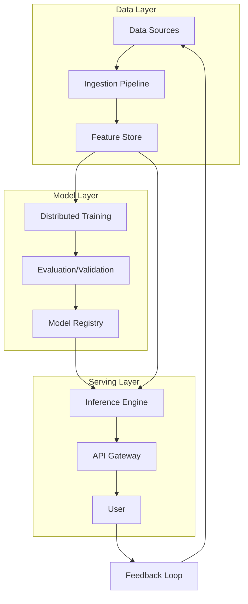
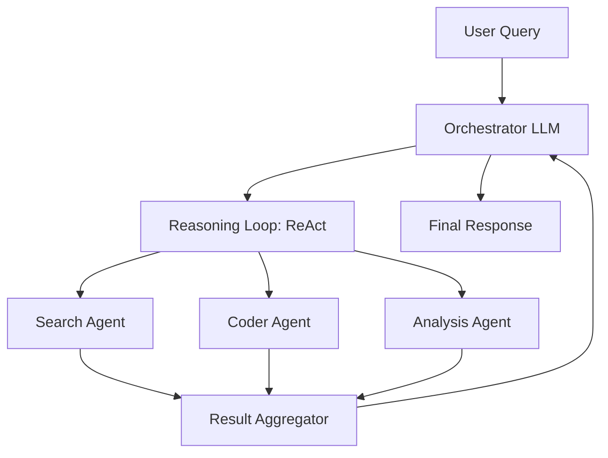
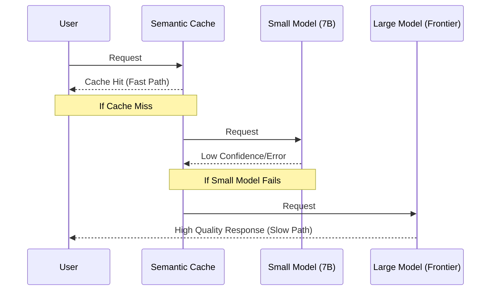

# AI System Design: From Simple Inference to Agentic Workflows

**Source:** https://engineering.roblox.com/
**Generated:** 2026-04-11 20:20:53
**Word Count:** 1120
**Tags:** system-design, generative-ai, distributed-systems, mlops, llm-architecture

---

# AI System Design: From Simple Inference to Agentic Workflows

By the end of this post, you'll be able to architect a production-grade AI system capable of handling millions of requests, understand the critical trade-offs between predictive and agentic AI, and avoid the "training-serving skew" that kills most ML projects in production.

### The Challenge: Why AI Systems Break at Scale

Building a prototype in a Jupyter notebook is easy. Building a system that serves 100k requests per second with p99 latency under 200ms is a nightmare. 

Traditional software engineering is deterministic: `Input A` always leads to `Output B`. AI systems, however, are probabilistic. They drift, they hallucinate, and they consume massive amounts of GPU memory. When you transition from a single model to an agentic workflow—where an AI decides which tools to call and how to reason through a problem—the complexity doesn't just grow; it explodes.

Most teams fail because they treat AI as a "black box" API call. In reality, a production AI system is a complex distributed system where the model is just one component. The real challenge lies in the "plumbing": data freshness, feature consistency, and the orchestration of multi-agent loops.

### The Architecture: The Three-Layer Cake

To build a resilient AI system, you must decouple the lifecycle of the data from the lifecycle of the model and the request. We divide this into the Data Layer, the Model Layer, and the Serving Layer.

This separation prevents the dreaded **Training-Serving Skew**. This occurs when your training pipeline uses a Python script to calculate a "user average spend" over six months, but your production API uses a different SQL query that calculates it over three months. Because the model receives data it doesn't recognize, accuracy plummets. A unified Feature Store (such as Feast or Hopsworks) ensures that the exact same logic is applied to both training and inference.

### Core Components: Moving Toward Agentic AI

The industry is shifting away from "Predictive AI" (e.g., *Is this fraud? Yes/No*) toward "Agentic AI" (e.g., *Find the fraud, trace the money, and draft a report*). This requires a fundamental shift from a linear pipeline to a decision loop.

In an agentic system, we employ the **Orchestrator-Worker pattern**. Instead of relying on one monolithic model to handle everything, a high-reasoning "Brain" (the Orchestrator) breaks the goal into sub-tasks and delegates them to specialized agents.

**The Reasoning Loop (ReAct):** Agents don't just guess; they follow a *Reason-Act* cycle:
1. **Thought:** "I need to find the current stock price of NVDA."
2. **Action:** Call `get_stock_price("NVDA")`.
3. **Observation:** "Price is $120."
4. **Thought:** "Now I need to compare this to the 50-day moving average."

This loop transforms an AI from a simple chatbot into a functional software engineer. However, this power comes with a cost: every loop adds latency. If an agent loops five times and each LLM call takes two seconds, your user is staring at a loading spinner for ten seconds. This is where strategic system design becomes critical.

### Data & Workflow: The Hot Path vs. The Cold Path

In a high-scale system, running a full agentic loop for every request is unsustainable. Instead, you should split your workflow into **Offline (Cold)** and **Online (Hot)** paths.

**The Cold Path (Batch):**
This is where the heavy lifting occurs. You run massive Spark jobs to compute embeddings, train models on GPUs, and populate vector databases. Here, you prioritize throughput over latency. If a model takes 12 hours to train, it is acceptable as long as the resulting model is accurate.

**The Hot Path (Real-time):**
When a user hits your API, you are on the "Hot Path." There is no time to retrain a model. Instead, you utilize:
- **Semantic Caching:** Rather than a literal key-value match (which fails if a user changes a single word), you embed the query and check a vector DB for a "close enough" previous answer. This can reduce GPU costs by 30–50%.
- **Vector Retrieval (RAG):** Instead of feeding the LLM 100 documents, you use an index (like HNSW) to find the top three most relevant chunks and inject only those into the prompt.
- **Micro-batching:** The inference engine groups multiple incoming requests into a single GPU batch to maximize throughput without significantly spiking latency.

### Trade-offs & Scalability: The Hard Truths

Every design decision involves a trade-off. In AI, the most painful conflict is **Accuracy vs. Latency**.

Frontier models (like GPT-4o or Claude 3.5) offer incredible reasoning but suffer from slower token generation and higher costs. Conversely, a distilled 7B parameter model is lightning-fast but may hallucinate a fake API endpoint.

**The Solution: Fallback Hierarchies.**
Avoid betting on a single model. Instead, design a cascade:
1. **Cache Hit?** $\rightarrow$ Return immediately (5ms).
2. **Small Model Confidence High?** $\rightarrow$ Return response (100ms).
3. **Complex Query?** $\rightarrow$ Route to Frontier Model (2s).

**Scaling the Infrastructure:**
- **Model Parallelism:** When a model is too large for a single GPU (e.g., 175B parameters), you split the model weights across multiple GPUs.
- **Data Parallelism:** When dealing with massive datasets, you deploy a copy of the model to 100 GPUs and split the data between them.
- **Quantization:** Moving from FP32 to INT8 precision. This results in a negligible loss of accuracy but cuts the memory footprint in half and doubles inference speed.

### Key Takeaways

- **Stop treating LLMs as simple APIs.** Treat them as components within a distributed system, supported by a dedicated data layer (Feature Store) and a serving layer.
- **Solve for skew early.** Use a unified feature store to ensure training and serving utilize identical data logic.
- **Use agentic patterns judiciously.** The Orchestrator-Worker pattern is powerful, but the ReAct loop can kill latency. Mitigate this using semantic caching and model cascades.
- **Design for failure.** Implement fallback models. If your 70B model times out, a response from a 7B model is always better than a 500 Error page.

---

*This post was generated by the Autonomous Blog Agent*
*Includes architecture diagrams and visual examples*