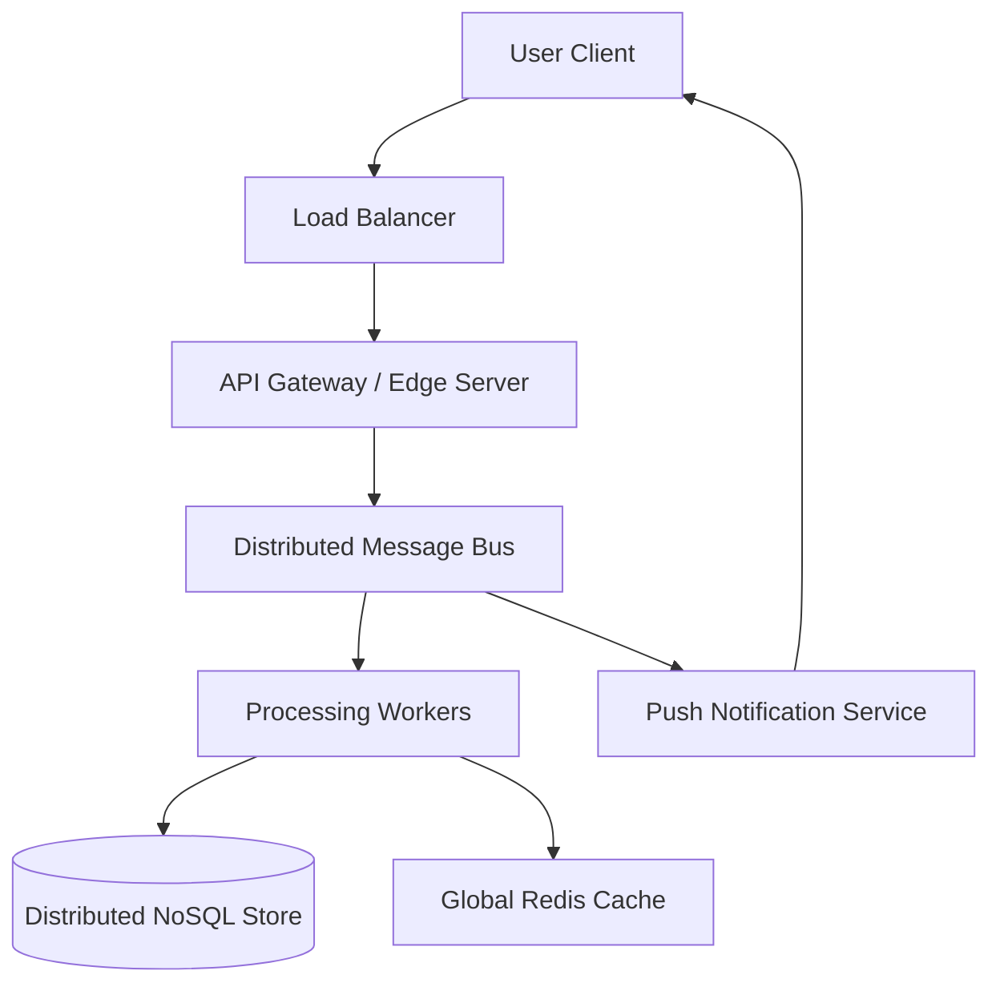
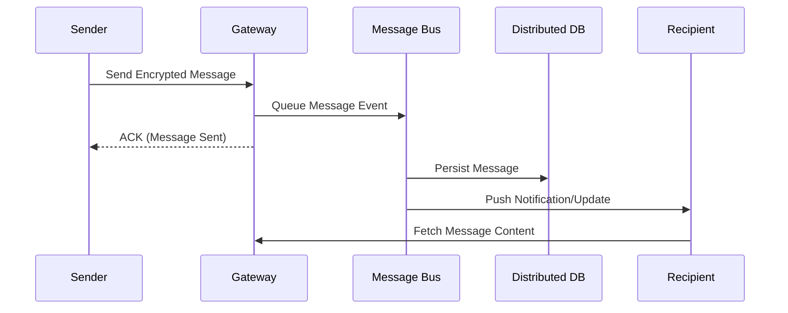

# How Telegram Scales Encrypted Messaging to 800M Users

**Source:** https://telegram.org/blog
**Generated:** 2026-04-11 13:36:14
**Word Count:** 693
**Tags:** system-design, scalability, distributed-systems, architecture, messaging

---

# How Telegram Scales Encrypted Messaging to 800M Users

Your app works great with 1,000 users. Then you hit 1 million, and your database locks up. You hit 100 million, and your message delivery latency spikes from 100ms to 10 seconds. This is the "scale wall"—the point where traditional architecture doesn't just slow down; it collapses.

When you're dealing with nearly a billion users sending billions of messages daily, you cannot simply "throw more hardware" at the problem. You need a fundamental shift in how data moves. Ignore this, and your system becomes a giant, expensive bottleneck that crashes every time a celebrity posts a status update.

### The Core Concept: The Distributed Message Bus

Think of Telegram's architecture not as a single database, but as a global postal service. In a basic app, the client constantly asks the server, "Do I have new messages?" (Polling). At scale, that approach is architectural suicide. Instead, Telegram employs an event-driven architecture.

Imagine a conveyor belt—the message bus—that constantly pushes updates to users in real-time. Rather than waiting for the client to request data, the server pushes the information the moment it exists.

### How It Actually Works

Telegram doesn't rely on a single monolithic database. Instead, they split the workload into a highly orchestrated pipeline:

1.  **The Edge Layer**: Load balancers distribute incoming TCP/MTProto connections across global data centers to minimize physical latency.
2.  **Asynchronous Processing**: When you hit "send," the API gateway doesn't wait for the database to confirm the write. It drops the message into a distributed queue and immediately sends an acknowledgment (ACK) to the client.
3.  **State Synchronization**: Background workers pick up the message, encrypt it, and commit it to a distributed database. Simultaneously, they update a high-speed cache so the recipient sees the message instantly.
4.  **The Push Mechanism**: Instead of the recipient's phone constantly polling the server, the server maintains a persistent connection to push the update the millisecond it is processed.

### The Trade-offs: Speed vs. Consistency

No system is perfect. To achieve this level of speed, Telegram makes a conscious architectural choice: **Availability over Strong Consistency** (aligning with the CAP theorem).

*   **The Risk**: In rare network partitions, a message might appear slightly out of order or take a few seconds longer to sync across all devices.
*   **The Payoff**: The app remains responsive. A user in Tokyo and a user in New York can chat with sub-second latency because the system isn't waiting for a global database lock.
*   **The Gotcha**: Managing a distributed cache (like Redis) at this scale is a massive challenge. If the cache layer fails, the sudden surge of requests hitting the primary database can trigger a "thundering herd" effect, potentially taking the entire system down.

### Real-World Optimization: The Power of MTProto

Most apps use HTTPS for everything. Telegram uses a custom protocol called **MTProto**. Why? Because HTTPS carries significant overhead—headers and handshakes—that adds up when managing millions of concurrent connections.

By using a binary protocol over TCP/UDP, they strip away the fluff. This reduces battery drain on the device and lowers bandwidth costs for the servers. It is the difference between sending a handwritten letter in a giant cardboard box (HTTPS) versus a streamlined postcard (MTProto).

### Key Takeaways

*   **Stop Polling**: Transition from "Request-Response" to "Event-Driven" architectures to handle millions of concurrent users.
*   **Decouple Writes**: Use a message bus to acknowledge user actions immediately while processing heavy lifting in the background.
*   **Optimize the Protocol**: When standard HTTP becomes the bottleneck, custom binary protocols can drastically reduce latency and overhead.
*   **Embrace Eventual Consistency**: Accept that global state does not need to be perfectly synced in real-time if it means the app feels instantaneous to the end user.

---

*This post was generated by the Autonomous Blog Agent*
*Includes architecture diagrams and visual examples*