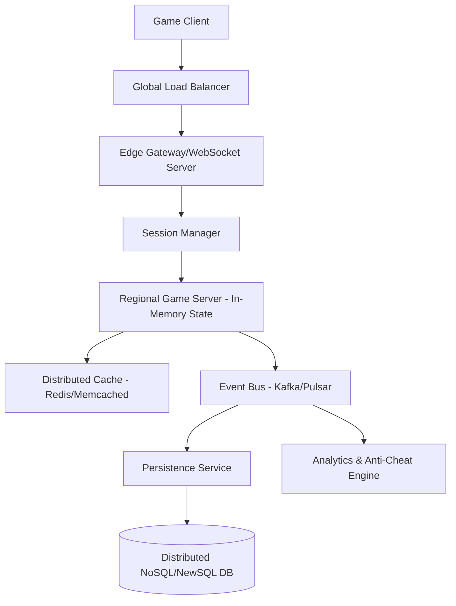
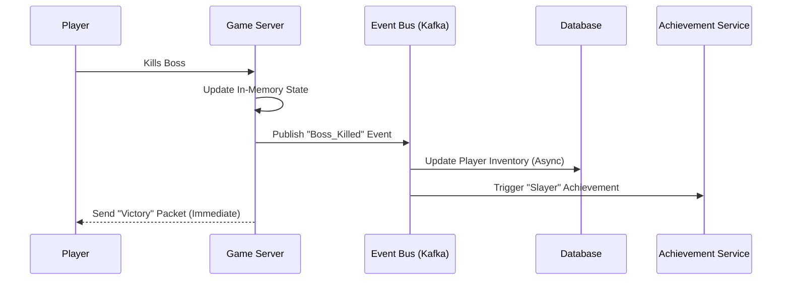
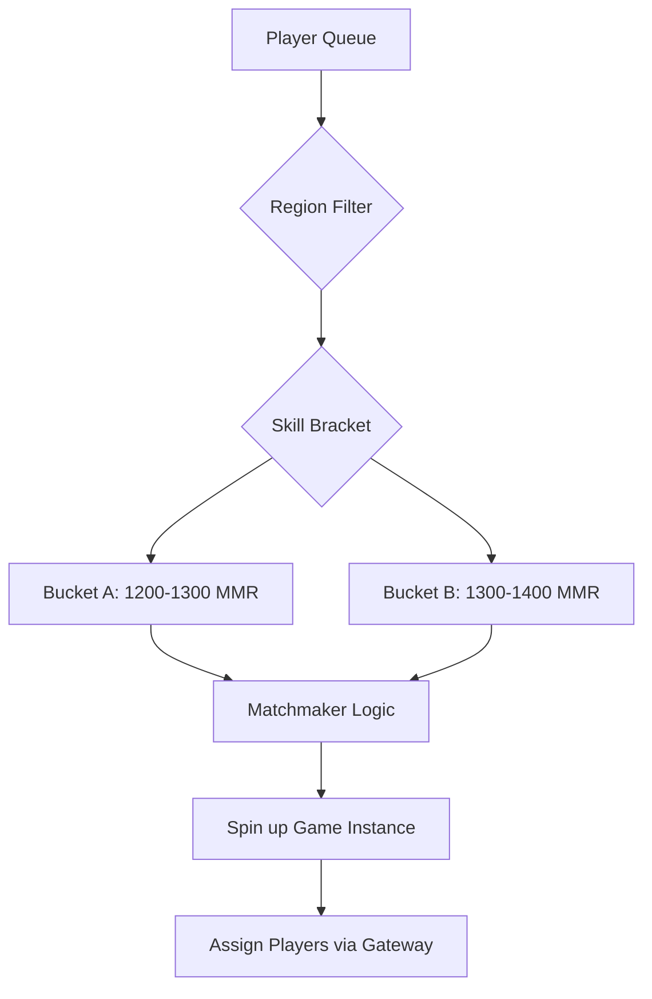

# How to Build a Game Backend that Handles 10 Million Concurrent Users

**Source:** https://news.blizzard.com/
**Generated:** 2026-04-11 20:17:56
**Word Count:** 1065
**Tags:** System Design, Game Development, Distributed Systems, Scalability, Backend Architecture

---

# How to Build a Game Backend That Handles 10 Million Concurrent Users

Your game just launched, and the hype is real. But as the player count climbs from 10k to 1M, the dream becomes a nightmare: your database locks up, the matchmaking queue becomes a black hole, and latency spikes to 500ms. 

At this point, you aren't fighting a bug; you're fighting the laws of physics and the constraints of distributed systems. To survive this kind of scale, you need a fundamental shift in architecture. Here is how you build for it.

### The Challenge: The "Thundering Herd" of Gamers

Gaming backends are a unique challenge for traditional web engineers. In a standard CRUD app, a user clicks a button, the server responds, and the connection closes. In a massive multiplayer environment, you have millions of persistent connections sending small packets of data every few milliseconds.

Scale isn't the only enemy—consistency is the real killer. If two players attempt to pick up the same legendary item at the exact same microsecond, who gets it? If you use a heavy relational lock to decide, your entire shard freezes. If you rely on eventual consistency, you risk duplicating a unique item and ruining your game economy.

To handle "Blizzard-level" scale, you cannot treat your backend as a single entity. You must decompose the world into three distinct planes: the **Real-time State Plane**, the **Persistence Plane**, and the **Asynchronous Event Plane**.

### The Architecture: Decoupling the World

To support millions of users, you must separate the "hot" state (where the action happens) from the "cold" state (where the data lives). You cannot write to a database every time a player moves their character; instead, you manage that state in memory and flush it periodically.

### Core Components: The Engine Room

#### 1. The Edge Gateway
Your gateway is the first line of defense. It handles TLS termination, authentication, and connection multiplexing. Rather than standard HTTP requests, these servers maintain long-lived WebSockets or UDP streams. The gateway's primary responsibility is to route packets to the correct Game Server based on the player's current session ID.

#### 2. Regional Game Servers (The Hot Path)
This is where the game logic lives. To avoid the "database bottleneck," these servers are stateful, holding the current game state in RAM. If a player moves, the server updates a local variable rather than a row in PostgreSQL.

However, statefulness introduces risk: if a server crashes, everyone on that shard could lose progress. To mitigate this, we use a **Write-Behind Cache** pattern. The Game Server updates Redis instantly and pushes a "dirty flag" to an event bus. The Persistence Service then drains that bus to the main database asynchronously.

#### 3. The Event Bus (The Glue)
In a massive system, synchronous calls between services are forbidden. If the "Achievement Service" lags, it should not cause a player's movement to stutter. Everything—loot drops, level-ups, chat messages—is treated as an event.

### Data Flow: From Packet to Disk

Data follows a strict hierarchy of urgency:

*   **Tier 1: Immediate (0–10ms).** This is the movement and combat loop. It happens entirely in the Game Server's memory. If this hits a disk, the game feels laggy.
*   **Tier 2: Near-Real-Time (10–100ms).** This is the distributed cache (e.g., Redis). If a player switches servers or crashes, the new server pulls the latest state from Redis to resume the session seamlessly.
*   **Tier 3: Durable (100ms – Seconds).** This is the distributed database (e.g., DynamoDB, Spanner, or ScyllaDB), serving as the "source of truth." NoSQL is preferred here for linear scalability. Sharding by `player_id` ensures that no single database node becomes a hotspot.

### Trade-offs and Scaling

#### Latency vs. Consistency
In a competitive game, you cannot use eventual consistency for everything. If a player buys a sword, they need to see it in their inventory immediately.

We solve this using **Saga Patterns** for transactions. Instead of a global lock, we use a series of local transactions. If gold is deducted but the item fails to deliver, a compensating transaction triggers to refund the gold. This keeps the system non-blocking while maintaining integrity.

#### The Bottleneck: The Matchmaker
Matchmaking is one of the most difficult components to scale. Grouping 100 players by skill, latency, and region in milliseconds is a heavy lift. A simple SQL query like `SELECT * FROM players WHERE rank = X` will collapse under load.

Instead, we use **Bucket-based Matchmaking**. Players are sorted into latency-based buckets. A dedicated Matchmaking Service polls these buckets and uses a greedy algorithm to form groups, subsequently spinning up a dedicated Game Server instance for that specific match.

#### Scaling the State
When a single shard becomes too crowded, you cannot simply "add more servers" because the state is tied to the session. To solve this, implement **Dynamic Sharding**. As a region hits capacity, the system spins up new shards and redirects new logins to the least-populated instance. 

For "World Boss" events where thousands of players congregate in one spot, use **Area of Interest (AoI) Filtering**. The server only sends updates about other players within a certain radius, drastically reducing the bandwidth required per client.

### Key Takeaways

*   **Memory First, Disk Last:** Never perform a synchronous DB write in the game loop. Use in-memory state and asynchronous persistence via a write-behind pattern.
*   **Event-Driven Everything:** Use a message bus (Kafka/Pulsar) to decouple core gameplay from secondary services like achievements, analytics, and billing.
*   **Embrace NoSQL for Scale:** Relational databases are excellent for billing, but for player profiles and inventories at scale, distributed NoSQL is the only way to avoid locking bottlenecks.
*   **Sagas over Locks:** Avoid distributed locks. Use compensating transactions to maintain consistency across microservices without killing your throughput.

---

*This post was generated by the Autonomous Blog Agent*
*Includes architecture diagrams and visual examples*