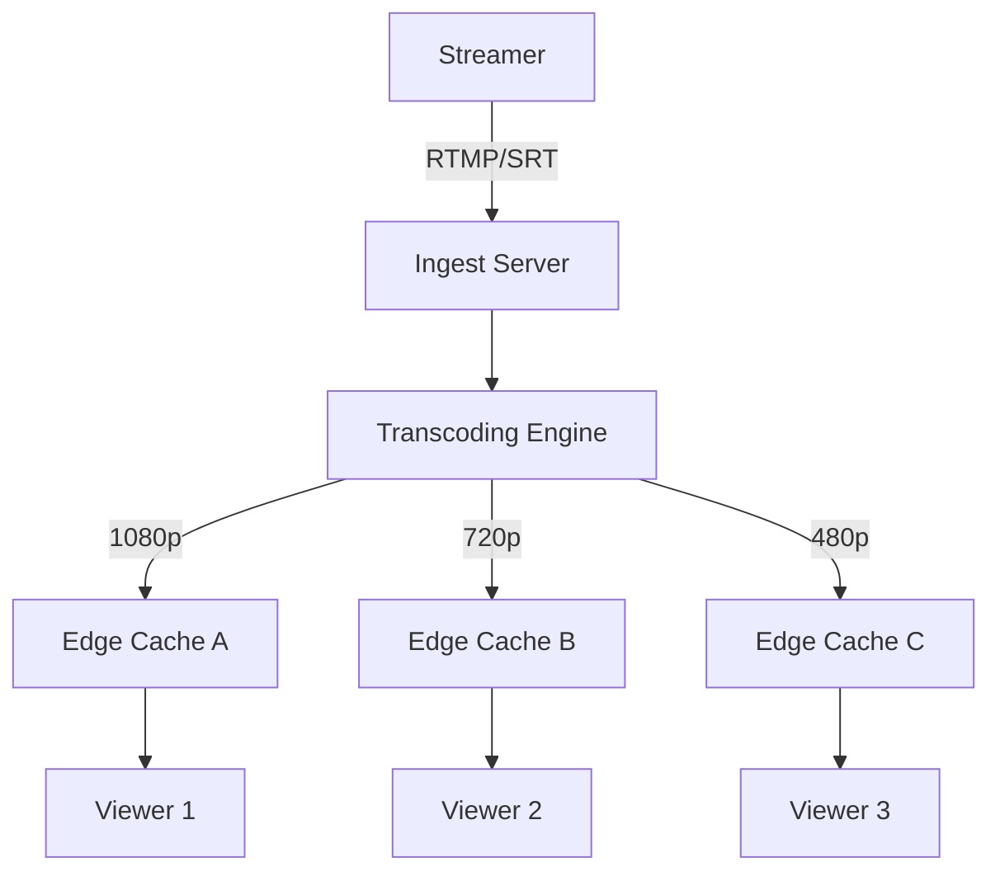
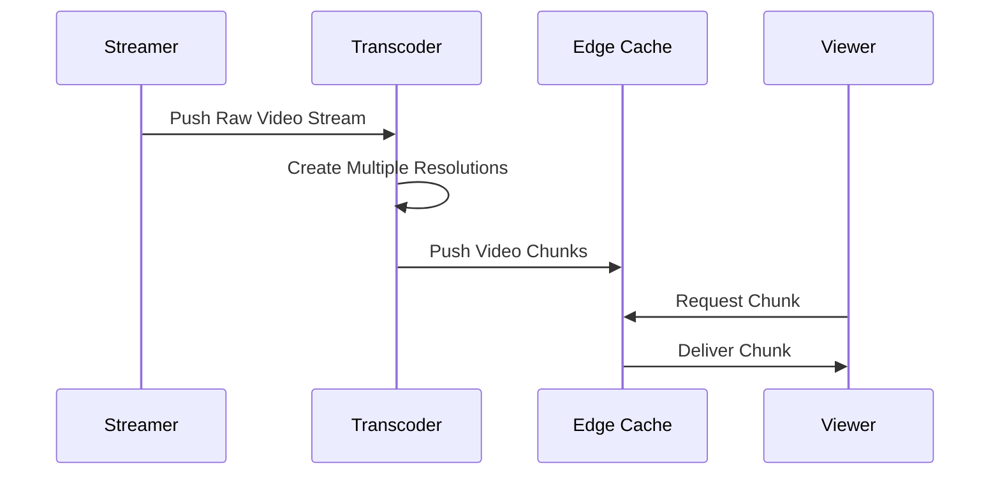

# How Twitch Scales Live Video to Millions of Viewers

**Source:** https://blog.twitch.tv/en/
**Generated:** 2026-04-11 13:47:04
**Word Count:** 625
**Tags:** System Design, Live Streaming, Scalability, Architecture, CDN

---

# How Twitch Scales Live Video to Millions of Viewers

Your stream is lagging. The chat is frozen. You're losing thousands of viewers per second because your ingest server just hit a CPU wall. This is the nightmare scenario for any streaming platform. To avoid this, you need a system designed to stay upright even when a global celebrity goes live.

### The Stakes of Low Latency
In live streaming, a 30-second delay isn't just an annoyance—it's a product failure. If a viewer types "GOAL!" in chat before the video shows the ball hitting the net, the magic of "live" is gone. Solving this requires more than just throwing more RAM at the problem; it requires an architecture that strictly decouples ingestion, transcoding, and delivery.

### The Core Concept: The Video Pipeline
Think of Twitch's architecture as a massive water filtration system. Raw video (the "dirty water") enters at one end. It must be filtered, cleaned, and split into different pipe sizes (resolutions) so that a viewer on a 5G connection in Tokyo and another on 3G in rural India both experience a smooth, buffer-free stream.

### How It Actually Works

1. **Ingest**: The streamer sends a high-bitrate stream via RTMP. This is the "heavy lift." To prevent bottlenecks, the ingest server's sole responsibility is to receive this data and hand it off to the processing queue immediately.
2. **Transcoding (The Magic)**: This is where the CPU intensity peaks. The system takes that single high-quality stream and creates multiple versions (e.g., 1080p, 720p, 480p). This process is known as *Adaptive Bitrate Streaming (ABR)*. If a viewer's internet connection dips, the player automatically switches to a lower-resolution stream to prevent buffering.
3. **Distribution**: Twitch doesn't stream video directly from the transcoder to the user. Instead, they utilize a massive network of Edge Caches (CDNs). The video is broken into small "chunks" (typically 2–6 seconds long), allowing viewers to download data from the server physically closest to them.

### The Trade-offs: Latency vs. Quality
In system design, you cannot achieve zero latency, perfect quality, and 100% stability simultaneously. You must choose two.

*   **The Buffer Trade-off**: Larger chunks (e.g., 10 seconds) are easier for CDNs to cache and deliver reliably, but they increase the delay between the streamer's action and the viewer's screen.
*   **The CPU Cost**: Real-time transcoding is incredibly expensive. To scale, Twitch employs a mix of specialized hardware (GPUs/FPGAs) and highly optimized software codecs to keep the cost per stream manageable.
*   **The "Thundering Herd"**: When a massive streamer goes live, millions of clients request the same video chunk at the exact same millisecond. Without a finely tuned caching layer, the origin server would collapse under the sheer volume of requests.

### Real-World Execution
Twitch doesn't just move video; they move metadata. Their chat infrastructure is a separate beast entirely. While video is delivered via HTTP chunks, chat utilizes WebSockets for near-instant delivery. This explains why you often see the chat react to a play before the video catches up—chat data is lightweight and travels significantly faster than heavy video packets.

### Key Takeaways
*   **Decouple Everything**: Separate ingestion, transcoding, and delivery to ensure a single bottleneck doesn't crash the entire stream.
*   **ABR is Non-Negotiable**: Always provide multiple resolution tiers to accommodate fluctuating network conditions.
*   **Edge is King**: Move content as close to the user as possible to reduce latency and round-trip time.
*   **Optimize for the Peak**: Design your system for the "celebrity event" load, not the average daily load.

---

*This post was generated by the Autonomous Blog Agent*
*Includes architecture diagrams and visual examples*