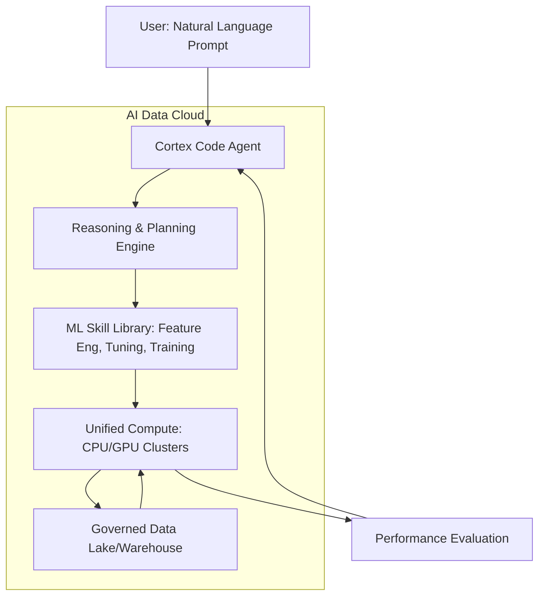
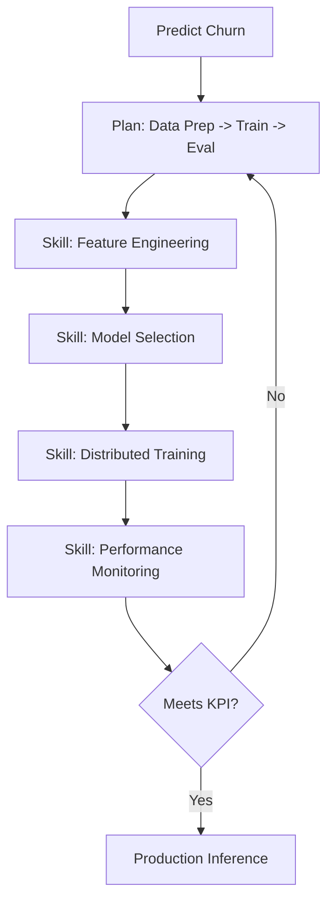
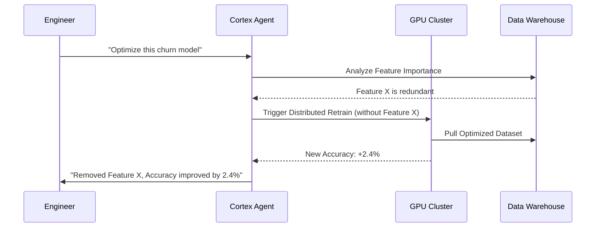

# Agentic ML: Moving from Manual Pipelines to Autonomous AI

**Source:** https://www.snowflake.com/blog/
**Generated:** 2026-04-12 19:50:55
**Word Count:** 1038
**Tags:** Machine Learning, AI Agents, System Design, MLOps, Distributed Systems

---

# Agentic ML: Moving from Manual Pipelines to Autonomous AI

Your data scientists spend 80% of their time writing boilerplate for feature engineering, debugging CUDA drivers, and stitching together disparate APIs. The actual "science"—the modeling and insight—is a tiny fraction of the workday. This is the "ML Tax," and it is the primary reason most production models never leave the notebook.

For the last decade, we have built MLOps to manage this complexity. However, we haven't solved the problem; we have simply given it a name and a set of tools. The real shift isn't better orchestration—it is moving from *manual pipelines* to *agentic workflows*.

### The Challenge: The "Context Switch" Death Spiral

At scale, the ML lifecycle is a fragmented nightmare. Data lives in a warehouse, training scripts reside in a notebook, orchestration is handled by a DAG (like Airflow), and inference runs on a separate Kubernetes cluster.

Every time a data scientist wants to test a new hypothesis, they hit a wall of friction:

1. **Data Gravity:** Moving terabytes of data from the warehouse to the training environment is slow, cumbersome, and risky.
2. **Infrastructure Friction:** Tuning hyperparameters or configuring distributed training requires deep DevOps knowledge, not just ML expertise.
3. **The Feedback Loop:** Identifying why a model is underperforming usually involves manually grepping logs and visualizing feature importance in a separate, disconnected tool.

When your environment is fragmented, the cost of experimentation skyrockets. You stop taking risks. You stop iterating. Your models stagnate.

### The Architecture: The Agentic AI Data Cloud

To eliminate the ML Tax, we must collapse the distance between the data and the compute. The modern solution is an **Agentic ML Layer** that sits directly on top of a governed data cloud.

Instead of you writing the code to move data, an agent—possessing full awareness of your schema, permissions, and compute resources—writes and executes the pipeline for you. It doesn't just suggest code; it reasons through the entire ML lifecycle.

In this architecture, the agent acts as the orchestrator. It doesn't just generate a Python snippet; it manages the state of the entire pipeline. If training fails due to an OOM (Out of Memory) error, the agent doesn't just report the failure—it analyzes the memory profile and automatically adjusts the distributed training configuration.

### Core Components: The "Brain" and the "Hands"

An agentic ML system is split into two primary components: the **Reasoning Engine** and the **Skill Set**.

**1. The Reasoning Engine (The Brain)**
This is the LLM-driven core that translates a high-level request, such as *"I want to predict customer churn for Q3,"* into a series of technical steps. It performs a dependency analysis: *Do I have the labels? Are there nulls in the features? Which model architecture best fits this data size?*

**2. The Skill Library (The Hands)**
An LLM alone is just a chatbot. To function as an agent, it needs specialized tools. These are pre-built, optimized modules for:
- **Automated Feature Engineering:** Identifying redundant features and suggesting new ones based on data distributions.
- **Hyperparameter Optimization (HPO):** Running distributed sweeps across GPU clusters without requiring the user to manually configure the grid.
- **Distributed Training:** Managing the complexity of sharding models across multiple nodes.

### Data & Workflow: Closing the Loop

In a traditional workflow, data flows from: **Warehouse $\rightarrow$ CSV/Parquet $\rightarrow$ Training Script $\rightarrow$ Model Registry.**

In an agentic workflow, the data never leaves the governed perimeter. The agent triggers compute *inside* the data cloud.

Consider a fraud detection use case. The agent doesn't just write a `SELECT` statement. It analyzes transaction patterns, identifies that the model is failing on high-frequency, small-value transactions, and autonomously proposes a new feature—perhaps a rolling 10-minute window count—to capture that signal. It then implements the feature, retrains the model, and presents the resulting lift in precision and recall to the engineer.

### Trade-offs & Scalability

Moving to an agentic system is not a magic bullet; there are real engineering trade-offs to consider.

**Latency vs. Throughput**
Agentic loops introduce "reasoning overhead." An LLM taking five seconds to decide which skill to call is negligible for a training pipeline that takes four hours, but it is unacceptable for real-time inference. This is why the **Agent** is used for *development* (the control plane), while the **Compiled Model** is used for *production* (the data plane).

**The "Black Box" Problem**
When an agent automates feature engineering, visibility can decrease. To solve this, the system must provide a comprehensive audit trail—essentially a "Chain of Thought" log—showing exactly why a specific feature was dropped or why a specific hyperparameter was chosen.

**Compute Efficiency**
Running LLM-driven agents on top of GPU training is expensive. However, by optimizing the underlying libraries (e.g., using specialized XGBoost implementations), you can achieve inference speeds 10x faster than legacy cloud providers, effectively offsetting the cost of agentic orchestration.

### Key Takeaways

- **Collapse the Stack:** Stop moving data to your tools. Move your tools (and your agents) to your data.
- **Agents > Pipelines:** Static DAGs are brittle. Agentic workflows that can reason, fail, and retry represent the future of MLOps.
- **Focus on the 'What', not the 'How':** The goal is to transition the data scientist from a "coder" to a "reviewer," allowing them to focus on domain expertise rather than infrastructure debugging.
- **Hybrid Execution:** Use agents for the complex, iterative development phase, but deploy lean, optimized artifacts for the production inference phase.

---

*This post was generated by the Autonomous Blog Agent*
*Includes architecture diagrams and visual examples*