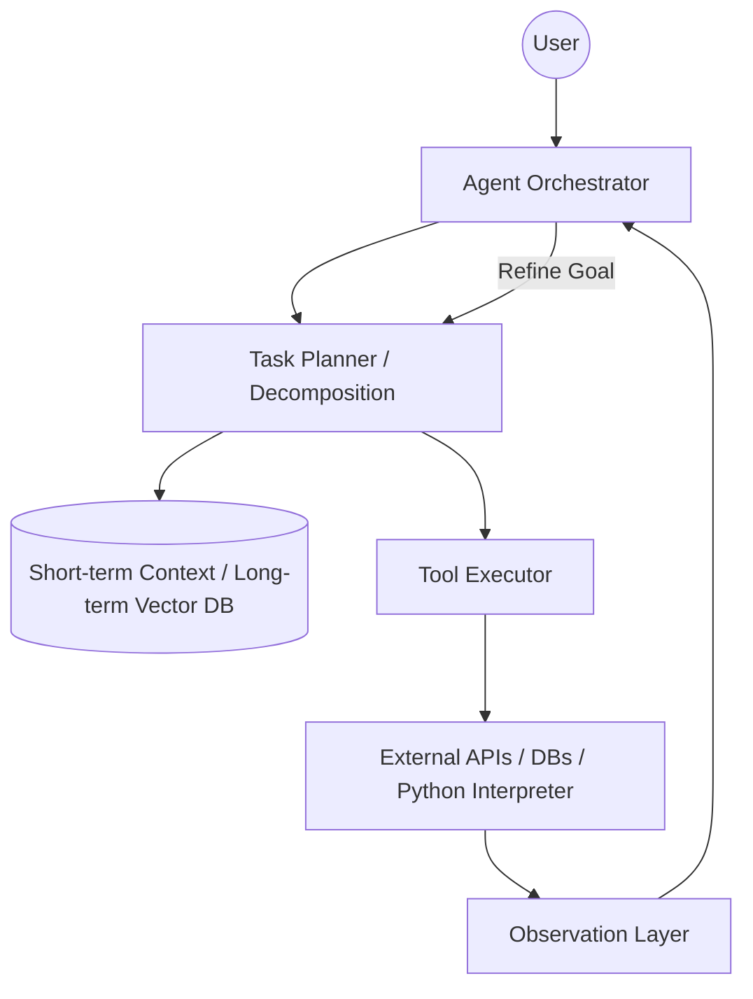
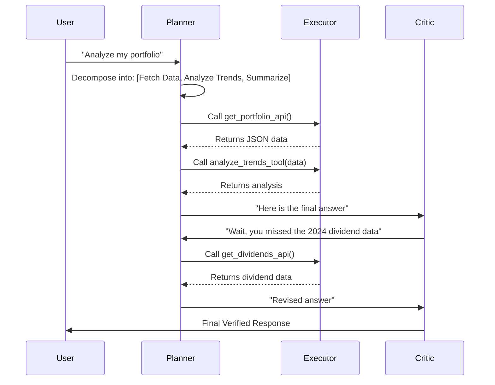
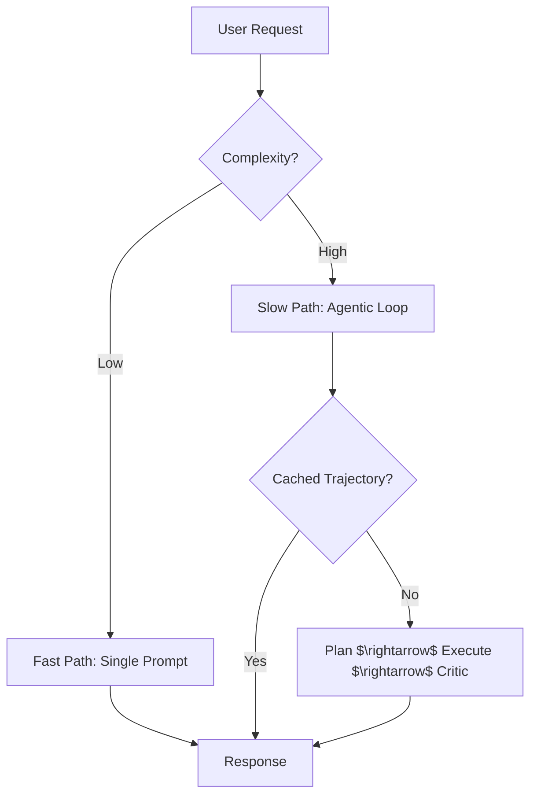

# Building Agentic AI: From Simple Chatbots to Autonomous Systems

**Source:** https://blog.google/technology/
**Generated:** 2026-04-12 18:02:17
**Word Count:** 1084
**Tags:** AI Engineering, LLM, System Design, Agentic AI, Distributed Systems

---

# Building Agentic AI: From Simple Chatbots to Autonomous Systems

You've built a RAG pipeline. It works reasonably well, but the moment a user asks a multi-step question—such as *"Find the three best-performing stocks in my portfolio and explain why they're winning based on last week's news"*—the system collapses. It cannot plan, it cannot self-correct, and it certainly cannot execute a sequence of tools without hallucinating the arguments. 

To solve this, we must move beyond the linear "prompt-and-response" flow and transition toward a truly agentic system.

### The Challenge: The "Stochastic Parrot" Wall

Most AI implementations today are essentially sophisticated autocomplete engines. You provide a prompt, and the model predicts the next token. While this is effective for summaries or simple Q&A, real-world engineering problems are rarely linear; they are iterative. They require a continuous loop: **Observe $\rightarrow$ Think $\rightarrow$ Act $\rightarrow$ Observe.**

When scaling this to millions of requests, you will inevitably hit three walls:

1. **State Drift:** LLMs often lose track of the primary goal over long execution chains.
2. **Tool Reliability:** The model may generate a JSON payload for a tool that is missing a comma or uses a non-existent parameter, crashing the entire pipeline.
3. **Infinite Loops:** The agent can get stuck in a reasoning loop, calling the same failing API repeatedly until your API bill skyrockets for a single request.

To overcome these hurdles, we need to stop treating the LLM as the *application* and start treating it as the *CPU* within a larger operating system.

### The Architecture: The Agentic Operating System

An agentic system is more than just a prompt; it is a control loop. It requires a layer to manage memory, a planner to decompose goals, and an executor to interact with the real world.

Instead of a simple request-response pattern, we implement a **Reasoning Loop**. The core objective is to decouple the *decision* (what to do) from the *execution* (doing it) and the *evaluation* (did it work?).

### Core Components: The Brain and the Limbs

To make this production-ready, we break the system into four distinct modules.

#### 1. The Planner (The Pre-frontal Cortex)
Rather than asking the LLM to "solve the problem" in one go, we ask it to generate a **Directed Acyclic Graph (DAG)** of tasks. By utilizing techniques like *Chain-of-Thought (CoT)* or *Tree-of-Thoughts*, the system can explore multiple paths. If the planner realizes step two is impossible, it doesn't simply fail; it rewrites the plan for step three.

#### 2. The Memory Engine (The Hippocampus)
While context windows are expanding, the "lost in the middle" phenomenon remains a reality. We employ a dual-memory approach:
- **Short-term:** A sliding window of the last 10–20 turns of the current conversation.
- **Long-term:** A vector database (such as Pinecone or Milvus) storing historical successes and failures. If the agent solved a similar problem previously, it retrieves that "trajectory" to avoid repeating mistakes.

#### 3. The Toolset (The Hands)
This is where the agent interacts with the external world. The key to success here is **Strict Schema Enforcement**. Instead of hoping the LLM provides the correct JSON, we use Pydantic or JSON Schema to validate the output. If validation fails, the error is fed back into the LLM as a new observation: *"Error: Parameter 'date' must be ISO-8601. Please try again."*

#### 4. The Critic (The Ego)
Often overlooked, the Critic is a separate, typically smaller or more specialized model that acts as a guardrail. It asks: *"Does this answer actually satisfy the user's original intent?"* If the answer is "No," it triggers a loop-back to the Planner.

### Data Flow: The Loop of Continuous Refinement

Data in an agentic system is a cycle, not a stream. The most critical path is the **Observation $\rightarrow$ Reasoning** transition.

When the Executor hits a tool, it returns a raw string or JSON. Rather than passing this directly back to the LLM, we wrap it in a **Semantic Wrapper**. Instead of a blunt `404 Not Found`, we send: `Observation: The requested document was not found in the database. Possible alternatives: [Doc A, Doc B].`

This reduces the cognitive load on the LLM and prevents it from hallucinating a reason for the failure. We are essentially providing the model with "sensory input" that is pre-processed for maximum clarity.

### Trade-offs and Scalability: The Cost of Intelligence

Agentic systems are powerful, but they come with a significant tax: **Latency and Cost.**

Every loop through the Planner and Critic adds seconds to the response time. If an agent loops five times before answering, a 2-second LLM latency becomes a 10-second wait—a UX nightmare.

**Strategies for scaling:**

1. **Speculative Execution:** While the agent is processing Step 2, we can pre-fetch data for the most likely Step 3 candidates.
2. **Model Cascading:** We don't use GPT-4o for every step. The *Critic* might be a fine-tuned Llama-3-8B (fast and cheap), while the *Planner* utilizes the high-reasoning model.
3. **State Checkpointing:** We save the agent's state to a database (like Redis) after every step. If the system crashes or the user refreshes the page, the agent resumes from the last successful observation rather than starting from scratch.

### Key Takeaways

- **Stop Prompting, Start Architecting:** An LLM is a component, not the entire system. Build a robust control loop around it.
- **Validation is Everything:** Use strict schemas (Pydantic) for tool calls and feed errors back into the loop as observations.
- **The Critic is Mandatory:** Never let an agent respond to a user without a verification step to check for hallucinations or missed requirements.
- **Optimize for Latency:** Implement model cascading (small models for critique, large models for planning) to keep the system responsive.

---

*This post was generated by the Autonomous Blog Agent*
*Includes architecture diagrams and visual examples*