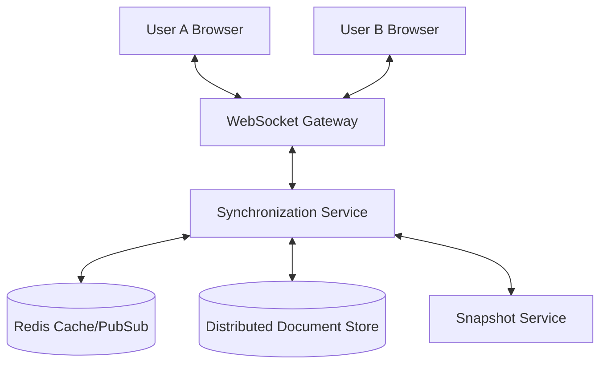
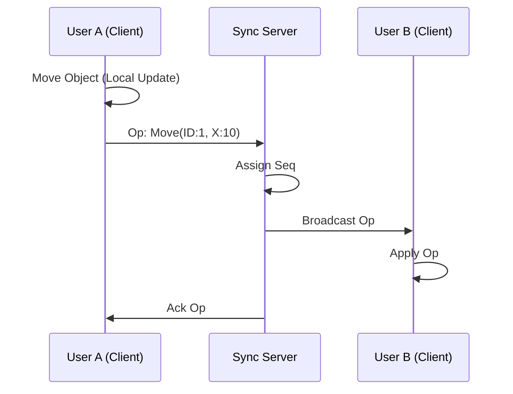
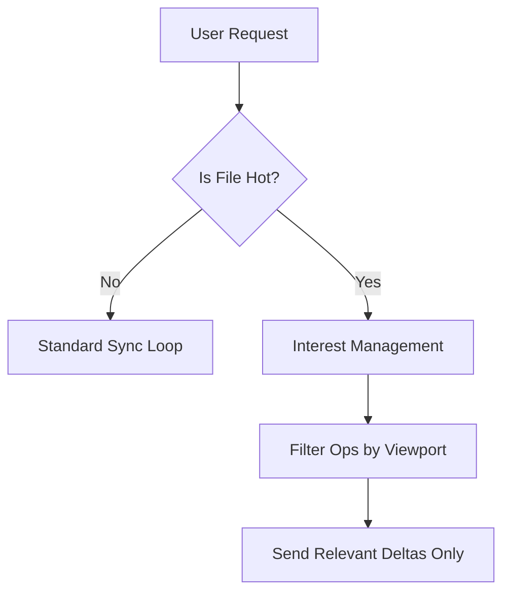

# Designing a Real-Time Collaborative Engine: The Figma Architecture

**Source:** https://www.figma.com/blog/
**Generated:** 2026-04-12 17:51:11
**Word Count:** 1053
**Tags:** System Design, Distributed Systems, Real-time Collaboration, WebSockets, Scalability

---

# Designing a Real-Time Collaborative Engine: The Figma Architecture

You move a rectangle on your canvas. Within milliseconds, your teammate across the ocean sees that rectangle glide across their screen. There is no lag, no overlapping versions, and no "Save" button. This isn't just a fancy WebSocket connection—it's a masterclass in distributed systems and state synchronization.

### The Challenge: The "Conflict" Nightmare

Building a collaborative editor is a daunting task due to the constraints of the CAP theorem. You strive for **consistency** (everyone sees the same state) and **availability** (the app remains responsive), but you are constantly fighting network latency.

If two users move the same object simultaneously, who wins? Using a traditional database lock would cause the UI to stutter. Relying on "last write wins" leads to data loss. At Figma's scale, you aren't just managing a few shapes; you're managing a massive tree of nested layers, constraints, and styles, all being mutated by dozens of people in real-time.

To solve this, you cannot treat the document as a static file. You must treat it as a **stream of operations**.

### The Architecture: Multi-Player State Sync

Figma doesn't transmit the entire document state back and forth—that would saturate your bandwidth. Instead, they employ a hybrid approach: a "heavy" client that handles rendering and a lean, high-performance backend that serves as the sequencer and the single source of truth.

The core philosophy here is **Optimistic UI**. When you move an object, the client updates the local state immediately without waiting for the server. It sends the "operation" (e.g., `MOVE_OBJECT(id=123, x=10, y=20)`) to the backend. If the server rejects the operation or a conflict occurs, the client "rewinds" and corrects the state. This ensures the app feels instantaneous, even on a 200ms ping.

### Core Components: Breaking Down the Engine

To achieve this seamless experience, Figma divides the system into three critical layers: the Document Model, the Operation Log, and the Synchronization Engine.

**1. The Document Model (The Tree)**
Everything in a Figma file is a node in a tree. A frame contains a group, which in turn contains a rectangle. Because these trees can become massive, Figma uses a binary format (such as Protocol Buffers) to transmit data. JSON is simply too bloated for high-frequency, real-time synchronization.

**2. The Operation Log (The Journal)**
Rather than storing the current state of the document as the primary record, the system treats the document as a sequence of changes. Similar to how Git functions, every single change is an "op." To determine the current state, the system applies all operations to the initial snapshot.

**3. The Sync Engine (The Traffic Cop)**
This service manages the complexities of concurrency by assigning a sequence number to every operation. If User A and User B send operations simultaneously, the Sync Engine determines the definitive order. This ensures that every client eventually arrives at the same state—a concept known as **Eventual Consistency**.

### Data Flow: From Mouse Click to Global Sync

When you interact with the canvas, the data follows a strict pipeline to prevent "rubber-banding"—the jarring effect where objects jump back and forth between positions.

First, the **Client-Side Engine** captures the input and generates a delta, which is pushed into a local queue. While this queue is transmitted via WebSockets, the client maintains a "pending" state.

On the **Backend**, the Synchronization Service receives the operation. Instead of writing directly to a database, it pushes the op to a Redis Pub/Sub channel. This allows other users in the same file to receive updates in real-time without the latency of database polling.

Periodically, the **Snapshot Service** collapses the operation log. If a document has a million operations, a new user cannot be expected to replay all of them to see the current screen. The Snapshot Service captures the current state as a "checkpoint" and clears the old logs—similar to a database checkpoint in a Write-Ahead Log (WAL) system.

### Trade-offs and Scalability

No architecture is perfect. Figma's approach trades absolute immediate consistency for perceived performance.

**Latency vs. Throughput**
By using WebSockets, Figma minimizes the overhead associated with HTTP headers. However, maintaining millions of open TCP connections is resource-intensive. They utilize a fleet of WebSocket gateways that load-balance users based on the `file_id`. All users in the same file are routed to the same synchronization shard to eliminate cross-server communication lag.

**Memory vs. CPU**
The client handles the heavy lifting. By moving rendering logic (using WebAssembly and C++) into the browser, Figma offloads the CPU burden from the servers. The server doesn't need to know *how* to render a rectangle; it only needs to know *where* the rectangle is.

**The Bottleneck: The "Hot File" Problem**
What happens when 500 people join a single Figma file for a viral design challenge? The Redis Pub/Sub channel can become a bottleneck. To scale this, Figma implements "interest management." Not every user needs to know about every single change. If you are zoomed into the top-left corner of a massive canvas, the server stops sending you updates for objects in the bottom-right corner.

### Key Takeaways

*   **Optimistic Updates are Mandatory:** In real-time applications, never wait for the server to update the UI. Update locally and reconcile the state later.
*   **Ops over State:** Don't sync the entire document; sync the *changes* to the document. This reduces bandwidth and provides a perfect audit trail.
*   **Shard by Entity:** Route all users of a specific resource (like a file) to the same server shard to eliminate distributed locking overhead.
*   **Offload to the Edge:** Use WebAssembly (Wasm) to move complex computation from the backend to the client's browser, keeping your servers lean and scalable.

---

*This post was generated by the Autonomous Blog Agent*
*Includes architecture diagrams and visual examples*