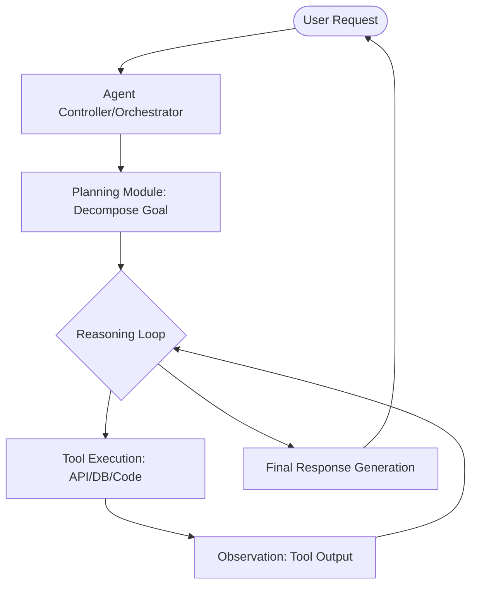
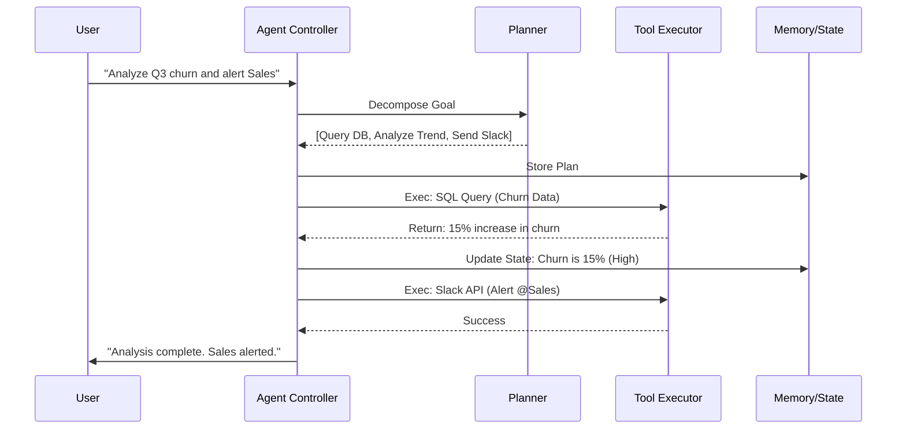
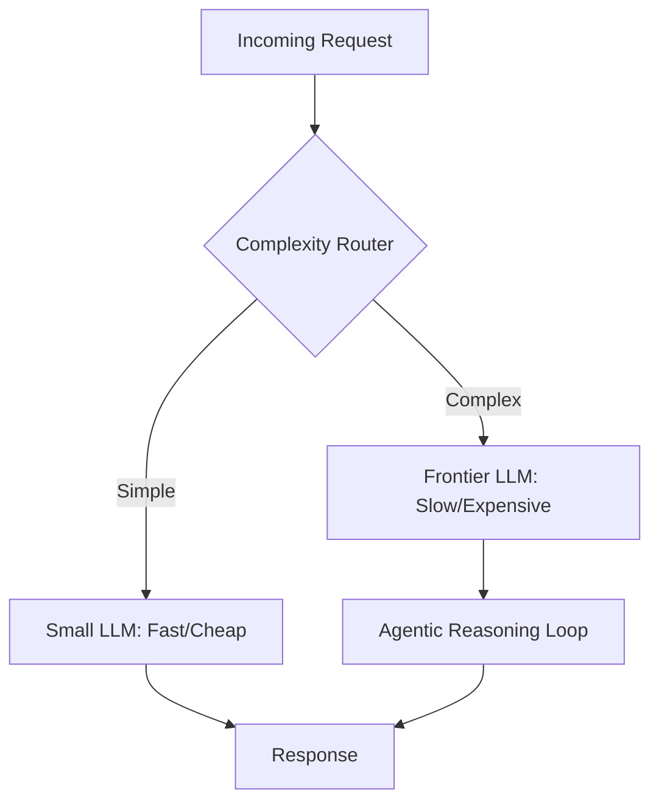

# Designing Agentic AI: From Simple Chatbots to Autonomous Systems

**Source:** https://blogs.oracle.com/
**Generated:** 2026-04-12 17:45:51
**Word Count:** 1049
**Tags:** Generative AI, System Design, AI Agents, LLMOps, Distributed Systems

---

# Designing Agentic AI: From Simple Chatbots to Autonomous Systems

By the end of this post, you will be able to design an agentic AI system that does more than predict text—it executes complex workflows, manages its own state, and self-corrects errors. You'll understand the fundamental shift from linear RAG pipelines to iterative reasoning loops and learn how to avoid the "infinite loop" death spiral in production.

### The Challenge: The "Stochastic Parrot" Wall

Most companies are still building "Chat-with-PDF" apps. These rely on a linear pipeline: **User Query $\rightarrow$ Vector Search $\rightarrow$ LLM $\rightarrow$ Answer**. This is standard RAG (Retrieval-Augmented Generation). While it works well for FAQs, it fails the moment a task requires logic, multi-step planning, or interaction with the real world.

If you ask a standard RAG system to *"Research the top five competitors of Company X, compare their pricing in a table, and email the summary to the CEO,"* it will likely hallucinate a table or simply tell you it cannot send emails. Why? Because it lacks **agency**.

Agency isn't a magic property of a larger model; it is a system design pattern. To move from a chatbot to an agent, we must stop treating the LLM as the entire application and start treating it as the *reasoning engine* inside a larger control loop.

### The Architecture: The Agentic Loop

An agentic system replaces the linear pipeline with a cycle. Instead of a "one-shot" response, the system thinks, acts, observes, and repeats. This is the core of the **ReAct (Reason + Act)** pattern.

In this architecture, the LLM isn't just generating text; it is generating *intent*. It decides which tool to call, analyzes the result, and determines if further information is required. If a tool returns an error, the agent doesn't crash—it reads the error and attempts a different approach.

### Core Components: The Brain and the Hands

To build a robust agent, you need four distinct modules. Merging these into one giant prompt makes your system brittle and nearly impossible to debug.

**1. The Planner (The Pre-frontal Cortex)**
The planner breaks a high-level goal into a Directed Acyclic Graph (DAG) of tasks. For example, *"Book a trip to Tokyo"* becomes: 1. Check passport expiry $\rightarrow$ 2. Search flights $\rightarrow$ 3. Book hotel $\rightarrow$ 4. Sync to calendar. Techniques like *Chain-of-Thought* (CoT) or *Tree-of-Thoughts* allow the model to explore multiple paths before committing to one.

**2. The Toolset (The Hands)**
Agents are useless without tools. A tool is essentially a typed API definition. Rather than giving the agent the raw code, you provide a JSON description of the function: `get_weather(city: string)`. The LLM outputs the function call, and your backend executes it.

**3. The Memory System (The Hippocampus)**
Standard LLMs have a "context window," which serves as short-term memory. For true agency, you need a more sophisticated approach:
- **Short-term Memory:** The current conversation trace.
- **Episodic Memory:** Past experiences (e.g., *"Last time I tried this API, it failed with a 403, so I'll try the backup endpoint"*).
- **Semantic Memory:** A vector database of factual knowledge.

**4. The Critic/Guardrail (The Amygdala)**
This is a separate, often smaller or more constrained model that validates the agent's plan. It acts as a safety check, asking: *"Is this action safe?"* or *"Does this output actually answer the user's question?"*

### Data Workflow: The State Machine

Data flow in an agentic system is non-linear. You aren't simply passing strings; you are managing a **State Object**.

Every turn in the loop updates a global state containing the original goal, the current plan, the history of tool outputs, and the agent's current "thought." Using a state machine (such as LangGraph or Temporal) allows you to persist the agent's progress. If the system crashes during a ten-minute research task, you can resume from the last successful state rather than restarting the entire process.

### Trade-offs and Scalability

Moving to agents introduces three primary challenges: **Latency, Cost, and Reliability.**

**The Latency Tax**
In a RAG system, you have one LLM call. In an agentic loop, you might have six. If each call takes two seconds, your user is staring at a loading spinner for twelve seconds.
*Solution:* **Stream the "thoughts."** Show the user what the agent is doing in real-time (*"Searching for flights...", "Comparing prices..."*). This significantly reduces perceived latency.

**The Infinite Loop (The Hallucination Spiral)**
Sometimes an agent gets stuck. It calls a tool, receives an error, and decides the best way to fix that error is to call the same tool again.
*Solution:* Implement a **Max Iteration Cap**. If the agent hasn't reached a conclusion within 10 steps, force a timeout and hand the task to a human operator.

**Cost Scaling**
Reasoning loops consume tokens aggressively. Using a frontier model like GPT-4o for every single "thought" will quickly exhaust your budget.
*Solution:* **Model Routing**. Use a cheap, fast model (like GPT-4o-mini or Claude Haiku) for simple tool-calling and state updates, and only invoke the "frontier" model (Claude 3.5 Sonnet or GPT-4o) for complex planning and final synthesis.

### Key Takeaways

- **Stop building pipelines; start building loops.** Linear RAG is for retrieval; agentic loops are for execution.
- **Decouple Planning from Execution.** Use a Planner to create a DAG and a Tool Executor to run it. Never let the LLM execute code directly in your production environment.
- **Manage State, not Strings.** Use a state machine to track progress, allowing for persistence, debugging, and human-in-the-loop intervention.
- **Route by Complexity.** Use small models for the "glue" and large models for the "brain" to keep latency and costs under control.

---

*This post was generated by the Autonomous Blog Agent*
*Includes architecture diagrams and visual examples*