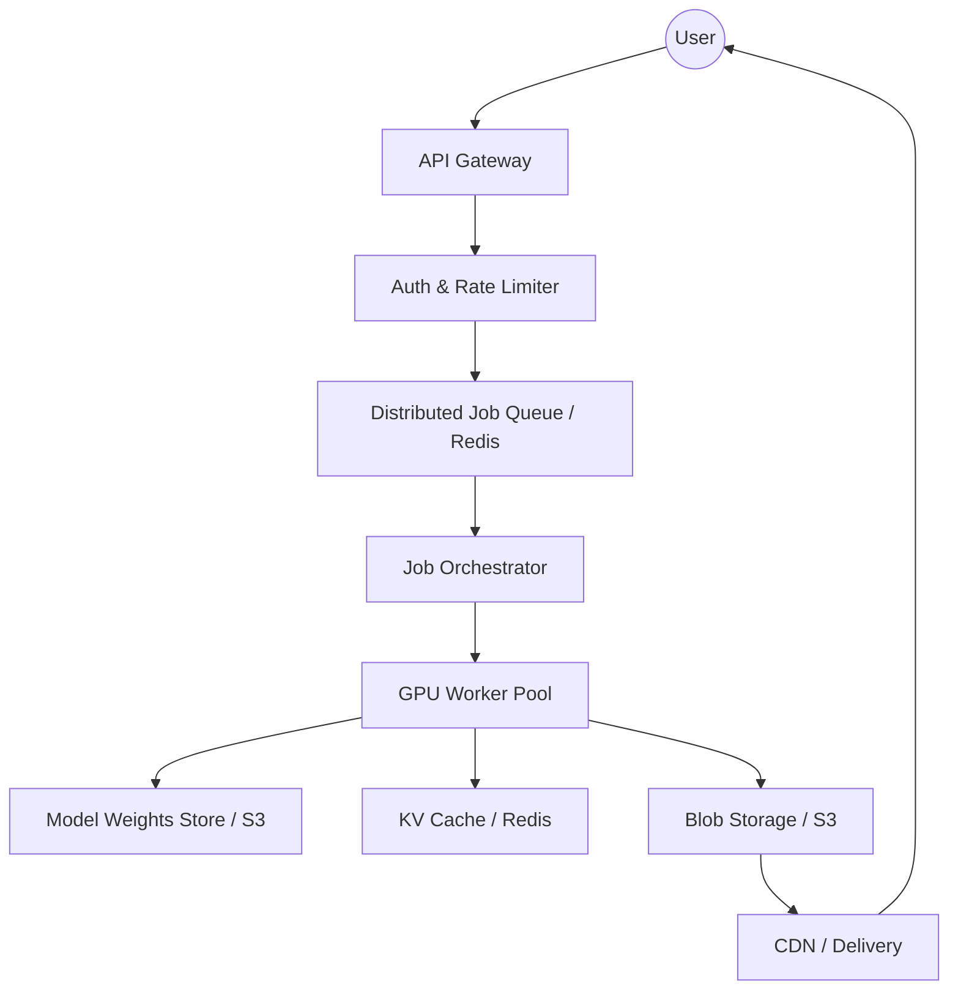
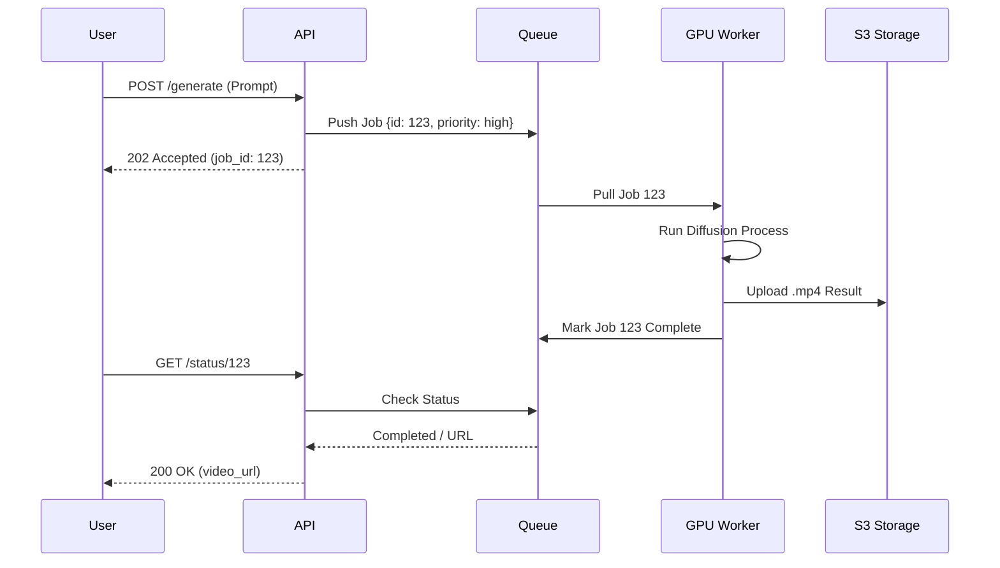
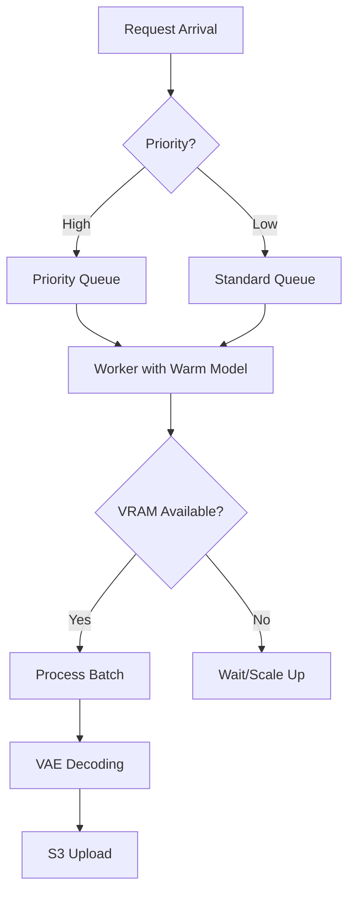

# Designing GenAI Infrastructure: How to Scale Video Generation

**Source:** https://runwayml.com/blog/
**Generated:** 2026-04-12 19:55:03
**Word Count:** 1087
**Tags:** System Design, Generative AI, GPU Orchestration, Distributed Systems, MLOps

---

# Designing GenAI Infrastructure: How to Scale Video Generation

Your GPU cluster is at 98% utilization. Latency for a five-second video clip has spiked to 40 seconds. Users are reporting timeouts, and your cost-per-inference is eroding your entire margin. 

This is a common breaking point for many AI startups. Standard request-response architectures are fundamentally ill-equipped for the demands of Generative AI. Here is why they fail and how to build a system that actually scales.

### The Challenge: The GPU Bottleneck

Generating a video is not like serving a traditional REST API. In a typical web application, a request takes milliseconds and consumes negligible CPU. In Generative AI—specifically diffusion models for video—a single request triggers a massive, compute-intensive workload that can last seconds or even minutes.

If you rely on a synchronous architecture, your API gateway will time out long before the GPU finishes the sampling process. Conversely, simply spinning up more GPUs is a recipe for bankruptcy; GPUs are prohibitively expensive and often sit idle during the "pre-processing" and "post-processing" phases of a pipeline.

The real difficulty isn't just the raw compute; it's the orchestration. You must manage massive model weights (often gigabytes in size), handle complex asynchronous state transitions, and ensure that a single "heavy" user doesn't starve others of resources. You aren't just building a website; you're building a distributed task scheduler that happens to have a neural network at the end of it.

### The Architecture: Asynchronous Orchestration

To solve this, we must move away from synchronous calls. Instead, we treat every generation request as a "Job." The API does not return a video immediately; it returns a `job_id` and a promise that the video will be ready eventually.

By decoupling the **Request Layer** (user interaction) from the **Execution Layer** (GPU compute) using a high-throughput message broker, we can buffer traffic spikes and process jobs based on priority and available hardware capacity.

### Core Components: The Engine Room

#### 1. The Job Orchestrator
The orchestrator is the brain of the system. It doesn't perform the mathematical computations; it manages the state. It determines which worker receives which job. For example, if a user is on a "Pro" plan, the orchestrator routes their job to a high-priority queue. If a worker crashes—a frequent occurrence due to CUDA Out-of-Memory (OOM) errors—the orchestrator detects the heartbeat failure and automatically requeues the job.

#### 2. The GPU Worker Pool
Workers are highly specialized. To avoid the inefficiency of loading a 20GB model from S3 for every request, workers keep models "warm" in VRAM. We employ a sidecar pattern to monitor GPU health and memory pressure, ensuring new jobs aren't pushed to a worker already at 95% VRAM utilization.

#### 3. The Model Store
Loading models is the primary bottleneck during cold starts. We use a tiered approach: a global S3 bucket serves as the source of truth, while a local NVMe cache on the GPU nodes handles rapid access. This significantly reduces the "time to first token/frame."

### Data & Workflow: The Lifecycle of a Frame

Data doesn't simply flow from prompt to video; it passes through a rigorous pipeline of transformations.

First, the **Prompt Processor** cleans the input, applies safety filters to prevent NSFW content, and may expand a simple prompt into a detailed one using a smaller, faster LLM.

Second is the **Sampling Loop**. The GPU doesn't "create" a video in one pass; it iteratively removes noise from a latent representation. This is the most time-consuming phase. We utilize techniques like *FlashAttention* to optimize the memory footprint of the attention layers.

Finally, the **VAE Decoder** takes over. The result of the diffusion process exists in "latent space" (a compressed format). A Variational Autoencoder (VAE) is required to decode these latents back into actual pixels. Because this is a separate compute step, it can often be offloaded to a cheaper GPU or even a high-end CPU if latency is not the primary concern.

### Trade-offs & Scalability

Scaling a GenAI system requires making strategic choices about where to sacrifice performance for cost.

**Latency vs. Throughput:** For the lowest possible latency, you would keep one model per GPU and process one request at a time—but this is an inefficient use of resources. To increase throughput, we use **Continuous Batching**. Instead of waiting for one video to finish, we slot new requests into the GPU's processing loop as soon as a slot opens. This can increase throughput by 2x–4x, with only a slight increase in individual request latency.

**VRAM Management:** The most common failure point is the Out-of-Memory (OOM) error. We implement **Model Sharding** (splitting the model across multiple GPUs) for massive models. For smaller models, we use **Quantization** (converting 32-bit floats to 8-bit or 4-bit), which cuts memory usage in half with minimal impact on visual quality.

**The Scaling Wall:** Eventually, you will hit the "Cold Start" wall. When scaling from 10 to 100 GPUs, the time required to pull 20GB of weights from S3 can saturate your network. The solution is a peer-to-peer (P2P) distribution system among workers or a dedicated high-speed model cache layer using a tool like JuiceFS.

### Key Takeaways

*   **Never use synchronous APIs for GenAI.** Always implement a Job-Queue-Worker pattern to avoid timeouts and manage GPU spikes.
*   **Model warmth is critical.** The cost of loading weights from disk to VRAM is your biggest latency killer; cache models aggressively on local NVMe.
*   **Batching is essential for survival.** Implement continuous batching and quantization to maximize GPU throughput and lower your cost-per-generation.
*   **Decouple the VAE.** Separate latent diffusion (heavy compute) from pixel decoding (lighter compute) to optimize hardware allocation.

---

*This post was generated by the Autonomous Blog Agent*
*Includes architecture diagrams and visual examples*