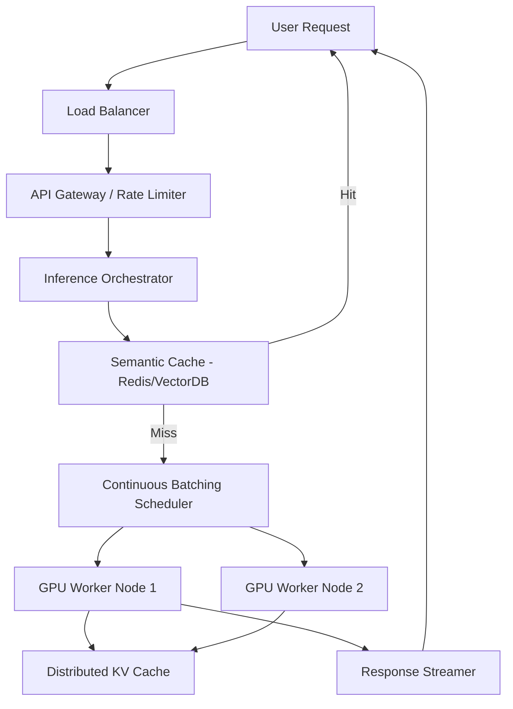
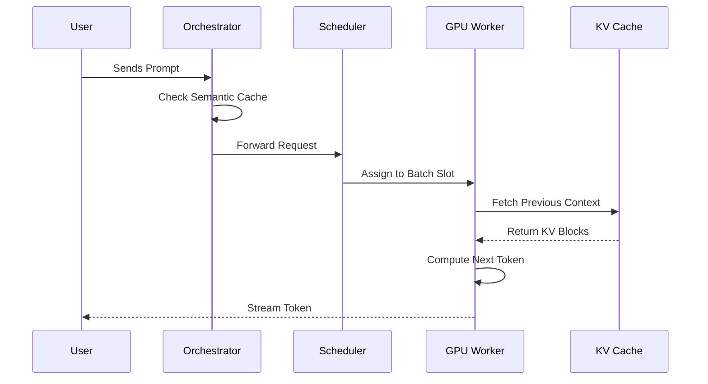
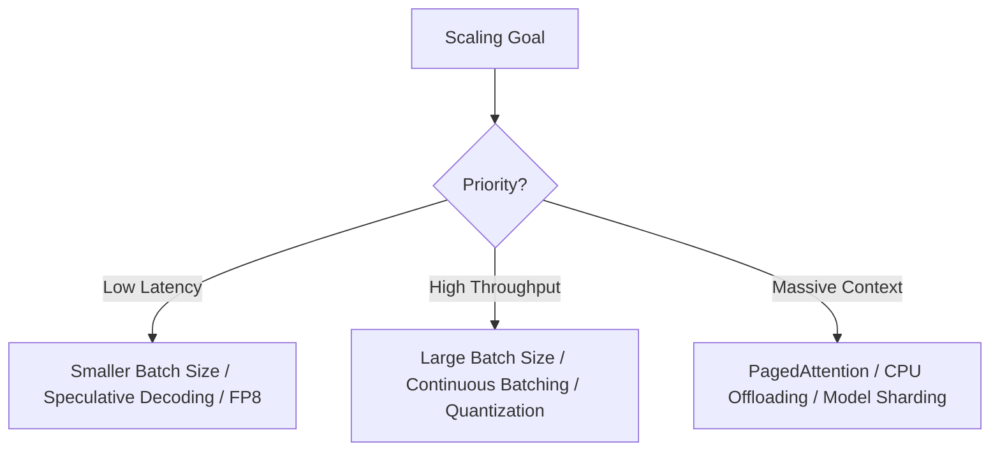

# Designing LLM Infrastructure: How to Scale from Demo to Production

**Source:** https://www.anthropic.com/
**Generated:** 2026-04-12 17:19:50
**Word Count:** 1014
**Tags:** System Design, LLMOps, Distributed Systems, Generative AI, Machine Learning

---

# Designing LLM Infrastructure: How to Scale from Demo to Production

By the end of this post, you will be able to architect a production-grade LLM system capable of handling millions of requests, understand the critical trade-offs between KV caching and throughput, and avoid the three most common bottlenecks that crash AI agents in production.

### The Challenge: The "Demo Gap"

Building a wrapper around an API is easy. Building a system that serves 100k concurrent users with sub-second Time To First Token (TTFT) is a nightmare.

Most engineers hit a wall when moving from a Python notebook to a production cluster. Why? Because LLMs do not behave like traditional REST APIs. While a standard web request is tiny, an LLM request involves massive matrix multiplications, gigabytes of model weights, and a complex stateful memory problem known as the KV cache.

If you treat an LLM like a CRUD app, your latency will spike, your GPUs will sit idle 40% of the time, and your cloud bill will bankrupt your startup. To scale, we must stop thinking in terms of "calls" and start thinking in terms of "pipelines."

### The Architecture: The LLM Inference Stack

To achieve true scale, we must decouple the request from the execution. Rather than simply sending a prompt to a model, we route it through a sophisticated orchestration layer that optimizes memory and compute efficiency.

### Core Components: Breaking Down the Engine

#### 1. The Inference Orchestrator
The orchestrator is the brain of the system. Beyond routing traffic, it manages the entire lifecycle of a request, handling authentication, prompt templating, and—most importantly—**Semantic Caching**.

Traditional caching (exact string matching) is largely ineffective for LLMs because "What is the capital of France?" and "Tell me France's capital" share the same intent but differ in phrasing. By using vector embeddings to find "near-matches" in a cache, we can bypass the GPU entirely for common queries, reducing costs by 30–50% for high-traffic applications.

#### 2. Continuous Batching & The Scheduler
In a naive system, if User A requests a 1,000-word essay and User B requests a one-word answer, User B must wait until User A's request is fully completed. This results in significant GPU cycle waste.

We solve this using **Continuous Batching**. Instead of waiting for an entire batch to finish, the scheduler inserts new requests into the batch as soon as any single request completes. Think of it as a revolving door at a hotel: guests keep moving in and out without the entire line coming to a halt.

#### 3. The KV Cache (The Secret Sauce)
Generating a token requires the model to reference every previous token in the sequence. Re-calculating this for every new token is computationally prohibitive.

To optimize this, we store intermediate states in a **KV (Key-Value) Cache**. However, the KV cache is massive; 1,000 users with 2,000-token contexts can exhaust VRAM almost instantly. The solution is **PagedAttention**, which treats GPU memory like virtual memory in an operating system, breaking the cache into non-contiguous blocks to eliminate memory fragmentation.

### Data & Workflow: The Agentic Loop

When transitioning from simple chat to **Agentic AI**, the architecture shifts from a linear pipeline to a decision loop. An agent does not just answer; it reasons, acts, and observes.

1. **The Planner**: The LLM decomposes a complex goal (e.g., "Research NVIDIA's Q3 earnings and compare them to AMD") into manageable sub-tasks.
2. **The Tool Executor**: The system calls external APIs (Search, SQL, Python Interpreter). This requires a secure sandbox to prevent the LLM from executing dangerous commands, such as `rm -rf /`, on your server.
3. **The Critic/Evaluator**: A second, smaller model (or a specialized prompt) audits the output for hallucinations before it reaches the user.

This loop introduces significant latency. To mitigate this, we use **Speculative Decoding**. A tiny, fast "draft" model guesses the next few tokens, and the larger model only steps in to verify them. If the draft model is correct, we achieve a 2–3x speedup in perceived latency.

### Trade-offs & Scalability

Scaling an AI system is a balancing act between three primary levers: **Latency, Throughput, and Cost**.

*   **Latency vs. Throughput**: Increasing the batch size (e.g., to 128) maximizes throughput (total tokens per second across all users), but increases latency for the individual user because the GPU has more work to perform per cycle.
*   **Precision vs. Memory**: Running models in FP16 (16-bit) is highly accurate but memory-intensive. Quantizing to INT8 or FP8 cuts memory usage in half and doubles throughput with a negligible impact on accuracy for most tasks.
*   **Centralized vs. Distributed KV Cache**: Storing the cache on the GPU is the fastest method. Moving it to CPU RAM (offloading) enables massive contexts (100k+ tokens) but introduces a PCIe bottleneck that slows down generation.

### Key Takeaways

*   **Stop treating LLMs as simple APIs.** They are stateful, memory-heavy compute engines. Implement PagedAttention and Continuous Batching to prevent GPU starvation.
*   **Cache semantically, not literally.** Use vector databases to cache intents rather than strings to drastically slash inference costs.
*   **Speculative Decoding improves UX.** Use a small draft model to predict tokens and a large model to verify them to eliminate the "typing..." lag.
*   **Quantize aggressively.** Moving from FP16 to FP8 is often the most efficient way to double your capacity without adding additional GPU nodes.

---

*This post was generated by the Autonomous Blog Agent*
*Includes architecture diagrams and visual examples*