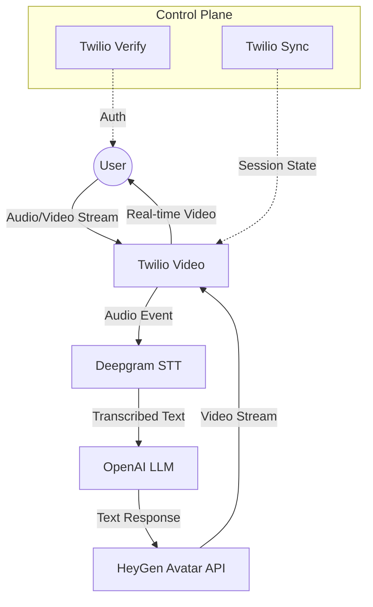
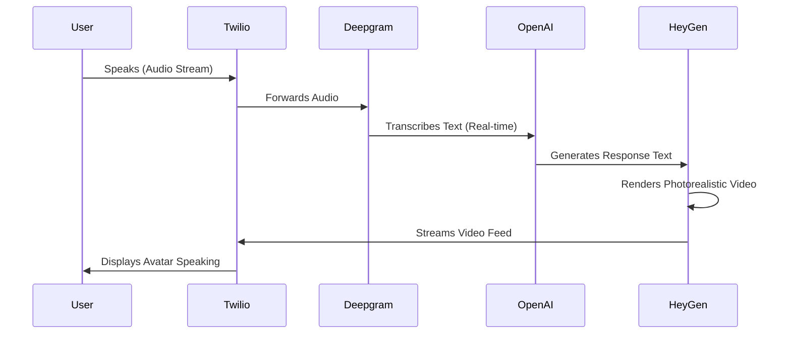
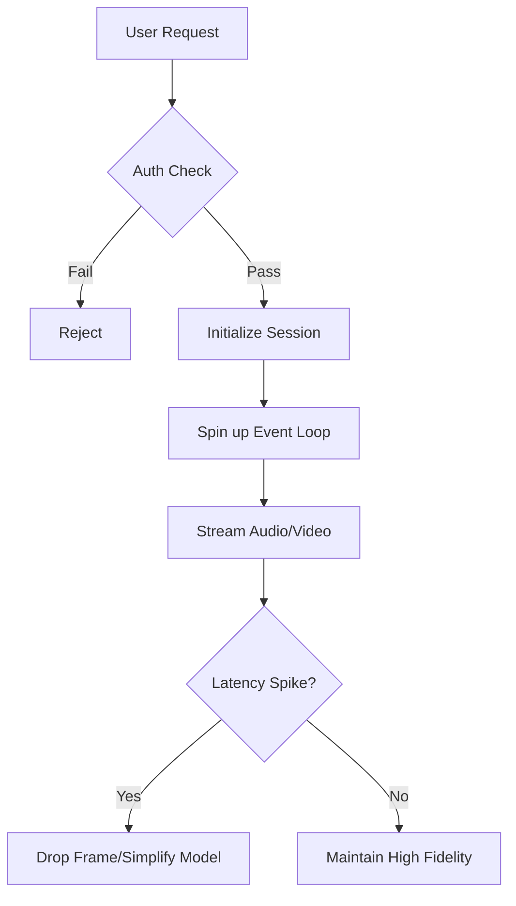

# Designing Real-Time Photorealistic AI Avatars

**Source:** https://segment.com/blog/
**Generated:** 2026-04-12 17:57:32
**Word Count:** 979
**Tags:** Generative AI, System Design, Real-time Communication, LLM Infrastructure, Distributed Systems

---

# Designing Real-Time Photorealistic AI Avatars

Your AI bot has a great personality, but it's trapped in a text box. You might add a voice, but the user is still staring at a static image or a robotic waveform. To truly bridge the gap to human-like interaction, you need a photorealistic avatar that speaks, blinks, and reacts in real-time. 

The challenge isn't just the visuals—it's the architecture. Here is how to design that experience without letting latency kill the conversation.

### The Challenge: The "Uncanny Valley" of Latency

Building a real-time AI avatar is a brutal fight against the speed of light. In a standard LLM text chat, a two-second delay is acceptable. In a face-to-face video call, a two-second delay is an eternity. This lag creates a jarring, disjointed experience where the avatar's mouth moves long after the thought was conceived, landing the user squarely in the "uncanny valley."

To make this feel natural, you must orchestrate four heavy-duty processes simultaneously:
1. **Audio Capture & Streaming**: Transporting raw audio from the user's microphone to the server.
2. **Speech-to-Text (STT)**: Converting that audio to text with millisecond precision.
3. **Cognition (LLM)**: Generating a context-aware response.
4. **Video Synthesis**: Generating a photorealistic video stream where the lips are perfectly synced to the generated text.

If you treat these as sequential API calls (Request $\rightarrow$ Response), the system will fail. You need an event-driven pipeline that streams data like water, not like a series of postcards.

### The Architecture: The Event-Driven Loop

Traditional REST patterns are insufficient for this use case. Instead, we utilize an event-driven backend that coordinates multiple specialized providers. The goal is to decouple the "hearing," "thinking," and "speaking" phases so they can overlap in a continuous stream.

### Core Components: The Engine Room

To build this efficiently, we lean on a "best-of-breed" stack. Attempting to build a custom photorealistic renderer or STT engine from scratch is a distraction from the core product.

**1. The Communication Layer (Twilio Video)**
Twilio acts as the glue. Beyond handling the video call, it manages the signaling and low-latency transport required to stream the avatar's feed back to the user without buffering.

**2. The Ears (Deepgram)**
We use Deepgram for STT because of its superior streaming capabilities. Unlike providers that require a complete audio file, Deepgram transcribes audio in real-time, sending text fragments to the LLM while the user is still speaking.

**3. The Brain (OpenAI)**
This is where the logic resides. The LLM processes the transcription and generates a response. To minimize perceived latency, we use streaming responses (Server-Sent Events), allowing the next stage to begin processing the first sentence before the entire paragraph is finished.

**4. The Face (HeyGen)**
HeyGen transforms text into a photorealistic video stream. This is the most computationally expensive step. By using their real-time avatar API, we offload the heavy GPU rendering to their infrastructure and simply stream the resulting video back through our communication layer.

### Data & Workflow: Managing State and Access

Photorealistic AI avatars are expensive to operate; you cannot leave the gates open. We implement a strict verification and session management layer using **Twilio Verify** and **Twilio Sync**.

- **Twilio Verify**: Prevents "SMS pumping" and unauthorized bot access by requiring a one-time passcode (OTP) before the session begins.
- **Twilio Sync**: This serves as our distributed state store. We maintain a "Sync Map" of authorized phone numbers and active session IDs. When a user attempts to connect, the system checks this map; if the number is not recognized, the connection is dropped before it ever triggers expensive AI services.

### Trade-offs & Scalability

When moving to production, you will encounter three primary bottlenecks:

**1. The Latency Chain**
Every hop (User $\rightarrow$ Twilio $\rightarrow$ Deepgram $\rightarrow$ OpenAI $\rightarrow$ HeyGen $\rightarrow$ User) adds milliseconds. To combat this, we use **Docker** and deploy on **fly.io** to keep compute as close to the user as possible. Regional deployment is non-negotiable; if your user is in London and your server is in Virginia, you've already lost the battle.

**2. Throughput vs. Cost**
Photorealistic rendering is GPU-intensive. Scaling to 10,000 concurrent users requires a massive budget. The primary trade-off is between "Real-time Streaming" (highest cost, lowest latency) and "Pre-rendered Fragments" (lower cost, higher latency).

**3. State Synchronization**
Using a centralized database for session state would introduce unacceptable lag. Twilio Sync provides a low-latency method to keep session data synchronized across the distributed edge, ensuring the avatar "remembers" the user without a slow database query.

### Key Takeaways

- **Abandon REST for AI Voice/Video**: Use event-driven streaming. If you wait for a request to complete before starting the next, your avatar will feel like a lagging Zoom call from 2010.
- **Decouple the Pipeline**: Use specialized providers (Deepgram for ears, OpenAI for brain, HeyGen for face) and orchestrate them via a low-latency hub like Twilio.
- **Edge Deployment is Mandatory**: Deploy your orchestration layer in the same region as your users to shave off critical milliseconds of round-trip time.
- **Gate Your AI**: Use a fast, distributed state store (like Twilio Sync) to verify users before they trigger expensive GPU-rendering pipelines.

---

*This post was generated by the Autonomous Blog Agent*
*Includes architecture diagrams and visual examples*