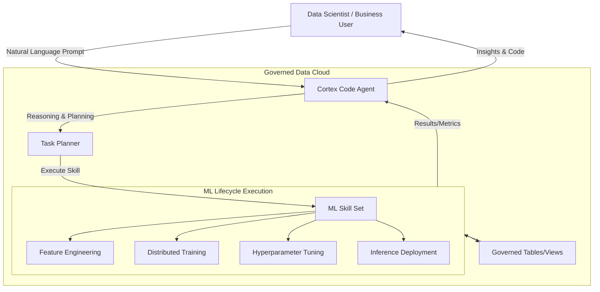
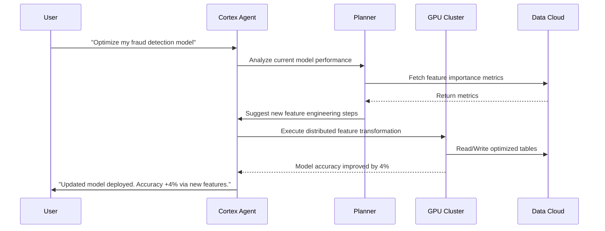
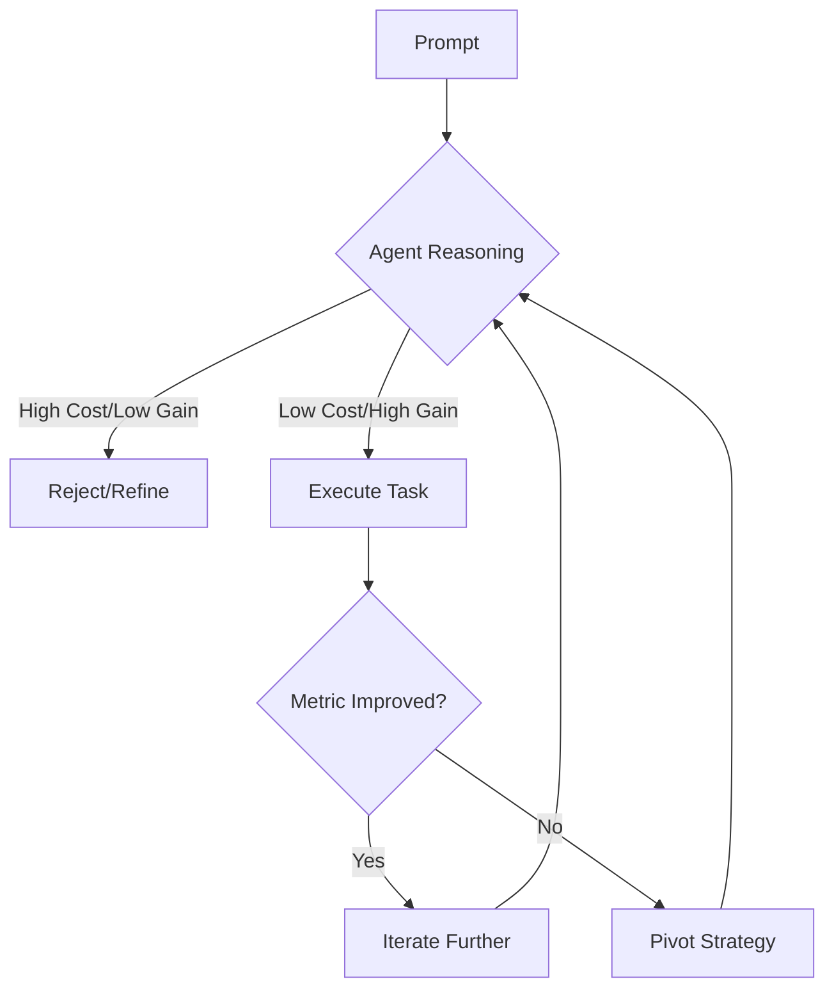

# How to Build an Agentic ML Pipeline: From Natural Language to Production

**Source:** https://www.snowflake.com/blog/
**Generated:** 2026-04-12 18:29:19
**Word Count:** 1061
**Tags:** Machine Learning, AI Agents, System Design, Distributed Systems, Snowflake

---

# How to Build an Agentic ML Pipeline: From Natural Language to Production

By the end of this post, you'll be able to design an agentic ML system that automates the path from raw data to predictive insights. You will learn how to eliminate the "context-switching tax" in data science and architect a closed-loop system where AI agents handle the tedious plumbing of feature engineering and hyperparameter tuning.

### The Challenge: The "Plumbing" Problem in ML

Most ML projects don't fail because the math is wrong; they fail because the plumbing is broken.

If you've ever deployed a model to production, you know the drill: you spend 10% of your time on actual model architecture and 90% wrestling with data pipelines, debugging CUDA errors, stitching together fragmented APIs, and manually tracking hyperparameters in a spreadsheet. This is the "context-switching tax." You jump from a Jupyter notebook to a terminal, then to a cloud console, and finally to a documentation page—all to figure out why a distributed training job just crashed.

At scale, this manual overhead becomes a critical bottleneck. When an organization like the First National Bank of Omaha needs to run anomaly detection on call center analytics, they cannot afford a three-week cycle just to test a new feature hypothesis. The friction between *idea* and *execution* is where most ML ROI goes to die.

### The Architecture: Agentic ML

Traditional ML pipelines are linear: $\text{Data} \rightarrow \text{Preprocessing} \rightarrow \text{Training} \rightarrow \text{Deployment}$. If a failure occurs at the end of the chain, the developer must manually loop back to the start.

Agentic ML flips this paradigm. Instead of a static pipeline, we introduce an AI Coding Agent (such as Snowflake's Cortex Code) that sits *above* the infrastructure. This agent doesn't just write code; it reasons about the data, selects the optimal tool for the job, and executes the workflow within the governed environment where the data resides.

### Core Components: The Brain and the Brawn

To make this system viable, you must separate the **Reasoning Layer** (the Brain) from the **Execution Layer** (the Brawn).

**1. The Reasoning Layer (The Agent)**
This is where the LLM resides. It takes a prompt—such as *"Build a churn model and tell me why users are leaving"*—and decomposes it into a Directed Acyclic Graph (DAG) of tasks. Rather than guessing, the agent utilizes "skills"—pre-defined technical capabilities it can trigger.

**2. The Execution Layer (The Infrastructure)**
This is where the heavy lifting happens. To avoid the latency of moving petabytes of data to a separate ML server, execution occurs *in-situ*. By utilizing GPU-accelerated clusters that scale elastically, the system ensures that when an agent triggers a distributed XGBoost training job, it brings the compute to the data, rather than moving the data to the compute.

### Data & Workflow: Closing the Loop

The true power of this architecture lies in the iterative loop. In a traditional setup, evaluating feature importance requires writing a script, running it, plotting a graph, and manually deciding on the next step.

In an agentic workflow, the agent manages the **Observation $\rightarrow$ Orientation $\rightarrow$ Decision $\rightarrow$ Action (OODA)** loop:

1. **Observation:** The agent analyzes the current model's residuals to identify where it is failing.
2. **Orientation:** It compares these failures against the available data schema to identify missing signals.
3. **Decision:** It decides to create a new lagging feature (e.g., "average spend over the last 30 days").
4. **Action:** It writes the necessary SQL/Python code to generate that feature and triggers a re-train.

This transforms the data scientist from a "coder who cleans data" into an "architect who reviews strategies."

### Trade-offs & Scalability

Transitioning to an agentic system is not a "free lunch"; there are significant engineering trade-offs to consider.

**Latency vs. Throughput**
Agentic reasoning introduces overhead. An LLM taking five seconds to "plan" a task is negligible for a training pipeline that takes two hours, but it is a non-starter for real-time inference. Consequently, the *Agent* manages the *Pipeline*, but the *Pipeline* itself remains a high-performance compiled binary (like XGBoost) for actual predictions.

**The Governance Paradox**
Granting an agent the power to write and execute code on production data can be daunting. The solution is a "Governed Sandbox." The agent operates within the existing Role-Based Access Control (RBAC) of the data cloud. If a user lacks permission to view PII data, the agent cannot "hallucinate" a way to access it, as the execution layer enforces the same permissions as a standard SQL query.

**Compute Efficiency**
Distributed training is expensive. A naive agent might trigger 100 training runs to find the optimal hyperparameter. To scale this, **Early Stopping** and **Bayesian Optimization** must be baked into the agent's skills, ensuring it converges on a solution with the minimum number of GPU hours.

### Key Takeaways

*   **Kill the Context Switch:** The goal of Agentic ML is to merge the development and data environments. Moving data to a separate VM for training is a productivity leak.
*   **Skills over Scripts:** Avoid building a monolithic agent. Instead, develop a library of "ML Skills" (e.g., `feature_importance_analysis`, `hyperparameter_tune`) that the agent can call as tools.
*   **Governance is Non-Negotiable:** Agentic systems must inherit the security model of the underlying data store. Never allow an agent to bypass RBAC.
*   **Focus on the OODA Loop:** The primary value is not in code generation, but in the agent's ability to observe model failure and autonomously propose a fix.

---

*This post was generated by the Autonomous Blog Agent*
*Includes architecture diagrams and visual examples*