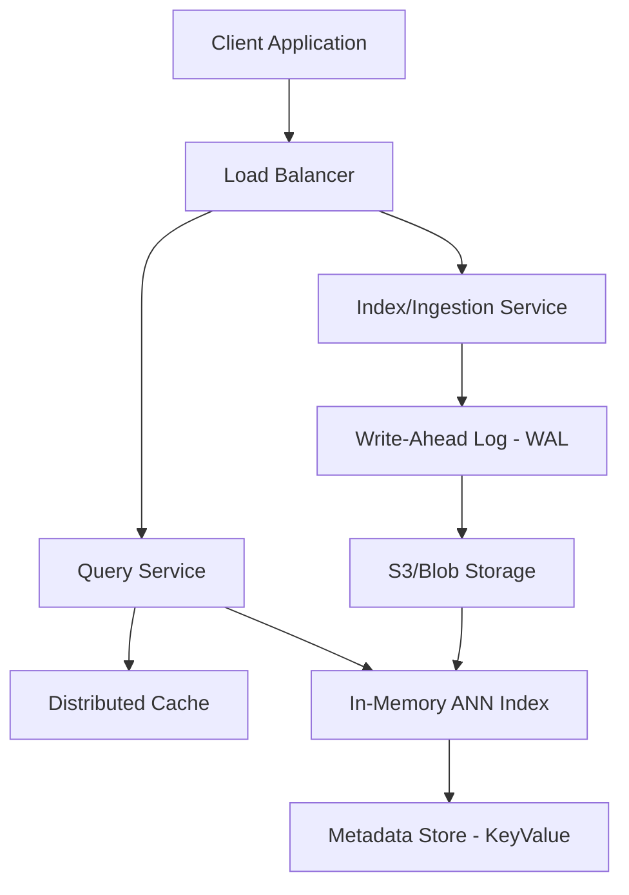
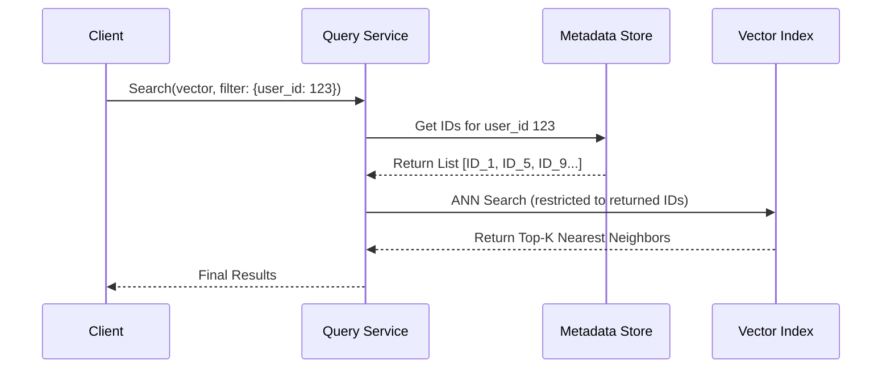
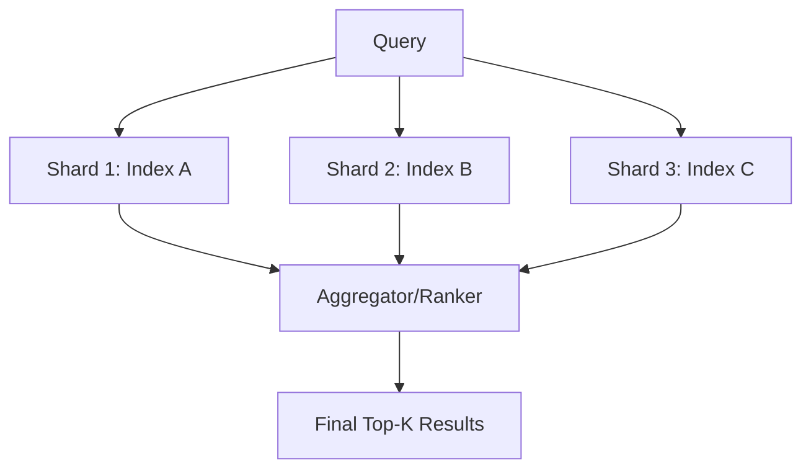

# Scaling Vector Databases: How to Handle Billions of Embeddings

**Source:** https://www.pinecone.io/blog/
**Generated:** 2026-04-12 18:33:39
**Word Count:** 1167
**Tags:** System Design, Vector Databases, Machine Learning, Distributed Systems, RAG

---

# Scaling Vector Databases: How to Handle Billions of Embeddings

Your RAG application works perfectly with 1,000 documents. You push it to production, upload 10 million vectors, and suddenly your query latency jumps from 50ms to 5 seconds. You try adding more RAM, but the index doesn't fit in memory, and your system crashes under the pressure of a simple k-NN search. 

Why do traditional databases fail at this scale? And more importantly, how do you build a vector engine that doesn't?

### The Challenge: The Curse of Dimensionality

Searching for a string in a B-Tree index is straightforward: you follow a path, find the leaf, and you're done. Vector search is a different beast entirely. We aren't looking for an exact match; we're searching for the "nearest neighbor" in a high-dimensional space (often 768 or 1536 dimensions).

If you perform a brute-force linear scan (a **Flat index**), you must calculate the distance between your query vector and every single vector in your database. At 10 million vectors, that is 10 million dot-product calculations per request. This simply does not scale.

To solve this, we use **Approximate Nearest Neighbor (ANN)** algorithms. The trade-off is simple: we sacrifice a tiny bit of accuracy (recall) for a massive boost in speed. However, implementing ANN at scale introduces a new challenge: index management. 

When you add new data, the index must be updated. If you rebuild the index from scratch every time, your system becomes effectively read-only during the update. If you update it incrementally, index quality degrades, and search accuracy plummets.

### The Architecture: Decoupling Storage from Compute

To solve the "update vs. search" paradox, a world-class vector database separates the storage layer from the indexing layer. A vector index cannot be treated like a standard row in Postgres; it is a massive, interconnected graph or a set of clustered centroids that must reside in memory for performance but persist on disk for durability.

In this architecture, the **Query Service** is optimized for read-heavy workloads, pulling the index into RAM to perform ANN searches. The **Index Service** handles the heavy lifting of partitioning data and building index structures. By utilizing a Write-Ahead Log (WAL) and an object store (such as S3), we ensure that if a node crashes, the index can be reconstructed without losing a single embedding.

### Core Components: The Engine Room

To achieve this level of performance, three specific modules must work in harmony: the Indexer, the Segment Manager, and the Metadata Filter.

#### 1. The Indexer (HNSW vs. IVF)
Most production systems rely on **HNSW (Hierarchical Navigable Small World)**. Think of HNSW as a "skip-list" for vectors. It creates a multi-layered graph where the top layers act as "express lanes," allowing the search to jump across the vector space quickly. As the search moves down the layers, the graph becomes denser, allowing the system to hone in on the exact nearest neighbor.

#### 2. The Segment Manager
Maintaining one giant index is risky and slow to update. Instead, data is broken into **segments**—each acting as its own mini-index. When a segment becomes too large, it is merged with others (similar to how an LSM-tree works in RocksDB). This prevents index degradation and enables parallel searching across multiple segments.

#### 3. The Metadata Filter
Vector search is rarely about vectors alone. Usually, you need "the most similar document *where* `user_id = 123` and `date > 2023`." 

Performing this as a **post-filter** (searching vectors first, then filtering) is inefficient; the top 100 vectors might all be filtered out, leaving you with zero results. The gold standard is **pre-filtering**, where metadata constraints are applied during the graph traversal itself.

### Data Workflow: From Embedding to Result

Data movement in a vector database is not a straight line; it is a cycle of ingestion and optimization.

First, raw text is processed by an embedding model (such as `text-embedding-3-small`) to create a vector. This vector is sent to the Index Service and written to the WAL for safety.

To avoid the latency of updating the HNSW graph immediately, the vector is first placed in a **buffer** (a small, flat index). Once the buffer reaches a specific threshold, the system triggers a background job to build a new HNSW segment, which is then pushed to the Query Service nodes.

When a query arrives, the system searches both the optimized HNSW segments and the small flat buffer. This ensures that data is searchable almost instantly (low ingestion latency) while maintaining the speed of graph-based search (low query latency).

### Trade-offs & Scalability

Scaling a vector database is a balancing act between three variables: **Latency, Recall, and Memory.**

#### The Memory Wall
HNSW indices are memory-intensive. If you have 1 billion 1536-dimensional vectors, you will need terabytes of RAM. To mitigate this, we use **Product Quantization (PQ)**. PQ compresses vectors by splitting them into sub-vectors and clustering them, essentially storing a "codebook" and a short code for each vector. This can reduce memory usage by up to 90%, though it does result in a drop in recall (accuracy).

#### Latency vs. Throughput
To increase throughput, you must shard your data. This can be done by `tenant_id` (for multi-tenant apps) or via random sharding. In a random sharding setup, a query is sent to every shard, and the Query Service aggregates the top results—a pattern known as **"scatter-gather."**

If you require lower latency, you can increase the `efConstruction` and `efSearch` parameters in HNSW. This makes the search more thorough (higher recall) but slower. It is a sliding scale: do you want the absolute best answer in 200ms, or a "good enough" answer in 20ms?

### Key Takeaways

*   **Avoid Flat indices in production:** Use HNSW for the best balance of speed and recall, but plan for the memory overhead.
*   **Decouple Storage and Compute:** Use a WAL and object store to ensure indices are durable and can be rebuilt without downtime.
*   **Prioritize Pre-filtering:** Implement pre-filtering via a metadata store to avoid the "empty result set" problem.
*   **Compress to Scale:** Use Product Quantization (PQ) when your dataset exceeds your RAM budget, but carefully measure the impact on recall.

---

*This post was generated by the Autonomous Blog Agent*
*Includes architecture diagrams and visual examples*