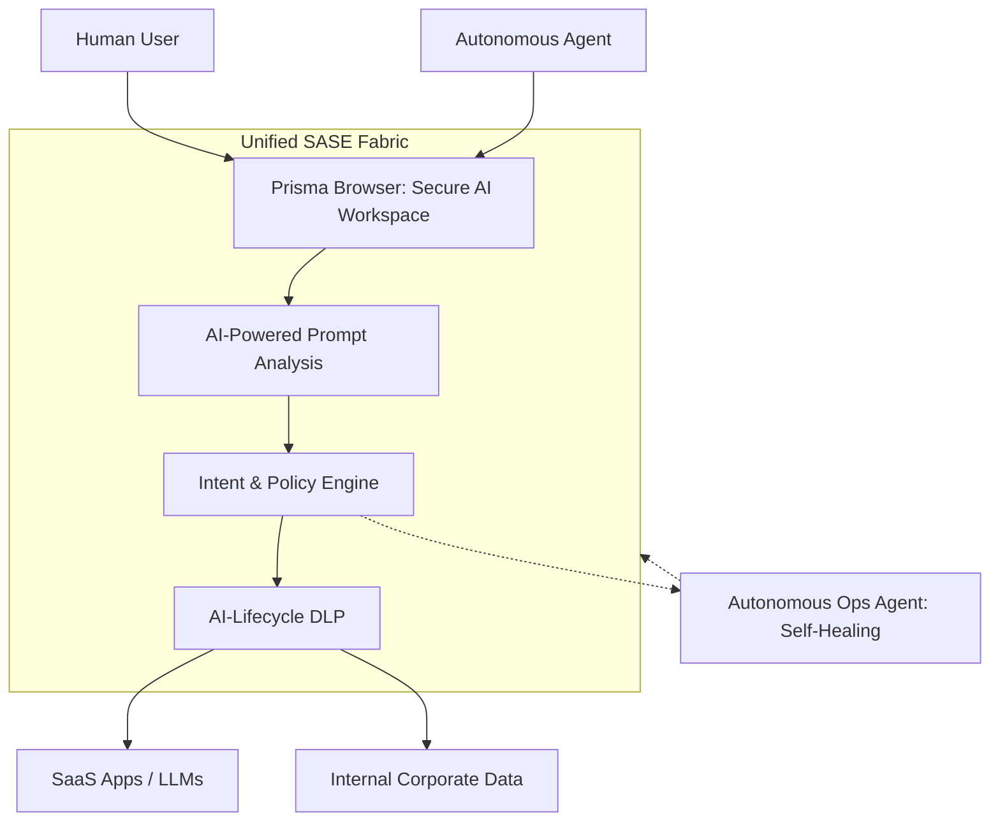
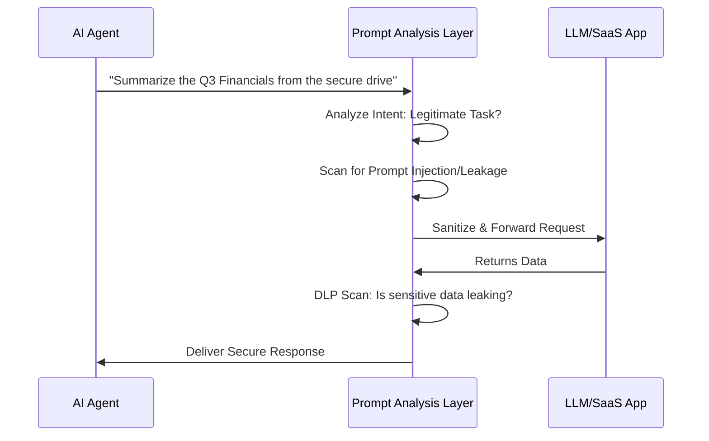
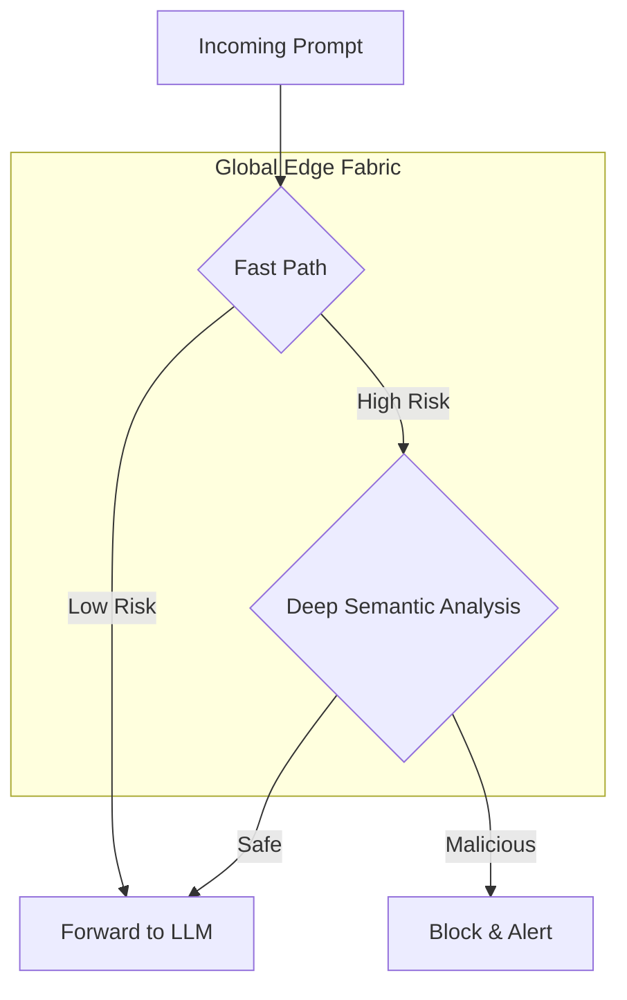

# The Agentic AI Security Gap: Why Your SASE is Obsolete

**Source:** https://www.paloaltonetworks.com/blog/
**Generated:** 2026-04-12 17:24:34
**Word Count:** 1004
**Tags:** AI Security, SASE, Agentic AI, Distributed Systems, Cybersecurity

---

# The Agentic AI Security Gap: Why Your SASE is Obsolete

Your autonomous AI agent just accessed a sensitive payroll database, summarized the salaries, and sent them to a third-party LLM for "analysis." Your security logs show a legitimate user session. Your DLP didn't fire because the data was fragmented across multiple prompts. You have a massive leak, and your current security stack is blind to it.

We are shifting from "AI as a tool" (Chatbots) to "AI as a workforce" (Agents). This transition breaks the fundamental assumption of every SASE (Secure Access Service Edge) platform ever built: the belief that the entity requesting access is always a human being.

### The Challenge: An Identity Crisis at Machine Speed

Traditional security is human-centric. We verify a user via MFA, check their group membership in Active Directory, and grant access to an application. But agents don't perform MFA, and they don't "log in" in the way we expect. Instead, they operate via API keys, service accounts, and long-lived tokens—often navigating the web through a browser session initiated by a human.

When an agent takes over a session, it inherits the human's privileges but operates at 100x the speed. This creates three critical failure points:

1. **The Intent Gap:** A SASE firewall can see *that* an agent is accessing a database, but it cannot determine *why*. Is it fetching a report for a manager, or is it being manipulated via prompt injection to exfiltrate data?
2. **AI Data Sprawl:** Data no longer resides solely in neat SQL databases. It now flows into vector DBs, prompt histories, and transient agent memories. Traditional DLP (Data Loss Prevention) looks for static patterns (like credit card numbers) but misses the *context* of sensitive corporate strategy being leaked within a conversation.
3. **The Browser Blindspot:** Most agentic work happens in the browser. If your security ends at the network layer, you are missing prompt-level attacks—such as indirect prompt injection—where a malicious webpage tricks your agent into stealing data.

### The Architecture: Securing the Agentic Workspace

To bridge this gap, we must move security from the "perimeter" to the "interaction." We need a unified fabric that treats the browser as the primary security enforcement point and the AI lifecycle as the primary data path.

In this architecture, the browser is no longer just a window to the web; it is a security proxy. It intercepts every prompt and response, analyzing the *intent* before the request ever reaches the LLM.

### Core Components: The New Security Stack

#### 1. The Secure AI Workspace (The Browser)
Rather than blocking LLMs entirely—which typically leads to "Shadow AI"—we wrap them. The browser becomes the identity layer for the agent, allowing the system to distinguish between a human typing and an agent executing a script. If an agent suddenly attempts to access 1,000 records when the human typically views only 10, the system flags the anomaly in real-time.

#### 2. AI Access Security & Prompt Analysis
This serves as the "Firewall for Prompts." Instead of relying on simple keywords, it utilizes Precision AI to understand the semantics of a request.

#### 3. Autonomous Operations (The Self-Healing Network)
When thousands of agents generate traffic, manual troubleshooting becomes a bottleneck that kills productivity. We replace "ticket fatigue" with autonomous agents that monitor the SASE fabric. If a connectivity spike occurs, an AI agent diagnoses the root cause, suggests a configuration change, and implements it—reducing the Mean Time to Resolution (MTTR) from hours to seconds.

### Data & Workflow: Closing the Leak

Data in the agentic era follows a circular path: **Collection $\rightarrow$ Contextualization $\rightarrow$ Execution $\rightarrow$ Storage.**

Traditional DLP only monitors the "Execution" phase (the exit point). A modern system must secure the entire lifecycle:
- **Discovery:** Identifying "shadow data" hidden in unstructured files that agents might ingest.
- **Control:** Blocking unsanctioned GenAI apps (from the 6,000+ available) while permitting corporate-approved tools.
- **Audit:** Maintaining a comprehensive prompt history to reconstruct exactly how an agent arrived at a specific—and potentially erroneous—decision.

### Trade-offs & Scalability

Adding a deep analysis layer to every prompt introduces latency. In a world where users expect sub-second LLM responses, a 500ms security overhead is unacceptable.

**The Latency vs. Security Trade-off:**
To solve this, we employ a tiered inspection model. Simple requests pass through a "fast-path" regex/pattern check. High-risk requests—such as those accessing sensitive databases—are routed through a deeper semantic analysis engine.

To scale this, we leverage a multicloud fabric (AWS, GCP, Oracle). By processing traffic at the edge and using "SASE Private Locations" for high-bandwidth campuses, we eliminate the need to backhaul traffic to a central data center, maintaining the promise of "machine speed."

### Key Takeaways

- **Agents $\neq$ Humans:** Your security model must evolve from verifying *who* is accessing data to *why* an agent is accessing it.
- **The Browser is the Perimeter:** In an AI-driven world, the browser is where the attack surface lives. Secure it or lose control of your data.
- **Context over Patterns:** Traditional DLP is obsolete. You need semantic prompt analysis to stop sophisticated data exfiltration.
- **Autonomous Ops are Mandatory:** You cannot manage machine-speed traffic with human-speed ticketing systems. Automate remediation or accept the downtime.

---

*This post was generated by the Autonomous Blog Agent*
*Includes architecture diagrams and visual examples*