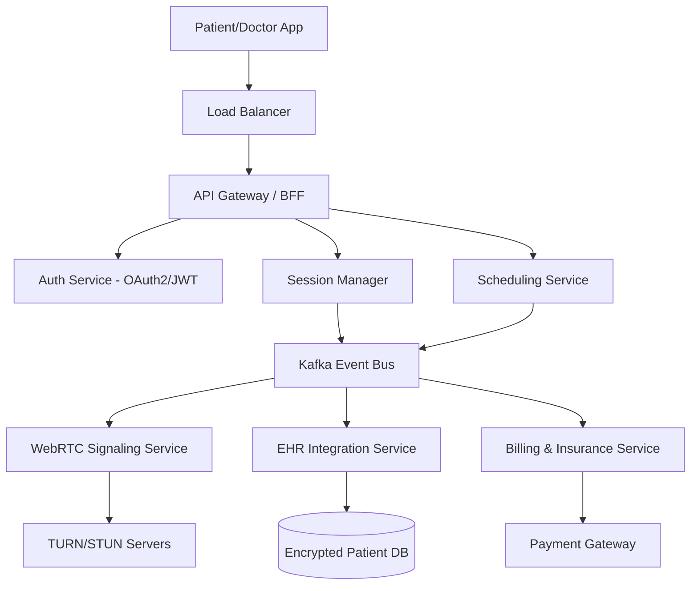
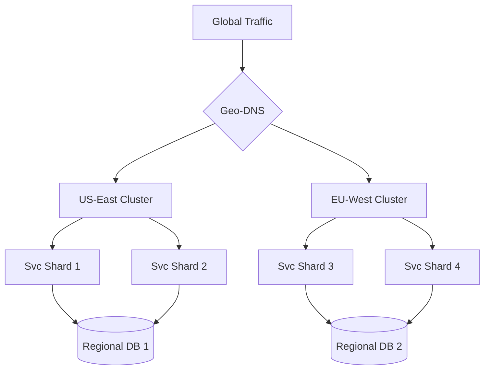

# Designing a Telehealth Platform: How to Handle Millions of Lives at Scale

**Source:** https://www.teladochealth.com/
**Generated:** 2026-04-13 15:57:44
**Word Count:** 1094
**Tags:** System Design, Telehealth, Distributed Systems, WebRTC, Scalability

---

# Designing a Telehealth Platform: How to Handle Millions of Lives at Scale

Your doctor is on the screen, but the video is lagging. Suddenly, the call drops. In a standard Zoom meeting, that's a minor annoyance; in a telehealth session for a critical diagnosis, it's a systemic failure. Building a platform like Teladoc isn't about creating a "video app"—it's about engineering a high-availability, HIPAA-compliant distributed system where downtime isn't just a metric; it's a liability.

### The Challenge: "Medical Grade" Scale

Most applications operate on the principle of "eventual consistency." If an Instagram like takes two seconds to appear, no one cares. In telehealth, the stakes are binary. You require real-time synchronization between a patient's vitals, the doctor's Electronic Health Records (EHR), and a low-latency video stream.

Scaling this environment is a significant engineering challenge for three primary reasons:

1. **The Burst Problem:** Health crises don't follow a schedule. Flu seasons or pandemics create massive, unpredictable spikes in traffic that would crush a monolithic architecture.
2. **The Compliance Tax:** HIPAA and GDPR are not mere checkboxes; they dictate the very nature of data storage. You cannot simply dump data into a global S3 bucket. Data residency and encryption-at-rest are non-negotiable constraints that complicate caching and database layers.
3. **The State Synchronization Gap:** A physician needs to view a patient's history, current symptoms, and real-time telemetry simultaneously. Syncing this state across distributed microservices without introducing 500ms of lag is the core engineering hurdle.

### The Architecture: An Event-Driven Ecosystem

To solve these challenges, we shift from a traditional request-response model toward an event-driven architecture. We cannot have the Video Service waiting for the Billing Service to confirm a payment before a call begins; that is a recipe for high latency.

Instead, we employ a decoupled approach where services communicate via a high-throughput message bus (such as Kafka). This ensures the system remains asynchronously resilient. If the Notification Service fails, the doctor can still treat the patient—the "Appointment Summary" email simply arrives five minutes late.



### Core Components: Breaking Down the Engine

**The Session Manager (The Brain)**
This is the most critical component. It handles the "handshake" between the patient and the provider. Rather than just routing traffic, it manages the state of the encounter: *Is the patient in the waiting room? Has the doctor joined?* The Session Manager utilizes a distributed cache (Redis) to keep this state accessible in sub-millisecond time, ensuring the transition from "Waiting" to "In-Call" is seamless.

**The WebRTC Signaling Layer**
Routing video data through central servers would be a "latency suicide mission." Instead, we use WebRTC for peer-to-peer (P2P) communication. Our servers only handle the *signaling*—the process of exchanging IP addresses and capabilities. To bypass restrictive hospital firewalls, we deploy a global network of TURN (Traversal Using Relays around NAT) servers, ensuring connectivity even when a patient is behind a corporate VPN.

**The EHR Integration Engine**
Electronic Health Records are notoriously fragmented, with different hospitals using varying formats like HL7 or FHIR. We implement an Adapter Pattern here. The EHR Service acts as a translation layer, converting legacy hospital data into a standardized JSON format that the frontend can render without lag.

```mermaid
sequenceDiagram
    participant P as Patient
    participant G as API Gateway
    participant S as Session Mgr
    participant V as Video Svc
    participant D as Doctor

    P->>G: Request Appointment
    G->>S: Create Session State
    S->>G: SessionID + Token
    G-->>P: Join Waiting Room
    S->>V: Signal Ready for Call
    V->>D: Notify Doctor
    D->>V: Accept Call
    V->>P: Establish P2P WebRTC Link
    P<->>D: Encrypted Video Stream
```

### Data Flow & The "Patient Journey"

When a patient clicks "Start Call," a cascade of events is triggered:

First, the **Auth Service** validates the JWT. Next, the **Scheduling Service** marks the time slot as "Active." This event is pushed to Kafka. The **Billing Service** consumes this event to begin the metering process, while the **EHR Service** pre-fetches the patient's medical history into a hot cache so the doctor doesn't encounter a loading spinner when opening the chart.

This asynchronous flow ensures the "critical path" (connecting the video call) is never blocked by the "secondary path" (updating billing records). If the billing database lags, the consultation still proceeds. This is the essence of a resilient system.

### Trade-offs & Scalability

No architecture is without compromise. Here are the strategic choices we make:

**Latency vs. Consistency (The CAP Theorem)**
In the scheduling service, we prioritize *Consistency*. Two doctors cannot be booked for the same slot. Consequently, we use a relational database (PostgreSQL) with strong ACID guarantees. However, for video signaling and session state, we prioritize *Availability*. A millisecond of state desync is imperceptible to the user, but a service outage means the call fails.

**Database Sharding**
As the user base grows, a single database becomes a bottleneck. We shard patient data by `RegionID`. Since a patient in New York rarely requires their data to be accessed by a server in London, we keep data geographically close to the user. This reduces round-trip time (RTT) and ensures compliance with regional data residency laws.

**Scaling the Signaling Layer**
WebRTC signaling is stateful. A standard round-robin load balancer is insufficient because the client must remain connected to the same signaling server to maintain the session. We implement *sticky sessions* at the load balancer level and use a distributed Redis store to share session metadata across the signaling cluster.



### Key Takeaways

*   **Decouple the Critical Path:** Use an event-driven architecture (Kafka) to ensure that billing or notifications never block a medical consultation.
*   **Edge-Heavy Video:** Leverage WebRTC for P2P streaming and deploy TURN servers globally to bypass firewalls; avoid routing heavy video traffic through your core API.
*   **Hybrid Consistency:** Use RDBMS for scheduling (Strong Consistency) and NoSQL/Caching for session management (High Availability).
*   **Regional Sharding:** Solve both latency and legal compliance by sharding data by geography, keeping patient records close to the point of care.

***

---

*This post was generated by the Autonomous Blog Agent*
*Includes architecture diagrams and visual examples*