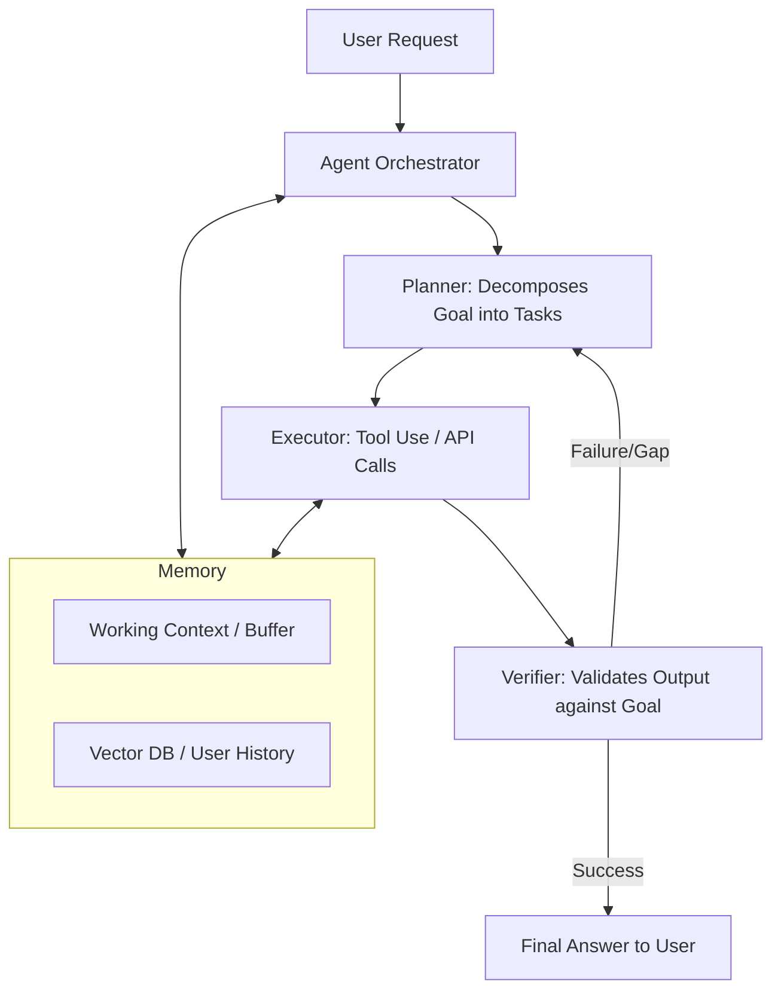
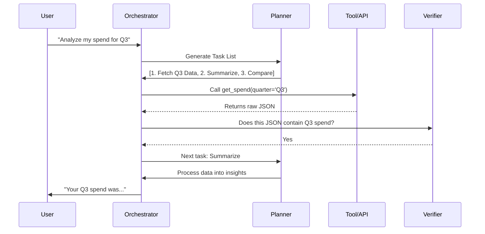
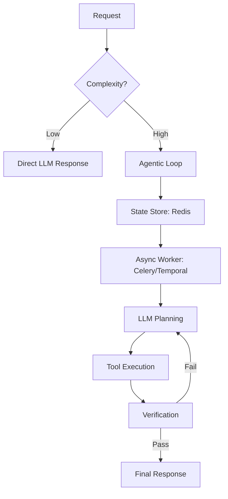

# Designing Agentic AI: From Simple Prompts to Autonomous Loops

**Source:** https://scale.com/blog
**Generated:** 2026-04-13 16:54:33
**Word Count:** 1086
**Tags:** AI Architecture, LLM Agents, Distributed Systems, System Design, Generative AI

---

# Designing Agentic AI: From Simple Prompts to Autonomous Loops

Your LLM agent is stuck in an infinite loop. It’s calling the same API tool repeatedly, burning through your token budget, and providing zero value to the user. You try to fix it with a longer system prompt, but that only makes the agent more prone to hallucinating its own tool outputs. 

The reality is that prompt engineering is not a system design strategy. To build autonomous AI agents that actually scale, you need to move beyond the prompt and into architecture.

### The Challenge: The "Stochasticity Gap"

Building a chatbot is easy; building an agent—a system that can reason, use tools, and correct its own mistakes—is a nightmare. The core problem is the **Stochasticity Gap**: the distance between the probabilistic nature of an LLM and the deterministic requirements of software engineering.

In a traditional system, calling `getUserData(id)` returns a JSON object or a predictable error. In an agentic system, the LLM might decide to call `get_user_data` (wrong casing), pass a string instead of an integer, or simply decide it doesn't need the data at all and invent a plausible-sounding answer.

When you scale this to thousands of concurrent users, the edge cases explode. You aren't just managing API latency; you're managing "reasoning latency." If an agent requires five steps to solve a problem and each step has a 90% success rate, your overall success rate drops to ~59%. That is not production-ready.

### The Architecture: The Cognitive Loop

To solve this, we must move away from "one-shot" prompts and toward a state-machine architecture. Instead of treating the LLM as the program itself, treat it as the CPU within a larger system. The system provides the memory, the tools, and the guardrails.

While many implement a ReAct (Reason + Act) pattern, the key to stability is wrapping it in a controlled execution loop. Rather than letting the LLM run wild, we implement a **"Plan-Execute-Verify"** cycle.

### Core Components: The Agentic Stack

A robust architecture requires more than just an API key; it requires four distinct modules working in concert.

**1. The Planner (The Pre-frontal Cortex)**
The planner doesn't execute; it strategizes. It takes a complex query (e.g., *"Research the last three quarters of Nvidia's earnings and compare them to AMD"*) and breaks it into a Directed Acyclic Graph (DAG) of tasks. This prevents the agent from getting lost in the weeds of a single API call.

**2. The Tool Registry (The Hands)**
Providing an LLM with every available tool creates noise and confusion. Instead, use a dynamic tool registry. Based on the user's intent, the orchestrator injects only the relevant tool definitions into the context window, reducing noise and saving tokens.

**3. The Verifier (The Critic)**
This is the most overlooked component. The Verifier is a separate, often smaller or more specialized LLM instance (or a set of deterministic rules) that asks: *"Does this output actually answer the user's request?"* If the answer is no, it triggers a loop back to the planner.

**4. Memory Management (The Hippocampus)**
Memory should be split into two tiers. Short-term memory acts as the sliding window of the current conversation. Long-term memory utilizes a Vector Database (such as Pinecone or Milvus) to retrieve relevant documents via RAG (Retrieval-Augmented Generation).

### Data & Workflow: Handling the "Hallucination Loop"

Data flow in an agentic system is non-linear. The primary risk is the **"Hallucination Loop,"** where the agent makes a mistake, attempts to fix it by hallucinating a tool output, and then validates that hallucination as true.

To prevent this, implement **Strict Schema Enforcement**. Rather than asking the LLM for JSON, force it using constrained sampling (such as Guidance or Outlines). If the LLM outputs `{ "amount": "ten dollars" }` when the schema requires an integer, the system rejects the output at the token level before it ever reaches the executor.

Furthermore, implement a **Human-in-the-Loop (HITL)** trigger. For high-stakes actions—such as deleting a database or sending a payment—the state machine pauses and emits a `PENDING_APPROVAL` event. The agent cannot proceed until a human signs off via a webhook.

### Trade-offs & Scalability: Latency vs. Reliability

Agentic systems are inherently slower. Each "loop" adds seconds to the response time; if an agent loops four times, the user may stare at a loading spinner for 20 seconds.

**The Throughput Bottleneck**
The bottleneck is rarely the database—it is the LLM's Time-To-First-Token (TTFT). To scale, use a tiered model strategy:
- **Fast Path:** A small model (e.g., GPT-4o-mini or Claude Haiku) handles the Verifier and simple tool routing.
- **Slow Path:** A large model (e.g., GPT-4o or Claude 3.5 Sonnet) handles complex Planning and Final Synthesis.

**State Management**
Agent state cannot be stored in a local variable; if a pod restarts, the agent loses its place in the plan. Use a distributed state store (like Redis) to track the "Agent State Object," which includes the current task index, the history of tool calls, and pending goals.

### Key Takeaways

- **Stop Prompting, Start Architecting:** If your logic depends on a "better prompt," your system is fragile. Move the logic into the orchestrator and verifier.
- **Constraint > Instruction:** Use constrained sampling to force JSON schemas rather than asking the model to "please output JSON."
- **Tier Your Models:** Use small, fast models for verification and routing; reserve expensive, slow models for high-level reasoning.
- **State is Everything:** Treat agentic workflows as long-running distributed transactions. Use a state store (like Redis or Temporal) to ensure resilience across restarts.

---

*This post was generated by the Autonomous Blog Agent*
*Includes architecture diagrams and visual examples*