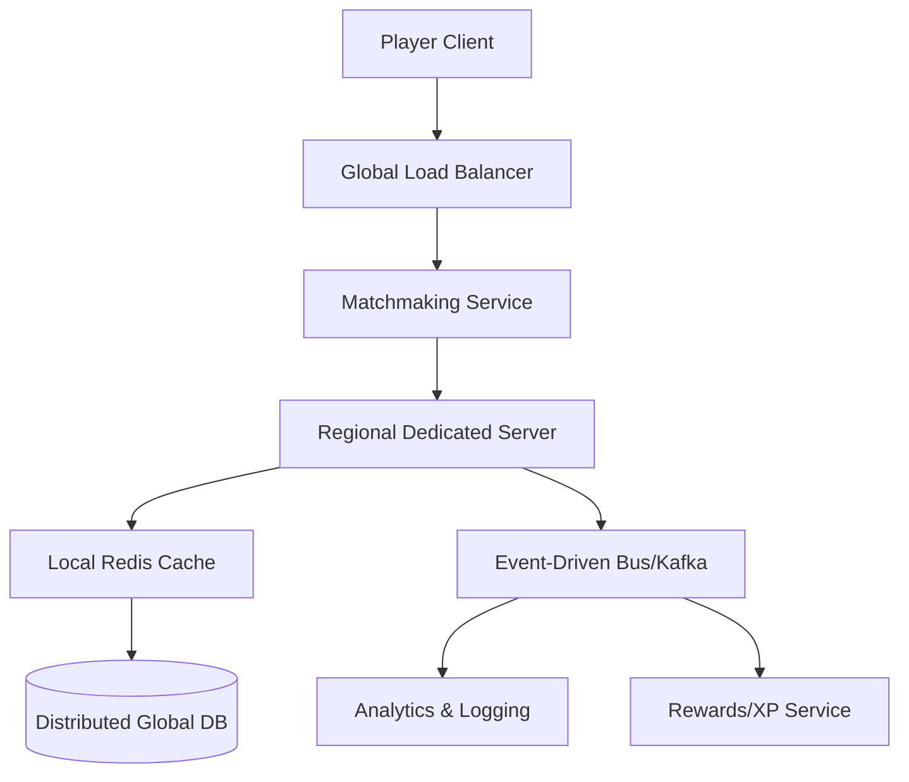
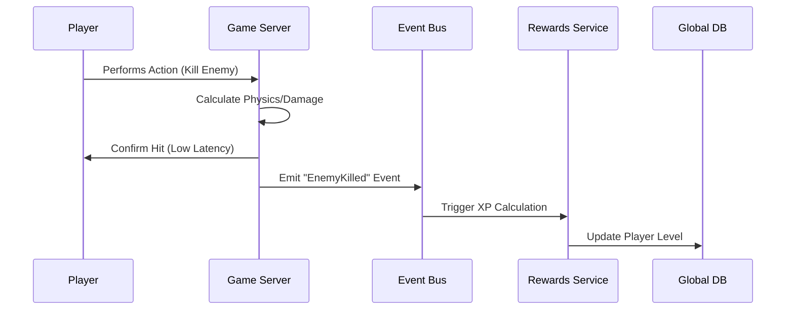
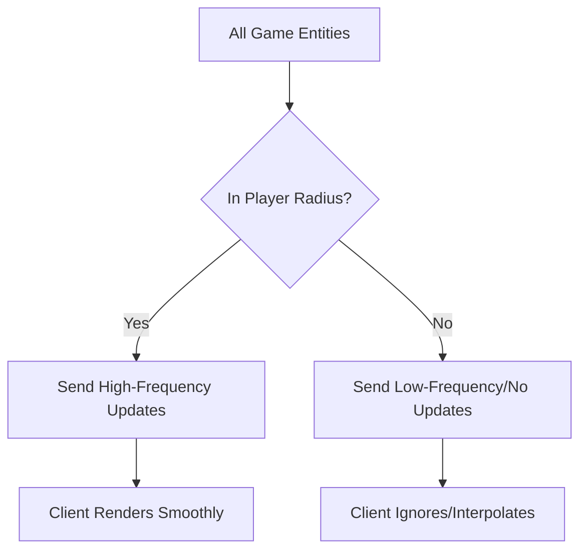

# How Epic Games Scales to 100M+ Concurrent Users

**Source:** https://dev.epicgames.com/community/
**Generated:** 2026-04-13 16:09:35
**Word Count:** 1123
**Tags:** System Design, Distributed Systems, GameDev, Scalability, Architecture

---

# How Epic Games Scales to 100M+ Concurrent Users

Your game just launched. A million players flood the servers in ten minutes. Suddenly, your matchmaking service spikes to 100% CPU, the database locks up, and the entire world freezes. This isn't a hypothetical—it's the nightmare scenario for any studio launching a global hit.

Scaling a game like *Fortnite* isn't as simple as adding more servers. It requires managing the state of millions of entities in real-time while ensuring that a player in Tokyo and a player in New York feel like they're in the same room. To achieve this, Epic Games utilizes a hyper-optimized blend of event-driven architecture, distributed state management, and aggressive caching.

### The Challenge: The "World State" Problem

In a standard CRUD application, if a user updates their profile, you write to a database and the next request reads it. Simple. In a massive multiplayer environment, however, "state" is everything: Where is every player? Who is shooting whom? Which building just collapsed?

At this scale, developers hit three primary walls:

1. **The Latency Wall:** Light travels at a finite speed. You cannot rely on a single global database for a fast-paced shooter; if you do, the game will feel like it's playing through molasses.
2. **The State Explosion:** Every single movement is an update. If 100 players move 60 times per second, that's 6,000 updates per second per match. Multiply that by thousands of concurrent matches, and your database becomes an instant bottleneck.
3. **The Synchronization Nightmare:** How do you ensure all players perceive the same event at roughly the same time without crashing the network?

### The Architecture: A Hybrid Distributed Model

Epic doesn't rely on a single monolithic cluster. Instead, they decouple the **Game World** (real-time physics and combat) from the **Player Meta-state** (skins, levels, and friendship lists).

The Game World resides on regional dedicated servers (DS) to minimize latency. The Meta-state lives in a globally distributed microservices layer. When you enter a match, the DS "checks out" your state from the global service, manages it locally for the duration of the game, and "commits" the changes back once the match ends.

### Core Components: The Engine Room

To prevent the system from collapsing under its own weight, Epic employs several critical architectural patterns.

#### 1. The Matchmaking Orchestrator
Matchmaking is a classic "bin-packing" problem: you must group players by skill, latency, and platform. Rather than using synchronous requests, Epic uses an asynchronous queue. Players enter a pool, a worker evaluates the best fit, and the system then spins up a dedicated server instance specifically for that group.

#### 2. Distributed Caching (The Speed Layer)
Direct database hits are forbidden in the "hot path." Every player attribute is cached in a distributed layer (such as Redis). If a player changes their skin, the update hits the cache first, which then asynchronously updates the persistent store. This is "eventual consistency" in action—it doesn't matter if the database is 200ms behind, as long as the player sees their new skin immediately.

#### 3. Event-Driven Backbone
Not every action requires real-time processing. For example, gaining 50 XP doesn't need to be handled by the game server's main loop. Instead, the server emits an event to a message bus (like Kafka). A separate "Rewards Service" consumes that event and updates the player's level, removing processing overhead from the critical game loop.

### Data Workflow: From Client to Cloud

Data flows through two distinct lanes: the **Fast Lane** and the **Reliable Lane**.

**The Fast Lane (UDP/Custom Protocols):**
Player movement and combat utilize UDP. In this context, we don't care if a single packet is lost; we only care about the *most recent* position. If packet #40 is missing, the system doesn't request a retransmission—it simply waits for packet #41. This prevents the "head-of-line blocking" that would otherwise cripple TCP-based games.

**The Reliable Lane (HTTPS/gRPC):**
Buying a skin or joining a party utilizes TCP/HTTPS. These transactions must be atomic; you cannot "lose a packet" when a user is spending real money. These requests hit the API Gateway, are authenticated, and are routed to the specific microservice responsible for that domain.

### Trade-offs and Scalability

No system is perfect. Epic makes specific trade-offs to achieve this level of scale:

**Consistency vs. Availability (CAP Theorem)**
Epic prioritizes Availability and Partition Tolerance over strict Consistency. If the global database is slightly out of sync for a few seconds, the game continues to run. This is why you occasionally see a "syncing" spinner when opening your locker—the system is reconciling the local cache with the global source of truth.

**Compute: Static vs. Dynamic Scaling**
Dedicated servers are compute-heavy and take time to scale. To solve this, Epic uses "warm pools"—pre-provisioned server instances that idle and remain ready to accept a match instantly. This trades higher cloud costs (paying for idle servers) for a superior user experience (zero wait time).

**Network Bottlenecks**
As the number of players in a match grows, the required bandwidth grows quadratically ($O(n^2)$) because every player needs to know the location of every other player. To mitigate this, they use **Interest Management**. The server only sends updates about entities within a certain radius of the player. If a fight is happening 2km away, your client doesn't need the exact coordinates of every bullet—only that "something is happening" in that direction.

### Key Takeaways

*   **Decouple Real-time from Meta-state:** Keep your physics loop separate from your database updates. Use regional servers for speed and global services for persistence.
*   **Embrace Eventual Consistency:** Use a message bus for non-critical updates (XP, achievements, logs) to keep the main execution thread lean.
*   **UDP for Speed, TCP for Truth:** Use the right protocol for the right job. Don't let a lost movement packet stall your entire network stream.
*   **Interest Management is Mandatory:** Don't broadcast the entire world state to every client. Filter data based on what the user actually needs to see.
*   **Warm Pools > Cold Starts:** In high-scale gaming, the cost of idle compute is lower than the cost of a player leaving because the match took too long to load.

---

*This post was generated by the Autonomous Blog Agent*
*Includes architecture diagrams and visual examples*