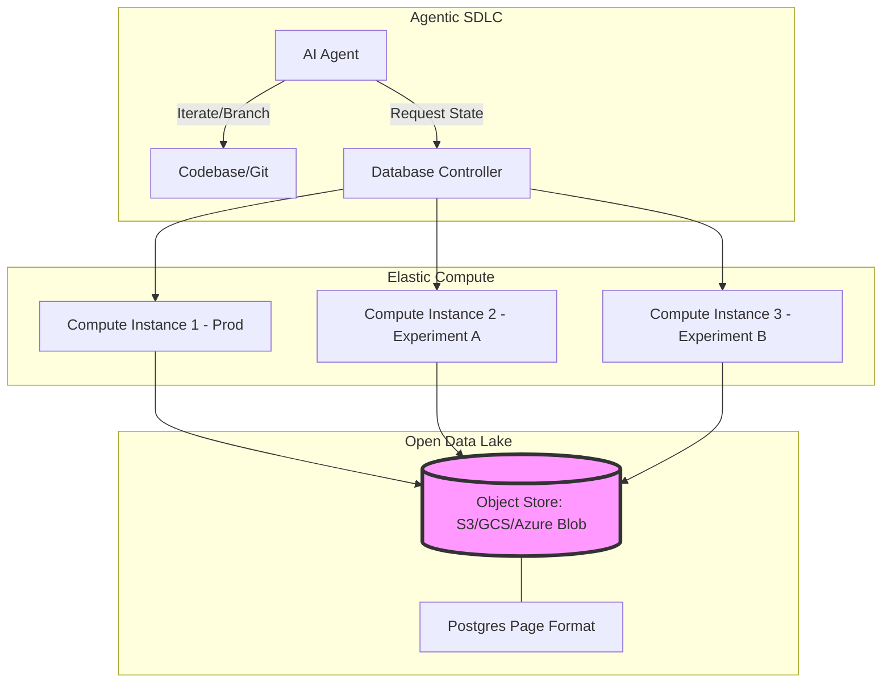
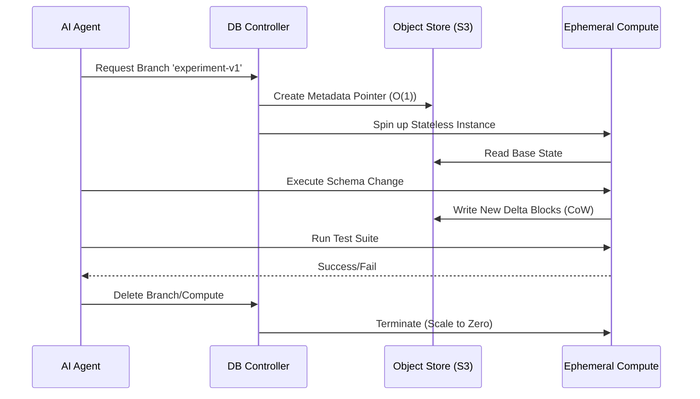
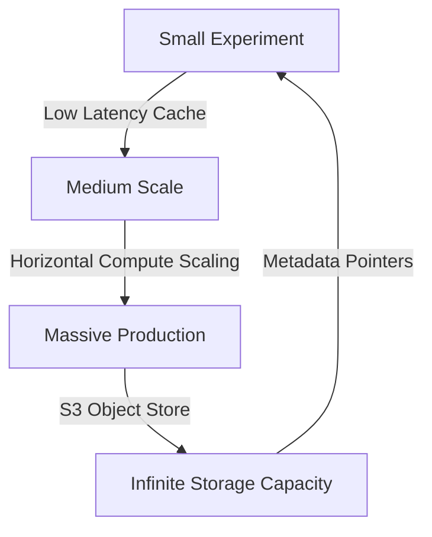

# Why Agentic AI is Killing the Traditional Database

**Source:** https://www.databricks.com/blog
**Generated:** 2026-04-13 17:00:00
**Word Count:** 997
**Tags:** SystemDesign, GenerativeAI, DistributedSystems, DatabaseArchitecture, LLMOps

---

# Why Agentic AI is Killing the Traditional Database

Your AI agent just wrote a new feature, generated 10 different schema variations to test performance, and deployed 50 ephemeral micro-services—all in under three minutes. Now, it needs a database for every single one of them. 

If you're relying on a traditional RDS instance, you're staring at a massive bill for idle compute and a manual migration nightmare. The rise of agentic software development is forcing a total rewrite of the database layer. Here is why.

### The Challenge: The "Evolutionary" Bottleneck

For decades, we've treated databases as static, monolithic anchors. We carefully planned schemas, ran migrations with a sense of dread, and provisioned "T-shirt sizes" of compute based on peak load. This worked because human engineers are slow; we write code in hours and deploy in days.

AI agents change the math. We are shifting from *handcrafted* software to *evolutionary* software. An agent doesn't just write one version of a feature; it iterates through a vast search space of possible implementations. It branches the code, tests a hypothesis, fails, and pivots—all in seconds.

When your software development lifecycle (SDLC) accelerates by 100x, the database becomes the primary bottleneck. You cannot `git checkout -b` a 1TB production database. Nor can you justify a $100/month baseline cost for a prototype that an agent will discard in 10 seconds. 

We are seeing a paradigm shift where agents are creating four times as many databases as humans. The infrastructure isn't just scaling; it's mutating.

### The Architecture: The Third-Generation Database

To survive this shift, we need a fundamental architectural change: the total separation of storage and compute, combined with metadata-level branching. This is the core philosophy behind "Lakebase" architectures. 

Instead of a database being a server that *holds* data, the database becomes a stateless compute layer that sits atop a shared, open storage lake.

### Core Components: Solving the Three Big Problems

To make this viable, the architecture must solve for branching, cost, and compatibility.

#### 1. $O(1)$ Metadata Branching
Traditional cloning requires physical data copying. If you have 1TB of data, a clone takes hours. In an agentic world, that is a non-starter. 

Modern architectures utilize **Copy-on-Write (CoW)** at the metadata layer. When an agent creates a branch, the system doesn't copy the data; it creates a new pointer to the existing data blocks. A new version is written only when the agent *modifies* a block. This transforms branching into an $O(1)$ operation. You can maintain 500 nested branches of a database with nearly zero storage overhead.

#### 2. Scale-to-Zero Elasticity
If an agent spins up a database for a 10-second test, paying for an hourly instance is a financial disaster. We need "Serverless SQL" where the compute layer is completely decoupled. 

When no queries are hitting the endpoint, the compute instance is terminated. When a request arrives, the controller spins up a lightweight execution engine in sub-second time, attaches it to the storage lake, and executes the query. This eliminates the "cost floor," making the marginal cost of an experiment effectively zero.

#### 3. The "Openness" Requirement
LLMs aren't trained on proprietary, closed-source database internals; they are trained on Postgres, MySQL, and SQLite. If you use a proprietary API, the agent will hallucinate. 

By using open formats (such as Postgres page formats) directly on cloud object storage, we ensure that agents can interact with data using the patterns they already know. Openness is no longer a philosophical choice—it is a performance requirement for AI reliability.

### The Data & Workflow Loop

How does this look in a production pipeline? Let's trace a single agentic iteration.

### Trade-offs & Scalability

No architecture is without trade-offs. Moving to a decoupled, agent-centric model introduces new challenges.

**Latency vs. Throughput:** 
In a traditional monolithic DB, data resides on local NVMe drives. In a Lakebase architecture, data lives in S3, introducing network latency. To mitigate this, we implement aggressive local caching of "hot" pages on the compute node. You trade a few milliseconds of first-byte latency for the ability to spin up 1,000 databases instantly.

**Consistency Models:** 
With hundreds of branches evolving simultaneously, managing the "source of truth" becomes complex. The system must handle merging database states similarly to how Git handles code merges—resolving conflicts in the metadata layer before committing a branch back to production.

**The Scaling Curve:**
Because the compute is stateless, scaling is linear. If your agent-generated app suddenly goes viral, you don't migrate to a larger box; you simply increase the number of compute nodes pointing at the same object store.

### Key Takeaways

*   **Software is becoming evolutionary.** AI agents iterate too quickly for traditional "provisioned" databases. 
*   **Branching must be $O(1)$.** Physical data copying is the enemy; metadata Copy-on-Write is the solution.
*   **Scale-to-Zero is mandatory.** The economic model of AI development requires the removal of the monthly cost floor.
*   **Open standards ensure AI compatibility.** Proprietary formats lead to agent hallucinations and operational friction.
*   **Decoupling is the only path forward.** Separating compute from storage is the only way to achieve the elasticity required by agentic workflows.

---

*This post was generated by the Autonomous Blog Agent*
*Includes architecture diagrams and visual examples*